# ⚡ Event Grid – Custom Topics Explained

## 🏷️ What is a Custom Topic?

- **Custom Topic = your own event channel**.
- Unlike **System Topics** (auto-created for Azure services), a **Custom Topic** is a **resource you create** when:

  - You want **your app** to publish events.
  - You want to define your **own event types** (e.g., `OrderCreated`, `OrderShipped`).

- Subscribers (Functions, Logic Apps, Webhooks, Service Bus, etc.) then consume these events just like Azure service events.

👉 AWS analogy: Custom Topic = **EventBridge custom event bus** where you publish your own events.

---

## 📊 Flow of Custom Topic

```mermaid
flowchart LR
    A[Custom App 🖥️] -->|Publish Events| B[Custom Topic]
    B --> C[Event Subscription 🎯]
    C --> D[Azure Function ⚡]
    C --> E[Logic App 🛠️]
    C --> F[Webhook 🌐]
```



---

## 🛠️ Hands-On Example: Custom Topic for an E-Commerce App

### Scenario

You have an **Order Processing App**.
When a customer places an order → publish an event `OrderCreated`.
Subscribers:

- Azure Function → process payment.
- Logic App → send confirmation email.

---

### Step 1. Create a Custom Topic

```bash
az eventgrid topic create \
  --name orderTopic \
  --resource-group myRG \
  --location eastus
```

👉 This creates an Event Grid Topic resource.
It gives you an **endpoint URL** + **access keys** (like an API key).

Example Endpoint:

```ini
https://orderTopic.eastus-1.eventgrid.azure.net/api/events
```

---

### Step 2. Create an Event Subscription

```bash
az eventgrid event-subscription create \
  --name OrderCreatedSub \
  --source-resource-id /subscriptions/<subId>/resourceGroups/myRG/providers/Microsoft.EventGrid/topics/orderTopic \
  --endpoint https://myfunction.azurewebsites.net/runtime/webhooks/eventgrid?code=<function-key>
```

👉 This means: “Whenever an event comes into `orderTopic` → forward it to my Azure Function.”

---

### Step 3. Publish Events to the Custom Topic

You can use **curl** or SDKs (C#, Python, Node.js).

#### Example Event (Event Grid Schema)

```json
[
  {
    "id": "12345",
    "eventType": "OrderCreated",
    "subject": "orders/order123",
    "eventTime": "2025-09-25T10:00:00Z",
    "data": {
      "orderId": "order123",
      "customerId": "cust789",
      "amount": 99.99
    },
    "dataVersion": "1.0"
  }
]
```

#### Send via curl

```bash
curl -X POST \
  -H "aeg-sas-key: <access-key>" \
  -H "Content-Type: application/json" \
  -d @event.json \
  https://orderTopic.eastus-1.eventgrid.azure.net/api/events
```

---

### Step 4. Subscriber (Azure Function) Code Example (Python)

```python
import logging
import azure.functions as func

def main(event: func.EventGridEvent):
    data = event.get_json()
    logging.info(f"Received event: {event.event_type} for {data['orderId']}")
    # process payment, send email, etc.
```

When you POST the `OrderCreated` event → the Function is triggered.

---

## ✅ Benefits of Custom Topics

- Define your **own event types** (not limited to Azure services).
- Decouple **publishers** and **subscribers** (classic pub/sub).
- Scale easily — millions of events per second.
- Subscribers can apply **filters** (e.g., only orders above \$100).

---

## 📦 AWS Comparison

| Azure Custom Topic      | AWS Equivalent            |
| ----------------------- | ------------------------- |
| Event Grid Custom Topic | EventBridge Custom Bus    |
| Publish Events via REST | `PutEvents` API           |
| Event Subscription      | EventBridge Rule + Target |
| Dead Letter Support     | DLQ in EventBridge        |

---

## 🎯 Summary

- **Custom Topic = your own Event Bus** inside Event Grid.
- Steps:

  1. Create Custom Topic (channel).
  2. Create Event Subscription (who listens).
  3. Publish events via REST/SDK.
  4. Subscribers (Functions, Logic Apps, Webhooks) process them.

- Perfect for **microservices apps, e-commerce flows, IoT custom logic**, etc.
