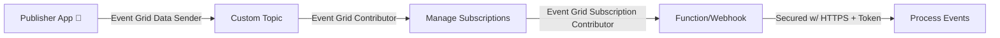
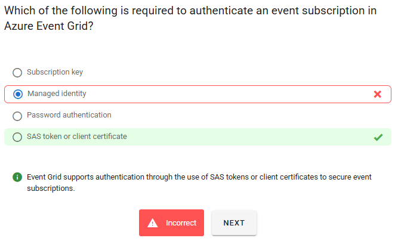

# 🔐 **Controlling Access to Events in Azure Event Grid**

Event Grid is powerful — but without **proper access control**, anyone could create subscriptions, read events, or even inject fake events. To prevent this, Azure uses **Role-Based Access Control (RBAC)** with **Event Grid–specific roles**.

---

## 📌 **Built-in Roles for Event Grid**

Azure has pre-defined RBAC roles tailored for Event Grid.

| Role                                    | Permissions                                                            | Use Case                                                         |
| --------------------------------------- | ---------------------------------------------------------------------- | ---------------------------------------------------------------- |
| **Event Grid Contributor**              | 🔑 Full control over **topics and subscriptions** (system + custom).   | Admin role for Event Grid.                                       |
| **Event Grid Data Sender**              | 🚀 Only permission is to **send events to a custom topic**.            | Applications publishing events, but not allowed to manage infra. |
| **Event Grid Subscription Reader**      | 🔍 Read-only access to **event subscriptions** (can view, not change). | Monitoring, auditing, operations team.                           |
| **Event Grid Subscription Contributor** | ➕ Create, ✏️ modify, ❌ delete event subscriptions.                   | Developers or ops managing subscriptions lifecycle.              |

👉 **AWS analogy**:

- Data Sender ≈ `SNS:Publish` permission.
- Contributor ≈ `SNS:FullAccess`.
- Subscription Reader ≈ read-only CloudWatch access on subscriptions.

---

## 📌 **Permissions for Event Subscriptions**

Event subscriptions deliver events to different destinations (webhooks, storage, Event Hubs, Service Bus, etc.).

- **Webhook handler** → only Event Grid and the webhook endpoint need mutual trust.
- **Non-Webhook handlers** (e.g., Queue Storage, Event Hubs, Service Bus):

  - Event Grid must have **write access** to that resource.
  - Otherwise, anyone with Event Grid access could try to push events to your storage/queue.

👉 Example:

- Delivering events to **Azure Queue Storage** requires:

  - Either **Storage access keys**, or
  - **Managed Identity + RBAC**.

⚠️ **Warning**: If you don’t secure Queue Storage, **unauthorized users could write arbitrary events**. Always lock down access.

---

## 📌 **Managing Topics and Subscriptions**

### **System Topics**

- Auto-created when you use Azure services (e.g., Blob Storage, Key Vault).
- To manage them, you need **write permissions** on the **publishing resource**.

  - Example: To subscribe to Storage events → need **Storage Account write access**.

### **Custom Topics**

- Created manually.
- To create/manage event subscriptions: need **write access** at the scope of the Event Grid **topic**.

👉 **AWS analogy**:

- Creating a subscription to an SNS topic requires `sns:Subscribe`.
- Publishing to EventBridge requires `events:PutEvents`.

---

## 📌 **Receiving Events Using Webhooks**

- Webhooks are common subscribers for Event Grid events.
- **Security best practices**:

  1. **Secure your endpoint** (HTTPS only).
  2. **Validate events** (Event Grid sends a handshake validation event).
  3. Use **authentication headers** or **Azure AD app registration** for extra protection.

👉 This prevents attackers from spoofing events or overwhelming your subscriber.

---

## 📊 **Access Control Overview**

---

## ✅ **Best Practices Summary**

- Use **least privilege**:

  - Publishers → only need **Event Grid Data Sender**.
  - Operators → only need **Subscription Reader**.
  - Admins → only Event Grid Contributor.

- Always **secure non-webhook destinations** (Queue, Event Hubs) with RBAC or keys.
- Protect webhook endpoints with **authentication + event validation**.
- Require **write permissions** at the right scope for managing subscriptions (System vs Custom Topics).

## ⁉️ **Questions**

  

### 🔐 Why SAS Token or Client Certificate Is Required

- **Event Grid uses HTTPS to deliver events**, and when targeting custom endpoints (like a webhook), it needs to ensure the destination is secure.
- **SAS tokens (Shared Access Signatures)** and **client certificates** provide a way to authenticate and authorize access without exposing credentials.
- These methods are standard for securing communication between Azure services and external systems.

---

### ❌ Why the Other Options Are Incorrect

| Option                      | Why It’s Not Used                                                                                      |
| --------------------------- | ------------------------------------------------------------------------------------------------------ |
| **Subscription key**        | Used in services like Azure API Management, not Event Grid.                                            |
| **Managed identity**        | Works for Azure-to-Azure authentication, but **not for custom endpoints** in Event Grid subscriptions. |
| **Password authentication** | Not supported in Event Grid; it's insecure and not scalable for service-to-service communication.      |
