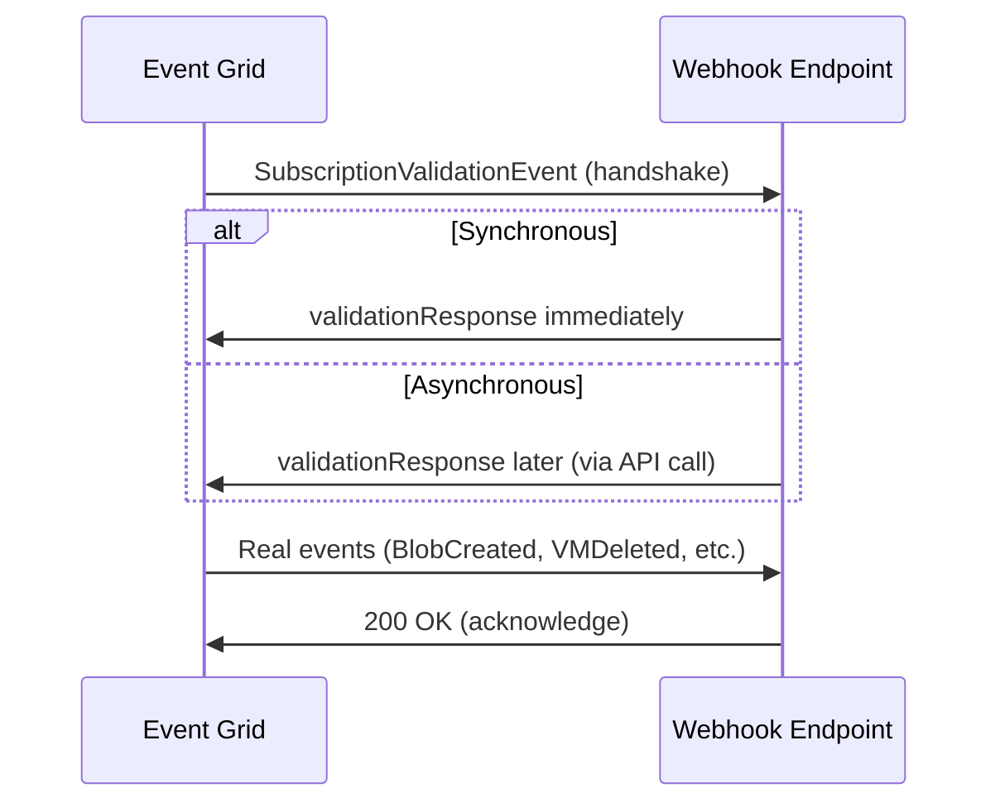

# 🌐 **Webhooks in Azure Event Grid**

A **Webhook** is simply an **HTTP endpoint** (a URL) that Event Grid calls via `POST` whenever an event occurs.
Think of it like Event Grid “knocking on your app’s door” and saying:

> “Hey 👋, here’s a new event for you — process it!”

---

## 🔑 **How Webhook Delivery Works**

1. **📝 Subscription Creation**

   - You tell Event Grid: “Send me all `BlobCreated` events to `https://myapp.com/events`”.

2. **🤝 Handshake Validation**

   - Event Grid checks if your webhook endpoint is **alive and trustworthy**.
   - This is done via a **validation event**.
   - Handshake happens only once, when you create the subscription (or update it with a new endpoint).

3. **✅ Subscription Verified**

   - If your webhook responds correctly → subscription becomes **Active**.

4. **🚀 Real Event Delivery**

   - Event Grid starts delivering **actual events** (e.g., BlobCreated, VMDeleted).

5. **🔄 Durability & Retry**

   - If your webhook fails, Event Grid retries and can send events to **dead-letter storage**.

---

## 🤝 **The Handshake Types**

When Event Grid sends the **validation event**, there are two possible handshake styles:

### 1. **Synchronous Handshake** (Immediate Response)

- Event Grid sends a **`SubscriptionValidationEvent`**.
- Your webhook must **immediately respond** with the `validationResponse`.
- Example payload:

  ```json
  {
    "id": "111",
    "eventType": "Microsoft.EventGrid.SubscriptionValidationEvent",
    "data": {
      "validationCode": "12345"
    }
  }
  ```

👉 Your webhook should reply with:

```json
{ "validationResponse": "12345" }
```

✅ If successful → Event Grid marks the subscription as verified instantly.

---

### 2. **Asynchronous Handshake** (Delayed Response)

- Sometimes, your endpoint can’t respond right away (maybe you’re warming up or need to process things).
- In this case, Event Grid allows **delayed validation**.
- Your webhook still receives the validation event, but you can confirm later by calling Event Grid with the validation code.

✅ Useful for services that need extra time before going “online.”

---

## 📊 **Workflow**

<div align="center" style="background-color: #1c2529ff ;border-radius: 10px;border: 2px solid white">



</div>

---

## ⚡ **Hands-On Example (Webhook in .NET Minimal API)**

```csharp
app.MapPost("/events", async (HttpContext context) =>
{
    using var reader = new StreamReader(context.Request.Body);
    var body = await reader.ReadToEndAsync();
    var events = JsonSerializer.Deserialize<JsonElement[]>(body);

    foreach (var ev in events)
    {
        var eventType = ev.GetProperty("eventType").GetString();

        if (eventType == "Microsoft.EventGrid.SubscriptionValidationEvent")
        {
            // Synchronous handshake
            var validationCode = ev.GetProperty("data").GetProperty("validationCode").GetString();
            return Results.Json(new { validationResponse = validationCode });
        }
        else
        {
            Console.WriteLine($"Event received: {eventType}");
        }
    }

    return Results.Ok();
});
```

---

## 🔒 **Securing Webhooks**

- **Authentication:** Use Azure AD, OAuth, or shared keys.
- **Firewall:** Restrict to Event Grid IP ranges.
- **Validation:** Always check schema & headers.

---

## ✅ **Summary**

- **Webhook = HTTP POST endpoint**, most flexible delivery method.
- Requires **handshake validation** before real events flow.
- **Two handshake types**:

  - **Synchronous** → immediate validation response.
  - **Asynchronous** → delayed validation if needed.

- Durable delivery with retries & dead-lettering.
- Best for **custom apps** that need fine control.
