# ⚡ **Azure Event Grid – Event Delivery Durability**

Event-driven systems must guarantee **reliable delivery**, even when subscribers (like Functions, Logic Apps, Webhooks) fail temporarily.
Event Grid includes several built-in mechanisms to ensure events **aren’t lost** and are retried smartly.

---

## 1️⃣ **Retry Mechanism**

- Event Grid **automatically retries** delivering events when the subscriber endpoint fails.
- Retry schedule is **exponential backoff** (wait times get longer between retries).
- Retry continues until either:

  - ✅ Event is delivered
  - ❌ Event expires (Time-To-Live ends)
  - ❌ Maximum retries are reached

👉 **Error handling logic**:

- **Transient error (e.g., 500, timeout)** → retry.
- **Permanent error (e.g., 400 Bad Request)** → drop immediately.

📌 **AWS equivalent**: Very similar to **SNS retry + DLQ** or **EventBridge retry policy**.

---

## 2️⃣ **Customizing Retry Policy**

You can control:

- **Max delivery attempts** → e.g., retry 30 times.
- **Event Time-To-Live (TTL)** → how long Event Grid should keep retrying (default: 24 hours, can be extended).

👉 This lets you tune:

- Aggressive retries (low tolerance for event loss).
- Conservative retries (avoid overwhelming downstream).

⚡ Example: Payment events might need retries for **hours**, but telemetry events might expire in **minutes**.

---

## 3️⃣ **Output Batching**

- Instead of sending one HTTP request per event, Event Grid can **batch multiple events** into one request.
- Benefits:

  - Fewer HTTP calls.
  - Better performance at high throughput.

📌 **AWS equivalent**: Similar to **Kinesis batching** or **SQS batch delivery**.

---

## 4️⃣ **Delayed Delivery**

- If the subscriber is temporarily down (e.g., webhook unreachable), Event Grid will **pause delivery** and retry later.
- Prevents event loss during **short outages**.
- Once the endpoint is back → pending events are redelivered.

📌 **AWS equivalent**: Similar to **SQS visibility timeout + retry**, but managed by Event Grid automatically.

---

## 5️⃣ **Dead-Letter Events**

- If all retries fail → Event Grid moves the event to a **Dead-Letter Destination (DLD)**.
- Supported DLD options:

  - **Azure Storage Blob Container** 📦
  - **Azure Storage Queue** 📨

👉 This gives you a chance to:

- Inspect failed events.
- Debug why delivery failed.
- Replay events manually if needed.

📌 **AWS equivalent**: Exactly like an **SNS/SQS Dead-Letter Queue**.

---

## 📊 **Visual** – Event Delivery Flow

```mermaid
flowchart TD
    A[Event Published] --> B[Event Grid]
    B --> C{Delivery Success?}
    C -->|Yes| D[Subscriber ✅]
    C -->|No| E[Retry with backoff 🔄]
    E -->|Still Failing| F{TTL/Max Retries?}
    F -->|Not Expired| E
    F -->|Expired| G[Dead-Letter Destination 📦]
```

---

## ✍🏻 **Hands-On:** Configuring Delivery Durability in Azure Portal

### **Step 1. Create Event Subscription**

- Go to Event Grid topic → **Add Event Subscription**.
- Choose **endpoint** (Webhook, Function, Logic App, Event Hub).

### **Step 2. Configure Advanced Options**

- **Retry Policy**:

  - Set **Max Attempts** (e.g., 30).
  - Set **TTL** (e.g., 1 day).

- **Dead-Letter Destination**:

  - Select **Storage Account Blob**.

### **Step 3. Test**

1. Upload a file in Storage (if using Blob events).
2. Shut down the subscriber temporarily.
3. Observe retries in **Event Grid Metrics**.
4. See undelivered events go to **Dead-Letter Blob Container**.

---

## ⚖️ **AWS vs Azure Durability Features**

| Feature          | Azure Event Grid              | AWS Equivalent                 |
| ---------------- | ----------------------------- | ------------------------------ |
| Retries          | Exponential backoff retries   | SNS & EventBridge retries      |
| TTL              | Configurable TTL              | EventBridge max retry duration |
| Dead Letter      | Blob / Queue storage          | SQS DLQ                        |
| Batching         | HTTP event batching           | Kinesis/SQS batch delivery     |
| Delayed Delivery | Hold + retry if endpoint down | SQS visibility + retry         |

---

## 🎯 **Key Takeaways**

- Event Grid is **durable by default** – retries, batching, dead-lettering built in.
- **Custom policies** let you balance durability vs speed.
- Use **Dead-Letter destinations** for debugging + replay.
- Works well for both **critical events** (must not lose) and **best-effort events** (can expire).
