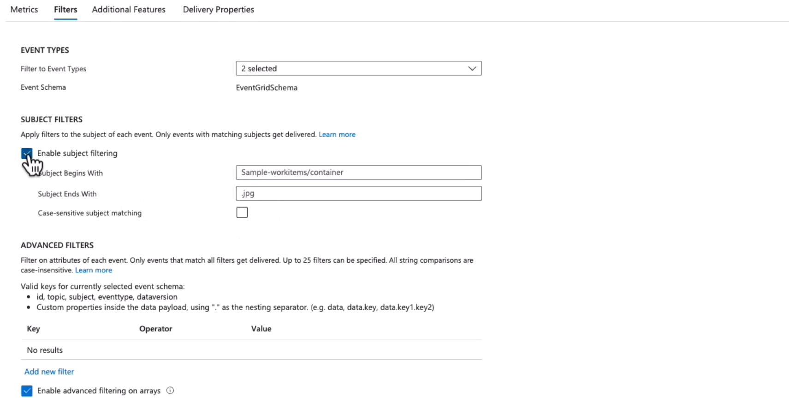
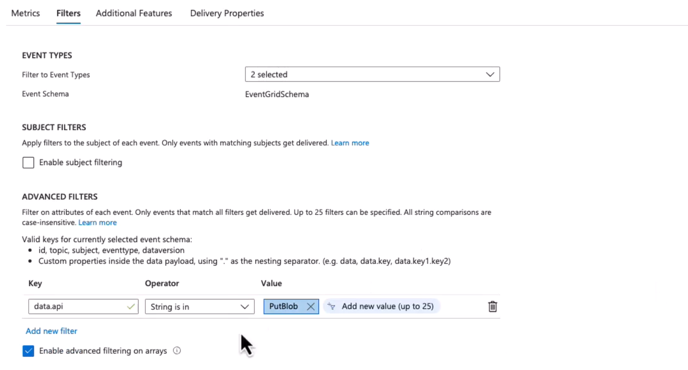
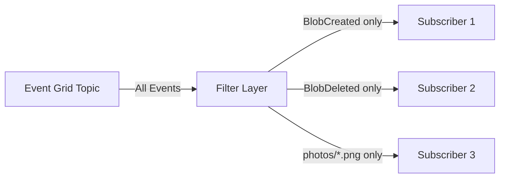

# 🎯 **Filtering Events in Azure Event Grid**

Event Grid doesn’t just blast **all events** to subscribers — it gives you **filters** so you only receive what you care about.
This makes your event-driven architecture **efficient, cheaper, and easier to manage**.

---

## 🛠️ **Types of Filters**

Event Grid provides several filtering options when creating a subscription:

---

### 1. **🏷️ Event Type Filtering**

- Choose which event types you want (out of all possible from a publisher).
- Example:

  - Storage emits: `BlobCreated`, `BlobDeleted`, `BlobRenamed`.
  - You only care about `BlobCreated`.

👉 So your subscriber won’t get spammed by delete/rename events.

---

### 2. **📂 Subject Filtering**

The **subject** is like the “path” of the resource inside the event.
You can filter based on:

- **Prefix match** → Only events starting with `/containers/photos/`.
- **Suffix match** → Only events ending with `.jpg`.

**📌 Example:**

- Rule: Prefix = `/containers/photos/`, Suffix = `.png`
- Result: You only get events for PNG files uploaded in the **photos container**.

---

### 3. **🧠 Advanced Filters**

For more complex scenarios, you can apply **field-level filters**.
You can filter on event properties like:

- `data.api` (e.g., only `PutBlob`).
- `data.clientRequestId` (specific application).
- Numeric/string comparisons (`>`, `<`, `=`, `startsWith`, `endsWith`).

**📌 Example:**

```json
"advancedFilters": [
  {
    "key": "data.api",
    "operatorType": "StringEquals",
    "values": ["PutBlob"]
  }
]
```

This ensures only **upload operations** trigger your subscriber.

---

<div align="center" style="background-color: #ffffffff ;border-radius: 10px;border: 2px solid white">
  
</div>

---

<div align="center" style="background-color: #ffffffff ;border-radius: 10px;border: 2px solid white">
  
</div>

---

## 📊 **Visual Flow**

<div align="center" style="background-color: #1c2529ff ;border-radius: 10px;border: 2px solid white">



</div>

---

## ⚡ **Hands-On Example (Portal Setup)**

1. Go to your **Event Subscription** in Azure Portal.
2. Under **Filters**, configure:

   - **Event Types** → select only `BlobCreated`.
   - **Subject Filters** → Prefix `/containers/photos/`, Suffix `.jpg`.
   - **Advanced Filters** → `data.api = PutBlob`.

3. Save subscription → Now your webhook/Function/Queue only gets the events you actually want.

---

## ✅ **Why Filtering Matters**

- **Performance** → Subscribers don’t waste CPU on unwanted events.
- **Cost** → You aren’t billed for processing/logic on events you don’t need.
- **Simplicity** → Business logic stays clean, less noisy data.

---

## 🏆 **Summary**

- **Event Type filter** → choose event kinds (e.g., only `BlobCreated`).
- **Subject filter** → prefix/suffix matching (e.g., only photos/\*.png).
- **Advanced filter** → fine-grained conditions on event payload (e.g., only `PutBlob`).

👉 Filtering ensures subscribers see **only the signals, not the noise**.
