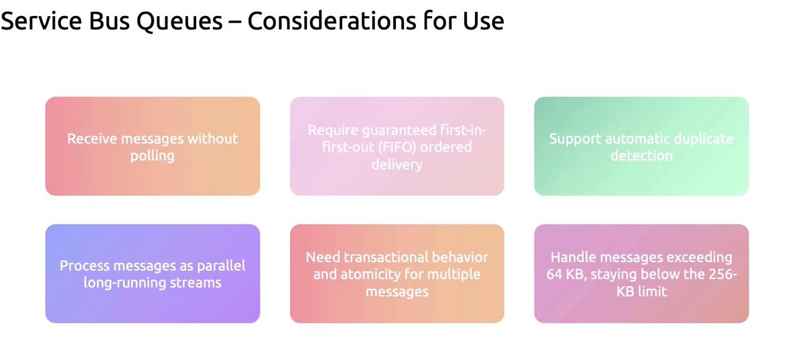
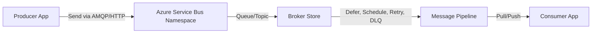
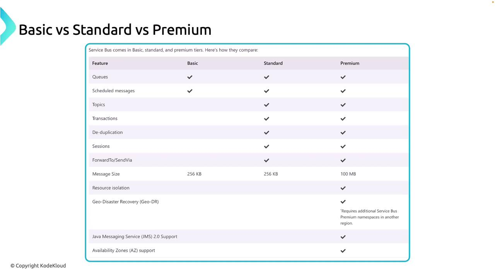

# 📨 **Azure Service Bus**

Azure Service Bus is Microsoft’s **fully managed enterprise message broker**.

- It’s designed for **decoupling, reliability, guaranteed delivery, and ordered messaging** across apps, services, and even organizations.
- Azure Service Bus uses pull-based with long polling (efficient, but not true push).

---

## 🌍 **1. Why Do We Need Service Bus?**

**In distributed systems:**

- Services run on different schedules (not always online).
- Some need guaranteed delivery (financial transactions).
- Some require order preservation (workflow engines).
- Some need retries, dead-lettering, and duplicate detection.

👉 Service Bus is **NOT just a queue**. It’s a **robust messaging fabric** for enterprise-grade integration.

Compare:

- **Event Hub** → Big data, telemetry, firehose streams.
- **Event Grid** → Reactive pub/sub, serverless events.
- **Service Bus** → Enterprise messaging with workflows, transactions, ordering, sessions, retries.

---

## 📌 **Key Considerations for Service Bus Queues**

<div align="center" style="background-color: #ffffffff ;border-radius: 10px;border: 2px solid white">
  
</div>

---

### 1️⃣ **Efficient Message Delivery with Long Polling**

Azure Service Bus uses long polling to efficiently deliver messages to applications. Instead of constantly checking for new messages, clients send a request and wait until a message arrives or the timeout expires.

1. **Client sends a request** to Azure Service Bus asking for a message.
2. **Service Bus holds the request** open (up to a timeout) while waiting for a message to arrive.
3. If a message arrives during that window, **Service Bus immediately delivers it** to the client.
4. If no message arrives, **Service Bus responds with a timeout**, and the client can retry.

> 💡 This mechanism feels like push, but it’s technically a smart pull — reducing resource usage while still delivering messages quickly.

### 2️⃣ **FIFO Delivery**

Messages are processed in a strict First-In-First-Out (FIFO) order—critical for applications demanding sequential operations, such as financial transactions.

### 3️⃣ **Automatic Duplicate Detection**

Duplicate messages are automatically identified and managed, ensuring each message is processed only once. This feature is particularly useful when accuracy is **<u title="مهم">paramount</u>**, such as in inventory management systems.

### 4️⃣ **Parallel Processing**

Service Bus supports parallel processing across multiple receivers, akin to several checkout counters operating simultaneously. This dramatically speeds up message handling.

### 5️⃣ **Transactional Operations**

It supports processing multiple messages as a single transaction. This means that either all operations succeed or none do, similar to atomic transactions in banking systems.

### 6️⃣ **Handling Larger Messages**

With an ability to handle messages up to `256 KB` (and in some cases, exceeding 64 KB), Service Bus queues are well-equipped for larger payloads.

---

## 🏗️ **Core Concepts of Service Bus**

### 🔹 **Queues**

- Store-and-forward mechanism.
- Messages kept until consumed.
- One-to-one communication: **Producer → Queue → Consumer**.

- Supports:

  - **FIFO (First In, First Out)**
  - **Dead-letter queues (DLQ)**
  - **Scheduled messages**
  - **Duplicate detection**

📦 Example: Payment processing system where each transaction must be processed exactly once.

> 🚨 In scenarios with multiple consumers accessing a queue, Azure Service Bus guarantees that `each message is processed only once`, **regardless of the number of receivers** attempting to handle them.

---

### 🔹 **Topics and Subscriptions**

- Implements **publish/subscribe**.
- Producer sends to a **Topic**.
- Consumers attach **Subscriptions** with optional filters.
- Each subscription gets its own copy of the message.

📦 Example: Order service publishes an "Order Placed" message →

- Billing subscription charges payment.
- Inventory subscription updates stock.
- Notification subscription sends email/SMS.

---

### 🔹 **Sessions**

- Used when messages belong to the same **logical workflow**.
- Service Bus ensures all messages in a session are processed by the **same consumer** in order.

📦 Example: Chat app → All messages for **user123** go to the same consumer in sequence.

---

### 🔹 **Dead-letter Queue (DLQ)**

- Each queue/subscription has its own DLQ.
- Messages move to DLQ when:

  - They expire (TTL reached).
  - They’re not processed after retries.
  - They violate size or contract rules.

📦 Example: Badly formatted orders can be sent to DLQ for manual inspection.

---

### 🔹 **Transactions**

- Service Bus supports **transactional messaging**:

  - Send multiple messages atomically.
  - Send + receive in the same transaction.
  - Rollback if failure.

📦 Example: Deduct stock and confirm order in **one atomic operation**.

---

## ⚙️ **Internal Architecture**



---

- **Namespace**: Logical container for queues/topics.
- **Broker Store**: Durable message store (replicated).
- **Transport Protocols**:

  - AMQP 1.0 (primary, reliable, efficient)
  - HTTPS (fallback, less performant)

- **Delivery Guarantees**:

  - **At least once** delivery
  - **Duplicate detection** to approximate **exactly once**

---

## ⚡ **Message Processing Models**

### (a) **Receive and Delete**

- Consumer reads and deletes immediately.
- Faster but risky (if consumer crashes, message lost).

### (b) **Peek-Lock** (✅ Recommended)

- Consumer locks message → processes → completes.
- If crash → lock expires → message redelivered.

---

## 🏷️ **Azure Service Bus tiers**

<div align="center" style="background-color: #ffffffff ;border-radius: 10px;border: 2px solid white">
  
</div>

---

### 🧩 **1. Basic Tier – Lightweight & Cost-Effective**

**Key Features**:

- Simple queues only (no topics or subscriptions)
- Scheduled message delivery
- Max message size: **256 KB**

**Use Case**:

- Ideal for small apps or prototypes
- You just need basic queueing—no advanced routing or transactions
- Example: A simple task queue for background jobs in a web app

**Limitations**:

- No pub-sub model (topics)
- No transactions or sessions
- No resource isolation

---

### ⚙️ **2. Standard Tier – Advanced Messaging Without Isolation**

**Key Features**:

- Supports **queues + topics/subscriptions** (pub-sub model)
- **Transactional messaging** (send/receive in atomic units)
- **Session-based grouping** (FIFO-like behavior)
- **Duplicate detection**
- Max message size: **256 KB**

**Use Case**:

- Medium-complexity apps that need reliable delivery and routing
- Example: A microservice architecture where services publish events to topics and subscribers handle them

**Limitations**:

- Shared infrastructure (no dedicated resources)
- Message size still capped at 256 KB

---

### 🏢 **3. Premium Tier – Enterprise-Grade Performance & Isolation**

**Key Features**:

- **Dedicated resources** (no noisy neighbors)
- **Larger message size**: up to **100 MB**
- **Geo-disaster recovery (GDR)** and **availability zones**
- **JMS support** for Java-based enterprise systems
- Enhanced throughput and latency

**Use Case**:

- Mission-critical systems with high performance and security needs
- Example: Financial transaction systems, healthcare platforms, or large-scale event-driven architectures

**Benefits**:

- Full isolation = predictable performance
- Better disaster recovery and compliance
- Supports hybrid enterprise integrations

---

### 🧠 How to Choose?

| Criteria                                    | Best Tier    |
| ------------------------------------------- | ------------ |
| Budget-sensitive, simple queueing           | **Basic**    |
| Pub-sub, transactions, moderate scale       | **Standard** |
| High throughput, security, enterprise-grade | **Premium**  |

---

## 🚀 **Scaling in Service Bus**

- **Message throughput** depends on:

  - **Premium tier** → dedicated resources, predictable latency.
  - **Partitions** → distribute load across brokers.
  - **Sessions** → parallelism vs. ordering.

- **Auto-scaling consumers** → Add more consumers to process multiple partitions.
- **Load balancing** via competing consumers in the same queue.

---

## 🔒 **Security & Access Control**

Same as Event Hub, Service Bus supports:

1. **Azure RBAC + Managed Identity**

   - Assign roles like:

     - `Azure Service Bus Data Owner`
     - `Azure Service Bus Data Sender`
     - `Azure Service Bus Data Receiver`

2. **Microsoft Identity Platform (OAuth2)**

   - External apps authenticate → token → RBAC check.

3. **SAS Policies**

   - Namespace-level shared keys.
   - Fine-grained access: **Send**, **Listen**, **Manage**.

👉 Best practice: **Managed Identity** for Azure apps, **OAuth2** for external apps, **SAS** only for legacy/IoT.

---

## ✍🏻 **Hands-On with .NET SDK**

### 🔹 Producer (Send messages)

```csharp
using Azure.Messaging.ServiceBus;

string connectionString = "<your_connection_string>";
string queueName = "orders";

await using var client = new ServiceBusClient(connectionString);
ServiceBusSender sender = client.CreateSender(queueName);

// Send a single message
await sender.SendMessageAsync(new ServiceBusMessage("Order123 - Payment Received"));

// Send a batch
using ServiceBusMessageBatch batch = await sender.CreateMessageBatchAsync();
batch.TryAddMessage(new ServiceBusMessage("Order124 - Payment Received"));
batch.TryAddMessage(new ServiceBusMessage("Order125 - Payment Received"));
await sender.SendMessagesAsync(batch);
```

---

### 🔹 Consumer (Receive messages)

```csharp
using Azure.Messaging.ServiceBus;

string connectionString = "<your_connection_string>";
string queueName = "orders";

await using var client = new ServiceBusClient(connectionString);
ServiceBusProcessor processor = client.CreateProcessor(queueName, new ServiceBusProcessorOptions());

processor.ProcessMessageAsync += async args =>
{
    string body = args.Message.Body.ToString();
    Console.WriteLine($"Received: {body}");
    await args.CompleteMessageAsync(args.Message); // marks as processed
};

processor.ProcessErrorAsync += async args =>
{
    Console.WriteLine($"Error: {args.Exception}");
};

await processor.StartProcessingAsync();

// keep app alive
Console.ReadLine();
await processor.StopProcessingAsync();
```

---

## ⚖️ **Service Bus** vs **Event Hub** vs **Event Grid**

| Feature   | Service Bus                      | Event Hub                    | Event Grid              |
| --------- | -------------------------------- | ---------------------------- | ----------------------- |
| Pattern   | Enterprise messaging             | Big data streaming           | Reactive pub/sub        |
| Delivery  | Reliable, ordered, transactional | High-throughput, partitioned | Push-based, serverless  |
| Use Case  | Order workflows, payments        | IoT telemetry, logs          | Azure resource events   |
| Protocols | AMQP, HTTP                       | AMQP, Kafka, HTTP            | HTTP (webhooks)         |
| Retention | Until consumed (TTL)             | Configurable retention       | Short-lived (event TTL) |

---

## ✅ **Best Practices**

- Use **Peek-Lock** mode for reliability.
- Always implement **dead-letter queue** handling.
- Use **duplicate detection** for idempotent apps.
- Separate workloads with **topics + subscriptions**.
- Prefer **Premium tier** for mission-critical apps.
- Secure with **RBAC + Managed Identity**, avoid raw SAS in production.

---

## 🎯 **Conclusion**

Azure Service Bus is the **enterprise-grade backbone for messaging** in Azure. It bridges **microservices, legacy systems, and external apps**, while ensuring **guaranteed delivery, ordering, retries, and resiliency**.

> 💡 If Event Hubs is the **firehose**, and Event Grid is the **doorbell**, then **Service Bus is the trusted post office** — delivering every message safely, in order, with a receipt.
