# 📨 **Azure Service Bus**

Azure Service Bus is Microsoft’s **fully managed enterprise message broker**.

- It’s designed for **decoupling, reliability, guaranteed delivery, and ordered messaging** across apps, services, and even organizations.
- Azure Service Bus uses pull-based with long polling (efficient, but not true push).

---

<div align="center" style="background-color: #ffffffff ;border-radius: 10px;border: 2px solid white">

<div>
  
</div>
<div>
    
</div>
</div>

---

## 🌍 **Why Do We Need Service Bus?**

**In distributed systems:**

- Services run on different schedules (not always online).
- Some need guaranteed delivery (financial transactions).
- Some require order preservation (workflow engines).
- Some need retries, dead-lettering, and duplicate detection.

👉 Service Bus is **NOT just a queue**. It’s a **robust messaging fabric** for enterprise-grade integration.

Compare:

- **Event Hub** → Big data, telemetry, firehose streams.
- **Event Grid** → Reactive pub/sub, serverless events.
- **Service Bus** → Enterprise messaging with workflows, transactions, ordering, sessions, retries.

---

## 🧩 **Core Components**

### 1️⃣ **Queues** (Point-to-Point, FIFO-ish)

- **Definition**: A **queue** is a durable store where messages wait until processed.

- **Architecture**:

  - Backed by **partitioned or non-partitioned storage**.
  - Guarantees **At-Least-Once delivery** (idempotency is your responsibility).
  - Messages are **locked (Peek-Lock)** before processing → prevents multiple consumers from stealing the same message.

- **Key Features**:

  - FIFO **within a partition** (not global, unless sessions are used).
  - Competing consumers pattern: multiple receivers, each processes a unique message.
  - Configurable **Time-To-Live (TTL)**, **Max Delivery Count**, **Duplicate Detection**.

👉 Tech Tip: Good for decoupling producer/consumer, but no built-in broadcast.

---

### 2️⃣ **Topics & Subscriptions** (Pub/Sub with Virtual Queues)

- **Definition**: A **Topic** = publish point; **Subscriptions** = _independent virtual queues_.

- **Architecture**:

  - When a message is published to a topic, it is **fanned out** to each subscription.
  - Each subscription has its **own queue backend** (with TTL, DLQ, etc.).
  - Subscriptions can apply **filters (SQL-like, correlation, boolean expressions)** to only accept certain messages.

- **Key Features**:

  - 1-to-N message delivery.
  - Different consumers get **independent copies** of the message.
  - Filters reduce noise and prevent unnecessary traffic.

👉 Tech Tip: Subscriptions behave like **dedicated queues** → you manage them (DLQ, sessions, TTL, etc.) just like queues.

---

### 4️⃣ **Dead Letter Queue (DLQ)** (Poison Message Handling)

- **Definition**: Every queue/subscription automatically has a **Dead Letter Queue** (virtual subqueue, accessed via `/$DeadLetterQueue`).

- **Architecture**:

  - DLQ is **not a separate entity** you create.
  - Messages land in DLQ when:

    - Exceeded `MaxDeliveryCount` (default 10).
    - TTL expired.
    - Application explicitly dead-letters.

- **Key Features**:

  - DLQ is durable → admins can inspect and replay.
  - Avoids message loss.

👉 Tech Tip: Always monitor DLQs via **Azure Monitor** or log pipelines, or you’ll miss poison messages silently piling up.

---

### 3️⃣ **Sessions** (Message Grouping & FIFO Guarantee)

- **Definition**: A **session** is a logical grouping of related messages inside a queue or subscription.

- **Architecture**:

  - Each message carries a `SessionId`.
  - Broker guarantees strict FIFO delivery per session.
  - When a consumer accepts a session, it **locks all messages for that session** until processing finishes.

- **Key Features**:

  - Enables **stateful processing** (can store session state in memory or use Service Bus session state).
  - Parallelism = session count (not message count).

👉 Tech Tip: Without sessions, ordering is _best effort_. With sessions, you get **per-session FIFO**.

---

### 5️⃣ **Transactions** (Atomic Multi-Message Operations)

- **Definition**: A **transaction** groups multiple Service Bus operations into a single **atomic unit**.

- **Architecture**:

  - Built on **transactional messaging infrastructure** within the broker.
  - Works across **queues and subscriptions** in the same namespace.
  - Operations supported:

    - Send multiple messages.
    - Receive + Complete.
    - Receive + Abandon + Send.

- **Key Features**:

  - ACID-style semantics → either all ops succeed or none.
  - Prevents “orphan messages” when processing involves multiple steps.

👉 Tech Tip: Not distributed (you can’t mix SQL + Service Bus in one transaction unless you wrap it in external coordination).

---

### 🔗 Putting It Together (E-Commerce Example)

- **Queue**: `orders-queue` → ensures each order is processed by exactly one worker.
- **Topic & Subscriptions**: `orders-topic` with:

  - `billing-subscription` → Billing system
  - `email-subscription` → Notification service
  - `analytics-subscription` → BI pipeline

- **DLQ**: If `billing-subscription` can’t parse a message, it ends up in `billing-subscription/$DeadLetterQueue`.
- **Sessions**: All updates for `Order123` share `SessionId=Order123` → guaranteed order lifecycle sequence.
- **Transactions**: Payment processor → receive order, send invoice request, send stock update → all succeed or rollback.

---

## ⚡ **Message Processing Models**

### (a) **Receive and Delete**

- Consumer reads and deletes immediately.
- Faster but risky (if consumer crashes, message lost).

```mermaid
sequenceDiagram
    participant ClientApp as 👨‍💻 Client Application
    participant SBQueue as 📬 Azure Service Bus Queue
    participant CustomApp as 🛠️ Custom Receiver App

    %% Step 1: Client sends message
    ClientApp->>SBQueue: 📤 Send message via AMQP/HTTP

    %% Step 2: Receiver fetches message
    CustomApp->>SBQueue: 🔍 Receive message (ReceiveAndDelete)

    %% Step 3: Message is auto-deleted
    SBQueue-->>CustomApp: 🧾 Return message (already deleted)

    %% Step 4: Receiver processes message
    CustomApp->>CustomApp: 🧮 Parse and handle message
```

<div align="center" >



</div>

---

### (b) **Peek-Lock** (✅ Recommended)

- Consumer locks message → processes → completes.
- If crash → lock expires → message redelivered.

```mermaid
sequenceDiagram
    participant ClientApp as 👨‍💻 Client Application
    participant SBQueue as 📬 Azure Service Bus Queue
    participant CustomApp as 🛠️ Custom Receiver App

    %% Step 1: Client sends message
    ClientApp->>SBQueue: 📤 Send message via AMQP/HTTP

    %% Step 2: Receiver fetches message
    CustomApp->>SBQueue: 🔍 Receive message (PeekLock)

    %% Step 3: Message is locked
    SBQueue-->>CustomApp: 🔒 Return locked message

    %% Step 4: Receiver processes message
    CustomApp->>CustomApp: 🧮 Parse and handle message

    %% Step 5: Receiver completes message
    CustomApp->>SBQueue: ✅ Complete message (delete manually)

    %% Optional: Receiver fails
    CustomApp->>SBQueue: 🔓 Abandon or ☠️ Dead-letter
```

<div align="center">



</div>

---

## 🧬 **Integration With Azure Services**

### 📤 Services That **Send Messages** to Azure Service Bus

These services act as **producers**, pushing messages into queues or topics:

| Service                  | Description                                             | Typical Use Case                            |
| ------------------------ | ------------------------------------------------------- | ------------------------------------------- |
| **Azure Functions**      | Serverless code that sends messages via output bindings | Triggered by HTTP or timers to enqueue work |
| **Azure Logic Apps**     | Low-code workflows with built-in Service Bus connector  | Automate business processes or alerts       |
| **Azure Event Grid**     | Event routing service that can forward to Service Bus   | React to blob uploads, resource changes     |
| **Azure API Management** | Gateway that forwards client requests to Service Bus    | Decouple front-end from backend processing  |
| **Custom Apps (SDKs)**   | Apps using .NET, Node.js, Python, etc.                  | Microservices, backend systems              |
| **Azure Data Factory**   | Data pipelines that send control messages               | Notify downstream systems of job status     |
| **Power Automate**       | Low-code automation tool                                | Triggered by user actions or data changes   |
| **IoT Hub**              | Sends telemetry or alerts to Service Bus                | Device-to-cloud messaging                   |

---

### 📥 Services That **Receive Messages** from Azure Service Bus

These services act as **consumers**, pulling and processing messages:

| Service                       | Description                                      | Typical Use Case                           |
| ----------------------------- | ------------------------------------------------ | ------------------------------------------ |
| **Azure Functions**           | Triggered by new messages in queue/topic         | Real-time processing, serverless workflows |
| **Azure Logic Apps**          | Polls or triggers on new messages                | Business logic, approvals, notifications   |
| **Custom Apps (SDKs)**        | Apps using ServiceBusReceiver or SessionReceiver | Stateful or stateless message handling     |
| **Durable Functions**         | Orchestrates long-running workflows              | Session-based or deferred message handling |
| **Azure Stream Analytics**    | Can ingest messages from Service Bus             | Real-time analytics and dashboards         |
| **Azure Synapse / Data Lake** | Pulls messages for batch processing              | Data warehousing, ETL pipelines            |
| **Azure Monitor / Insights**  | Observes dead-letter queues and failures         | Diagnostics and alerting                   |

---

## 🏷️ **Azure Service Bus tiers**

<div align="center" style="background-color: #ffffffff ;border-radius: 10px;border: 2px solid white">
  
</div>

---

### 🧩 **1. Basic Tier – Lightweight & Cost-Effective**

**Key Features**:

- Simple queues only (no topics or subscriptions)
- Scheduled message delivery
- Max message size: **256 KB**

**Use Case**:

- Ideal for small apps or prototypes
- You just need basic queueing—no advanced routing or transactions
- Example: A simple task queue for background jobs in a web app

**Limitations**:

- No pub-sub model (topics)
- No transactions or sessions
- No resource isolation

---

### ⚙️ **2. Standard Tier – Advanced Messaging Without Isolation**

**Key Features**:

- Supports **queues + topics/subscriptions** (pub-sub model)
- **Transactional messaging** (send/receive in atomic units)
- **Session-based grouping** (FIFO-like behavior)
- **Duplicate detection**
- Max message size: **256 KB**

**Use Case**:

- Medium-complexity apps that need reliable delivery and routing
- Example: A microservice architecture where services publish events to topics and subscribers handle them

**Limitations**:

- Shared infrastructure (no dedicated resources)
- Message size still capped at 256 KB

---

### 🏢 **3. Premium Tier – Enterprise-Grade Performance & Isolation**

**Key Features**:

- **Dedicated resources** (no noisy neighbors)
- **Larger message size**: up to **100 MB**
- **Geo-disaster recovery (GDR)** and **availability zones**
- **JMS support** for Java-based enterprise systems
- Enhanced throughput and latency

**Use Case**:

- Mission-critical systems with high performance and security needs
- Example: Financial transaction systems, healthcare platforms, or large-scale event-driven architectures

**Benefits**:

- Full isolation = predictable performance
- Better disaster recovery and compliance
- Supports hybrid enterprise integrations

---

### 🧠 How to Choose?

| Criteria                                    | Best Tier    |
| ------------------------------------------- | ------------ |
| Budget-sensitive, simple queueing           | **Basic**    |
| Pub-sub, transactions, moderate scale       | **Standard** |
| High throughput, security, enterprise-grade | **Premium**  |

---

## 🚀 **Scaling in Service Bus**

- **Message throughput** depends on:

  - **Premium tier** → dedicated resources, predictable latency.
  - **Partitions** → distribute load across brokers.
  - **Sessions** → parallelism vs. ordering.

- **Auto-scaling consumers** → Add more consumers to process multiple partitions.
- **Load balancing** via competing consumers in the same queue.

---

## 🔒 **Security & Access Control**

Same as Event Hub, Service Bus supports:

1. **Azure RBAC + Managed Identity**

   - Assign roles like:

     - `Azure Service Bus Data Owner`
     - `Azure Service Bus Data Sender`
     - `Azure Service Bus Data Receiver`

2. **Microsoft Identity Platform (OAuth2)**

   - External apps authenticate → token → RBAC check.

3. **SAS Policies**

   - Namespace-level shared keys.
   - Fine-grained access: **Send**, **Listen**, **Manage**.

👉 Best practice: **Managed Identity** for Azure apps, **OAuth2** for external apps, **SAS** only for legacy/IoT.

---

## ✍🏻 **Hands-On with .NET SDK**

### 🔹 Producer (Send messages)

```csharp
using Azure.Messaging.ServiceBus;

string connectionString = "<your_connection_string>";
string queueName = "orders";

await using var client = new ServiceBusClient(connectionString);
ServiceBusSender sender = client.CreateSender(queueName);

// Send a single message
await sender.SendMessageAsync(new ServiceBusMessage("Order123 - Payment Received"));

// Send a batch
using ServiceBusMessageBatch batch = await sender.CreateMessageBatchAsync();
batch.TryAddMessage(new ServiceBusMessage("Order124 - Payment Received"));
batch.TryAddMessage(new ServiceBusMessage("Order125 - Payment Received"));
await sender.SendMessagesAsync(batch);
```

---

### 🔹 Consumer (Receive messages)

```csharp
using Azure.Messaging.ServiceBus;

string connectionString = "<your_connection_string>";
string queueName = "orders";

await using var client = new ServiceBusClient(connectionString);
ServiceBusProcessor processor = client.CreateProcessor(queueName, new ServiceBusProcessorOptions());

processor.ProcessMessageAsync += async args =>
{
    string body = args.Message.Body.ToString();
    Console.WriteLine($"Received: {body}");
    await args.CompleteMessageAsync(args.Message); // marks as processed
};

processor.ProcessErrorAsync += async args =>
{
    Console.WriteLine($"Error: {args.Exception}");
};

await processor.StartProcessingAsync();

// keep app alive
Console.ReadLine();
await processor.StopProcessingAsync();
```

---

## 📌 **Key Considerations for Service Bus Queues**

<div align="center" style="background-color: #ffffffff ;border-radius: 10px;border: 2px solid white">
  
</div>

---

### 1️⃣ **Efficient Message Delivery with Long Polling**

Azure Service Bus uses long polling to efficiently deliver messages to applications. Instead of constantly checking for new messages, clients send a request and wait until a message arrives or the timeout expires.

1. **Client sends a request** to Azure Service Bus asking for a message.
2. **Service Bus holds the request** open (up to a timeout) while waiting for a message to arrive.
3. If a message arrives during that window, **Service Bus immediately delivers it** to the client.
4. If no message arrives, **Service Bus responds with a timeout**, and the client can retry.

> 💡 This mechanism feels like push, but it’s technically a smart pull — reducing resource usage while still delivering messages quickly.

### 2️⃣ **FIFO Delivery**

Messages are processed in a strict First-In-First-Out (FIFO) order—critical for applications demanding sequential operations, such as financial transactions.

### 3️⃣ **Automatic Duplicate Detection**

Duplicate messages are automatically identified and managed, ensuring each message is processed only once. This feature is particularly useful when accuracy is **<u title="مهم">paramount</u>**, such as in inventory management systems.

### 4️⃣ **Parallel Processing**

Service Bus supports parallel processing across multiple receivers, akin to several checkout counters operating simultaneously. This dramatically speeds up message handling.

### 5️⃣ **Transactional Operations**

It supports processing multiple messages as a single transaction. This means that either all operations succeed or none do, similar to atomic transactions in banking systems.

### 6️⃣ **Handling Larger Messages**

With an ability to handle messages up to `256 KB` (and in some cases, exceeding 64 KB), Service Bus queues are well-equipped for larger payloads.

---

## ⚖️ **Service Bus** vs **Event Hub** vs **Event Grid**

| Feature   | Service Bus                      | Event Hub                    | Event Grid              |
| --------- | -------------------------------- | ---------------------------- | ----------------------- |
| Pattern   | Enterprise messaging             | Big data streaming           | Reactive pub/sub        |
| Delivery  | Reliable, ordered, transactional | High-throughput, partitioned | Push-based, serverless  |
| Use Case  | Order workflows, payments        | IoT telemetry, logs          | Azure resource events   |
| Protocols | AMQP, HTTP                       | AMQP, Kafka, HTTP            | HTTP (webhooks)         |
| Retention | Until consumed (TTL)             | Configurable retention       | Short-lived (event TTL) |

---

## ✅ **Best Practices**

- Use **Peek-Lock** mode for reliability.
- Always implement **dead-letter queue** handling.
- Use **duplicate detection** for idempotent apps.
- Separate workloads with **topics + subscriptions**.
- Prefer **Premium tier** for mission-critical apps.
- Secure with **RBAC + Managed Identity**, avoid raw SAS in production.

---

## 🎯 **Conclusion**

- **Queue** = point-to-point, competing consumers.
- **Topic + Subscription** = pub/sub with _virtual queues_.
- **DLQ** = poison-message handling, auto-created subqueue.
- **Session** = per-session FIFO guarantee.
- **Transaction** = ACID atomicity across operations.

---

> 🚨 In scenarios with multiple consumers accessing a queue, Azure Service Bus guarantees that `each message is processed only once`, **regardless of the number of receivers** attempting to handle them.
