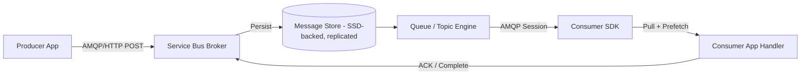

# 🛠️ Azure Service Bus — Internals Explained

## 🌍 1. **Messaging Model**

Azure Service Bus is a **brokered, cloud-native messaging system** designed for **enterprise-grade reliability** and **decoupled communication**.

- **Producers** send messages to a **Service Bus namespace** (the broker).
- **Consumers** connect to the broker to **receive and process messages**.
- The broker handles:

  - ✅ **Durable storage** (SSD-backed, replicated across zones)
  - ✅ **Delivery guarantees** (at-least-once, optionally exactly-once with transactions)
  - ✅ **Ordering** (FIFO via sessions or partitioned queues)
  - ✅ **Advanced features**:
    - Dead-lettering (DLQ)
    - Message deferral
    - Auto-forwarding
    - Duplicate detection
    - Transactions (send + complete atomically)

---

## 🔄 2. Is Service Bus Pull or Push?

👉 **Service Bus is fundamentally pull-based**, but SDKs abstract it to feel push-like.

### 🔍 Pull Model (Protocol Level)

- Consumers establish an **AMQP 1.0 session** with the broker.
- They **request messages** via `receiveMessages()` or a message pump.
- Messages are **locked** (Peek-Lock) or deleted (Receive-and-Delete).
- The consumer must **explicitly complete** the message to remove it.

### 🎭 Push Illusion (SDK Level)

- SDKs (e.g., .NET, Java) offer **event-driven handlers**:
  - You register a callback like `ProcessMessageAsync()`.
  - The SDK runs a **background pull loop** and invokes your handler.
- This feels like push, but under the hood it’s still polling.

✅ This hybrid model offers:

- **Scalable throughput** (AMQP batching + prefetch)
- **Reliable processing** (Peek-Lock control)
- **Consumer independence** (pull at your own pace)

---

## 🏗️ 3. Service Bus Internals Architecture

### 🔍 Breakdown:

- **Message Store**: Durable, geo-redundant, SSD-backed
- **Queue/Topic Engine**: Manages TTL, sessions, FIFO, partitions
- **AMQP Protocol**: Efficient binary transport for both send/receive
- **Lock Manager**: Enforces exclusive access in Peek-Lock mode
- **Checkpointing**: Consumer signals completion via `completeMessage()`

---

## ⚖️ 4. Service Bus vs RabbitMQ

| Feature     | Azure Service Bus                                              | RabbitMQ                              |
| ----------- | -------------------------------------------------------------- | ------------------------------------- |
| Hosting     | Fully managed PaaS                                             | Self-hosted / managed                 |
| Protocols   | AMQP 1.0, HTTPS                                                | AMQP 0.9.1, MQTT, STOMP               |
| Storage     | Durable, replicated Azure storage                              | In-memory (with optional persistence) |
| Delivery    | Pull-based (Peek-Lock or Receive-and-Delete)                   | Push-based by default                 |
| Ordering    | FIFO via sessions or partitions                                | FIFO per queue                        |
| Scaling     | Auto-scaling, partitioned queues, premium namespace            | Manual clustering/sharding            |
| Features    | DLQ, deferral, auto-forward, duplicate detection, transactions | DLX, routing, flexible bindings       |
| Integration | Deep Azure ecosystem (Functions, Logic Apps, Event Grid)       | Plugin-rich, generic ecosystem        |

👉 **Key difference**:

- RabbitMQ **pushes messages** → risk of consumer overload (back-pressure required).
- Service Bus **lets consumers pull** → safer for cloud-scale and fault tolerance.

---

## 🧠 5. Message Flow Example (Peek-Lock Mode)

### 🔒 Peek-Lock Lifecycle

1. **Producer sends message** → Broker stores it durably.
2. **Consumer pulls message** → Broker returns it with a **lock token**.
3. **Consumer processes message**:
   - ✅ `completeMessage()` → Message deleted.
   - ❌ `abandonMessage()` → Lock released, message retried.
   - ☠️ `deadLetterMessage()` → Message moved to DLQ.
4. **If no response** (crash, timeout):
   - Lock expires.
   - Message becomes visible again.
   - Retries continue until `MaxDeliveryCount` is reached.
   - Then → DLQ.

### 🔁 Retry Logic

- Controlled by `MaxDeliveryCount` (default: 10)
- Each abandon or lock expiration increments delivery count
- DLQ is triggered when count exceeds threshold

---

## ⚡ 6. Why Service Bus Internals Matter

- **Resiliency**: Messages survive crashes, restarts, and transient failures.
- **Scalability**: Add consumers freely—Service Bus load balances.
- **Throttling**: Prefetch and credits prevent overload.
- **Observability**: DLQ and metrics help diagnose failures.
- **Atomicity**: Transactions allow send + complete in one operation.

---

## 🎯 Conclusion

- Azure Service Bus is **pull-based at its core**, using **AMQP 1.0** for efficient, reliable transport.
- SDKs abstract this into a **push-like experience**, but you retain full control over message lifecycle.
- Peek-Lock mode gives you **safe, transactional processing** with retry and DLQ support.
- Compared to RabbitMQ, Service Bus is **cloud-native, enterprise-ready**, and deeply integrated with Azure services.
