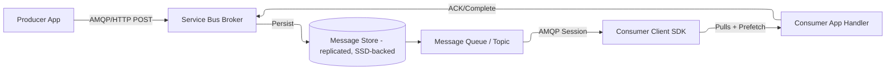

# 🛠️ Azure Service Bus — Internals Explained

## 🌍 1. Messaging Model

At its core, Service Bus is a **brokered messaging system**:

- Producers send messages to a **broker (Service Bus namespace)**.
- Consumers connect to the broker to **receive messages**.
- The broker is responsible for:

  - **Durable storage** of messages (until consumed or TTL expired).
  - **Delivery semantics** (at-least-once).
  - **Ordering guarantees** (sessions, FIFO in a queue).
  - **Advanced features** (DLQ, deferral, transactions).

---

## 🔄 2. Is Service Bus Pull or Push?

👉 **Service Bus is pull-based internally**, but it feels like push when you use the SDK.

- **Pull model (core)**

  - Consumers (apps) establish an **AMQP 1.0 session** with Service Bus.
  - The consumer **requests (prefetches)** messages.
  - Service Bus delivers batches across this AMQP link.
  - The app must call `CompleteMessageAsync` (in Peek-Lock mode) to mark as processed.

- **Push illusion (SDK abstraction)**

  - In .NET/Java SDK, you register a **message handler** (callback).
  - The SDK manages the **pull loop** under the hood, so it feels like push.

✅ This hybrid approach gives you:

- **High throughput** (because pull is efficient over AMQP).
- **Reliability** (you decide when to complete message).
- **Flexibility** (you can scale consumers independently).

---

## 🏗️ 3. Service Bus Internals Architecture

### Breakdown:

- **Message Store** → durable, replicated storage for reliability.
- **Queue/Topic Engine** → organizes messages by FIFO, TTL, sessions, etc.
- **AMQP Protocol** → efficient binary protocol used by both producers and consumers.
- **Lock Manager** → ensures only one consumer processes a message at a time (Peek-Lock).
- **Checkpoint/ACK** → consumer tells broker when processing is complete.

---

## ⚖️ 4. Service Bus vs RabbitMQ (Important!)

| Feature     | Service Bus                                                    | RabbitMQ                                               |
| ----------- | -------------------------------------------------------------- | ------------------------------------------------------ |
| Hosting     | Fully managed PaaS                                             | Self-hosted / managed                                  |
| Protocols   | AMQP 1.0, HTTPS                                                | AMQP 0.9.1, MQTT, STOMP                                |
| Storage     | Durable, replicated in Azure storage                           | In-memory (with persistence option)                    |
| Model       | Pull-based (SDK abstracts as push)                             | Push-based by default                                  |
| Ordering    | Sessions for per-user FIFO                                     | Per-queue FIFO                                         |
| Scaling     | Built-in partitioning, premium namespace                       | Manual clustering/sharding                             |
| Features    | DLQ, deferral, auto-forward, duplicate detection, transactions | DLX (dead letter exchange), routing, flexible bindings |
| Integration | Deep Azure integration (Logic Apps, Functions, Event Grid)     | Generic, plugin-rich ecosystem                         |

👉 **Key difference**:

- RabbitMQ **pushes messages** directly to consumers → can overwhelm them (back-pressure management needed).
- Service Bus **lets consumers pull at their own pace** → avoids overload, better for cloud scale.

---

## 🧠 5. Message Flow Example (Peek-Lock Mode)

1. Producer sends message → Service Bus broker persists it.
2. Consumer asks for messages (pull via AMQP).
3. Broker gives consumer a message with a **lock** (e.g., 30 sec).
4. Consumer processes message.

   - If success → `CompleteMessageAsync()` → broker deletes it.
   - If fail → no ACK → lock expires → message becomes visible again.

5. If retries exceed max → message moves to **DLQ**.

---

## ⚡ 6. Why Service Bus Internals Matter

- **Resiliency**: You can safely crash and restart, messages aren’t lost.
- **Scaling**: Add more consumers in the same group → load balancing.
- **Throttling**: Service Bus controls flow via credits (prefetch), unlike RabbitMQ push floods.
- **Transactions**: Messages and business operations can be atomic.

---

## 🎯 Conclusion

- **Service Bus is pull-based at the protocol level**, but SDK makes it feel push.
- Internally it uses **AMQP 1.0 sessions**, a **durable replicated log store**, and a **lock manager**.
- It’s **not RabbitMQ**: RabbitMQ is push-driven and DIY, Service Bus is pull-driven and cloud-native with advanced enterprise features.
- Think of it as:

  - **RabbitMQ = messaging toolkit**
  - **Service Bus = enterprise message backbone (as-a-service)**

---

👉 Do you want me to **deep dive into "Message Locking and Delivery Guarantees" (Peek-Lock, Receive & Delete, retries, DLQ, duplicate detection)** next? That’s the most critical part of Service Bus internals.
