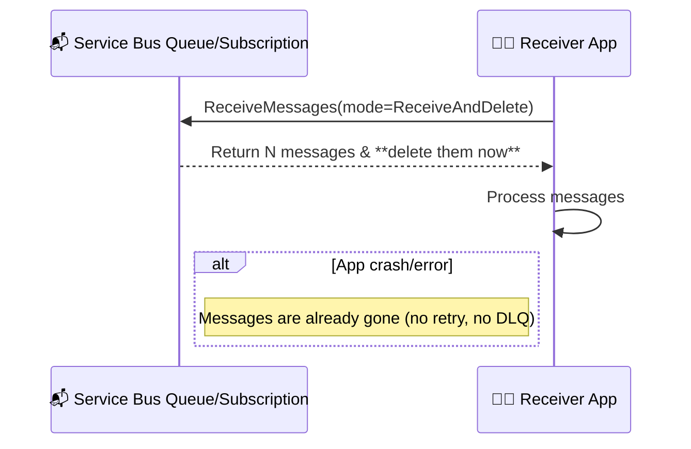

# ⚡️ Receive-and-Delete Model – Azure Service Bus

## 🧠 What Is It?

**Receive-and-Delete** is the _fire-and-forget_ mode of reading messages from Azure Service Bus.
When your consumer receives a message, **Service Bus deletes it immediately** from the queue/subscription — no lock, no settle step.

---

## 🧱 Why (and When) Use It?

- **Ultra-low latency** (no extra round-trip to complete).
- **High throughput** with **prefetch** and **batch receive**.
- Workloads where **occasional loss is acceptable**, e.g.:

  - Real-time metrics/telemetry sampling
  - Cache invalidation hints
  - Best-effort notifications

- Consumers that are **idempotent** and can tolerate gaps.

> ❗️If your app crashes after receive, the message is **lost**. Don’t use this for payments, orders, or anything requiring at-least-once processing. Use **Peek-Lock** there.

---

## 🔁 Lifecycle Overview

1. **Receiver calls `Receive` in Receive-and-Delete mode**
   → Broker returns the message **and removes it** from the queue/subscription immediately.
2. **Your app processes** the payload.

   - If success → done.
   - If failure/crash → message is **not retried** (already deleted).

No `complete()`, `abandon()`, or `deadLetter()` calls exist here.

---

## 🔍 Key Properties & Behavior

| Aspect             | Receive-and-Delete                                    |
| ------------------ | ----------------------------------------------------- |
| Delivery guarantee | **At-most-once** (may drop on failure)                |
| Lock / settle      | **None**                                              |
| DLQ interaction    | **No auto-DLQ** on failure (message already gone)     |
| Throughput         | **Highest** (no settle, pairs well with **prefetch**) |
| Error handling     | App-level only (no broker retry)                      |
| Sessions           | Supported (same risks apply)                          |
| Transactions       | Not applicable for receive settle (no settle stage)   |

---

## 🆚 Quick Compare: Peek-Lock vs Receive-and-Delete

| Feature  | Peek-Lock                                    | Receive-and-Delete            |
| -------- | -------------------------------------------- | ----------------------------- |
| Delivery | **At-least-once**                            | **At-most-once**              |
| On crash | Message reappears (after lock expiry)        | Message lost                  |
| Actions  | `complete`, `abandon`, `deadLetter`, `defer` | none                          |
| DLQ      | Auto after `MaxDeliveryCount`                | No (unless sender puts it)    |
| Latency  | Slightly higher                              | **Lower**                     |
| Use for  | Orders, invoices, workflows                  | Telemetry, non-critical hints |

---

## 📊 Sequence Diagram – Receive-and-Delete

<div align="center" style="background-color: #1d6c76be ;border-radius: 10px;border: 2px solid white">



</div>

---

## 🧪 Code Examples

### ✅ .NET (Azure.Messaging.ServiceBus)

```csharp
using Azure.Messaging.ServiceBus;

string conn = Environment.GetEnvironmentVariable("SB_CONN")!;
string queue = "telemetry";

await using var client = new ServiceBusClient(conn);
var options = new ServiceBusReceiverOptions
{
    ReceiveMode = ServiceBusReceiveMode.ReceiveAndDelete, // 👈
    PrefetchCount = 100
};
ServiceBusReceiver receiver = client.CreateReceiver(queue, options);

// Batch pull
IReadOnlyList<ServiceBusReceivedMessage> batch =
    await receiver.ReceiveMessagesAsync(maxMessages: 50, maxWaitTime: TimeSpan.FromSeconds(2));

foreach (var msg in batch)
{
    // No Complete/Abandon/DeadLetter methods here
    Console.WriteLine($"Got: {msg.MessageId} - {msg.Subject}");
}
```

### ✅ Node.js (npm: @azure/service-bus)

```js
const { ServiceBusClient } = require("@azure/service-bus");
const client = new ServiceBusClient(process.env.SB_CONN);
const receiver = client.createReceiver("telemetry", {
  receiveMode: "receiveAndDelete", // 👈
});

// Streaming (messages are removed as they’re delivered)
const sub = receiver.subscribe({
  processMessage: async (msg) => {
    console.log("Got:", msg.messageId, msg.subject);
    // No settle calls available
  },
  processError: async (err) => console.error("Err:", err),
});

// Later: await sub.close(); await receiver.close(); await client.close();
```

---

## ⚙️ Tuning for Throughput

- **Prefetch**: pull many messages per network call (e.g., 100–1000).
- **Batch receive**: `ReceiveMessagesAsync(maxMessages, maxWaitTime)` to reduce chattiness.
- **Concurrency**:

  - .NET: process batch in `Parallel.ForEachAsync` (but ensure idempotency).
  - Node: limit parallelism with a pool/semaphore.

- **Message size**: keep payload small; offload large payloads to Blob Storage + pointer.

---

## 🧰 Patterns That Fit

- **Event sampling**: drop-tolerant analytics.
- **Warm-cache hints**: if missed, cache will still repopulate.
- **UI notifications**: next push will refresh state anyway.
- **Metrics pipelines**: losing a few points doesn’t break aggregates.

---

## 🛑 Anti-Patterns (Don’t Use Receive-and-Delete)

- Anything requiring **retries** or **exactly-once semantics**.
- **Business-critical** processing (orders, billing, inventory).
- Flows needing **DLQ triage** on poison messages.

---

## 🧯 Failure & Idempotency Tips

- Make handlers **idempotent** (e.g., upsert by `MessageId` or business key).
- Add **client-side retries** for _your_ IO (DB/API) — the broker won’t redeliver.
- Emit **compensating events** for reconciliation if downstream fails.
- Consider **outbox** pattern on the _sender_ if you need stronger guarantees.

---

## 🧪 Sessions & Receive-and-Delete

You can use **session receivers** in `ReceiveAndDelete` too:

- Ordering within a session is preserved (messages are deleted as received).
- If the consumer drops mid-session, **those messages are gone**.
  → Only do this for workloads where loss in a given session is acceptable.

---

## 🏁 TL;DR

- **Receive-and-Delete = at-most-once**: fastest path, no broker retries, no DLQ.
- Great for **best-effort** and **drop-tolerant** streams.
- For anything important, stick with **Peek-Lock**.
