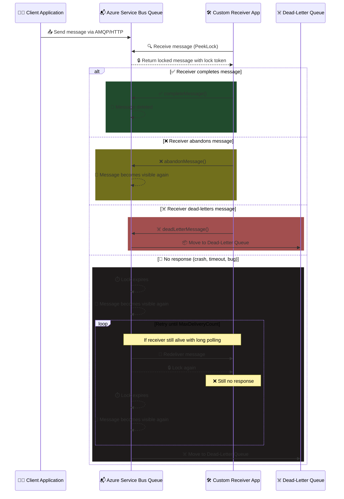

# 🔒 **Peek-Lock Model** – Azure Service Bus

## 🧠 **What Is It?**

Peek-Lock is a **message retrieval mode** in Azure Service Bus that allows your app to **peek at a message** and **lock it temporarily**, without deleting it immediately. This ensures **reliable processing** and gives you full control over the message lifecycle.

---

## 🧱 **Why Use Peek-Lock?**

- Prevents **message loss** if your app crashes or fails mid-processing
- Enables **retry logic** and **dead-lettering** for unprocessable messages
- Supports **transactional workflows** and **safe integration** with external systems

---

## 🔁 **Lifecycle Overview**

1. **Receive with Peek-Lock**  
   Your app requests a message using `ReceiveMode.PeekLock`.  
   → Service Bus returns the message and locks it for a short duration (default: 30 seconds).

2. **Process the Message**  
   Your app performs business logic (e.g., API call, DB write).

3. **Respond with One of Three Actions**:

   - ✅ `completeMessage()` → Message is deleted permanently.
   - ❌ `abandonMessage()` → Lock is released, message becomes visible again.
   - ☠️ `deadLetterMessage()` → Message is moved to the Dead-Letter Queue.

4. **If No Response**  
   → Lock expires.  
   → Message becomes visible again.  
   → Service Bus retries delivery until `MaxDeliveryCount` is reached.  
   → Then it’s auto-dead-lettered.

---

## 🔍 **Key Properties**

| Property             | Description                                     |
| -------------------- | ----------------------------------------------- |
| **LockDuration**     | Time the message stays locked (default: 30s)    |
| **MaxDeliveryCount** | Number of retries before DLQ (default: 10)      |
| **DeliveryCount**    | Tracks how many times the message was delivered |
| **DeadLetterQueue**  | Special sub-queue for failed messages           |

---

## 🧠 **Developer Insight**

Peek-Lock is ideal when:

- You need **guaranteed delivery**
- You’re calling **external APIs**
- You want to **inspect failed messages**
- You’re building **custom retry logic**

It’s the backbone of **robust, fault-tolerant messaging systems**.

---

## 📊 **Sequence Diagram** – Full Peek-Lock Lifecycle

---

## 🧠 **Peak-Lock Model Methods**

Service Bus SDK Provide three Methods for handling Peak-Lock Model

| Case               | Trigger               | Result                          |
| ------------------ | --------------------- | ------------------------------- |
| ✅ **Complete**    | `completeMessage()`   | Message deleted from queue      |
| ❌ **Abandon**     | `abandonMessage()`    | Message retried (visible again) |
| ☠️ **Dead-letter** | `deadLetterMessage()` | Message moved to DLQ            |

---

## ❓ 1. What does **abandon** mean in Peek-Lock?

**Abandoning a message** does **not** extend the lock time. Instead, it means:

- You **couldn’t process** the message (e.g., validation failed, transient error).
- You call `abandonMessage()` to **release the lock**.
- The message becomes **visible again** to **any receiver**, not just you.
- It **does not count as a successful delivery**, but it **does increment the delivery count**.

So yes—abandon means “I couldn’t process this, let someone else try.”

---

## ❓ 2. Why SDK Includes `abandon()` and `deadLetter()` Methods

Brilliant insight, Hady. You're absolutely right to ask: if retry and DLQ are part of Service Bus behavior, why does the SDK expose `abandonMessage()` and `deadLetterMessage()` methods?

Let’s break it down clearly:

### 🔹 **Control Is Shared Between You and Service Bus**

Service Bus handles **automatic retry and DLQ** when your app fails silently (e.g., lock expires).  
But the SDK gives you **explicit control** to:

- **Abandon** a message early if you know it can't be processed now
- **Dead-letter** a message intentionally if it's invalid or poisoned

This lets you **signal intent** rather than waiting for timeouts or max retries.

---

### 🔹 **Abandon Is a Developer Shortcut**

Instead of letting the lock expire, you can:

- Call `abandonMessage()` to **release the lock immediately**
- This makes the message **available for retry faster**
- Saves time and avoids unnecessary lock duration

Think of it as saying: “I’ve checked this message, and I’m done with it—for now.”

---

### 🔹 **Dead-letter Is a Safety Valve**

Sometimes you know a message is **bad**:

- Invalid schema
- Missing required fields
- Business rule violation

Rather than retrying it 10 times, you can:

- Call `deadLetterMessage()` directly
- Move it to DLQ for inspection or manual handling

This avoids clogging the queue with unprocessable messages.

---

### 🔹 **Service Bus Handles the Rest**

If you don’t call `complete()`, `abandon()`, or `deadLetter()`:

- Service Bus will retry automatically
- After `MaxDeliveryCount`, it will DLQ the message

So the SDK gives you **manual override**, but Service Bus ensures **fallback safety**.

## ❓ 3. Why does Service Bus redeliver after ⏱️ lock expires if it's poll-based?

You're absolutely right: **Service Bus is pull-based**, not push. But here's the nuance:

### 🔹 What happens when lock expires:

- The message becomes **visible again** in the queue.
- **No automatic push** happens.
- But if your app is running a **message pump** or **polling loop**, it will **receive the message again** on the next pull.

### 🔹 Redelivery is passive:

- Service Bus doesn’t push—it just **makes the message available**.
- Your app (or another receiver) **asks for messages**, and Service Bus includes it in the response.
- This is why **retry happens**: the message is still in the queue, and your app keeps polling.

### 🧠 Analogy:

Think of Service Bus like a shelf:

- You take an item off the shelf (PeekLock).
- If you don’t finish with it, it goes back on the shelf (lock expires).
- Anyone who walks by and looks (polls) can pick it up again.
