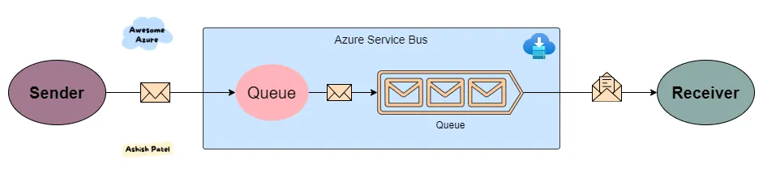
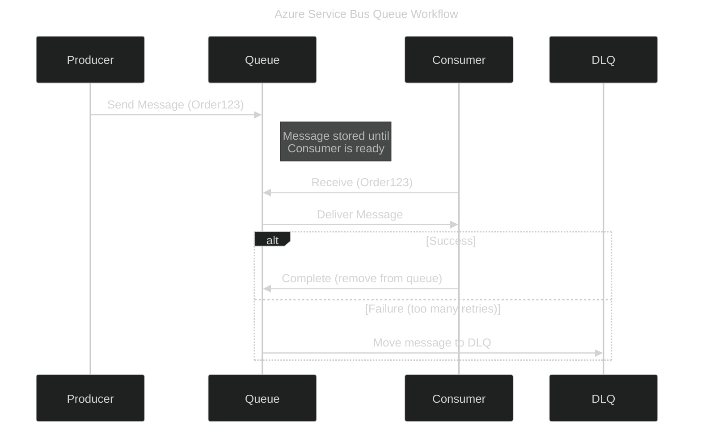

# 📬 **Azure Service Bus Queue**

## 📖 What is Azure Service Bus Queue?

Azure **Service Bus Queue** is a **fully managed enterprise message broker**.
It’s like a **postal mailbox** in the cloud:

- Producers (**senders**) put messages into the queue.
- Consumers (**receivers**) pick messages up later.
- Messages are processed **asynchronously**, in **FIFO order** (First In, First Out).
- Guarantees **at-least-once delivery** and supports advanced messaging patterns.

---

<div align="center" style="background-color: #ffffffff ;border-radius: 10px;border: 2px solid white">
  
</div>

---

## ⚙️ Core Components

1. **Queue** – The container where messages live until consumed.
2. **Message** – The data payload (JSON, text, binary) plus metadata.
3. **Producer (Sender)** – Application/service that sends messages to the queue.
4. **Consumer (Receiver)** – Application/service that processes messages.
5. **Dead Letter Queue (DLQ)** – A special sub-queue where failed/unprocessed messages are moved.

---

## 🔄 Queue Workflow (Simple)

<div align="center">



</div>

---

## 🧰 Features

✅ **Reliable Messaging**

- Message stays until it’s processed successfully.
- Retries are automatic.

✅ **Message TTL (Time-to-Live)**

- Expired messages go to DLQ.

✅ **Peek-Lock** (default receive mode)

- Message is locked while processing → avoids double-processing.
- If consumer crashes → lock expires → message is re-queued.

✅ **Transactions**

- Group multiple operations as one atomic unit.

✅ **Duplicate Detection**

- Queue can detect & ignore duplicate messages.

✅ **Scheduled Delivery**

- Delay message delivery until a specific time.

---

## 💡 Example (C# Code)

### Producer (Send a message)

```csharp
var client = new ServiceBusClient("<connection-string>");
var sender = client.CreateSender("orders-queue");

var message = new ServiceBusMessage("Order123 Created");
await sender.SendMessageAsync(message);
```

### Consumer (Receive & Process)

```csharp
var client = new ServiceBusClient("<connection-string>");
var processor = client.CreateProcessor("orders-queue", new ServiceBusProcessorOptions());

processor.ProcessMessageAsync += async args =>
{
    string body = args.Message.Body.ToString();
    Console.WriteLine($"Received: {body}");
    await args.CompleteMessageAsync(args.Message); // remove from queue
};

processor.ProcessErrorAsync += args =>
{
    Console.WriteLine(args.Exception.ToString());
    return Task.CompletedTask;
};

await processor.StartProcessingAsync();
```

---

## 🕵️ Advanced Concepts

### 1. **Dead Letter Queue (DLQ)**

- Each queue automatically has a **DLQ**.
- Used when:

  - Message TTL expired
  - Delivery count exceeded (too many retries)
  - Message can’t be deserialized

👉 This prevents “poison messages” from blocking processing.

---

### 2. **Message Sessions (Ordered Processing)**

- For workflows (e.g., `Order123` → Created → Packed → Shipped).
- All messages with the same `SessionId` go to **one consumer in order**.

---

### 3. **Partitioned Queues**

- Queue spread across multiple message brokers.
- Enables **higher throughput** and better fault tolerance.

---

### 4. **Geo-Disaster Recovery**

- Alias names allow failover to secondary namespace in another region.

---

## 📊 Service Bus Queue vs Storage Queue

| Feature            | **Service Bus Queue**                 | **Azure Storage Queue**          |
| ------------------ | ------------------------------------- | -------------------------------- |
| Ordering           | FIFO with Sessions                    | Best-effort only                 |
| Delivery Guarantee | At-least-once + Transactions          | At-least-once                    |
| Advanced Features  | DLQ, Dup-detection, TTL, Transactions | Basic enqueue/dequeue            |
| Scale              | Enterprise workflows, financial apps  | Lightweight messaging, IoT, logs |

---

## 🔥 Real-World Use Cases

- **Order Processing** – ensure each order is handled once, in sequence.
- **Payment Processing** – critical message workflows (retry + DLQ).
- **Microservices Communication** – decoupling services reliably.
- **IoT Workflows** – not for raw telemetry (that’s Event Hubs), but for device commands.
- **Job Scheduling** – delayed/scheduled delivery.

---

✅ **In short:**
Azure Service Bus Queue = **Enterprise-grade messaging for workflows & business processes**.
If you need **guaranteed delivery, transactions, ordered processing, and DLQs** → choose **Service Bus Queue**.
