# 🔞 Azure Service Bus – Routing & Correlation Patterns

You can mix and match these patterns using a few **core primitives** in the modern SDK (`Azure.Messaging.ServiceBus`):

- **Queue / Topic + Subscriptions**
- **Message properties**: `MessageId`, `CorrelationId`, `SessionId`, `ReplyTo`, `ReplyToSessionId`, `ApplicationProperties`
- **Sessions** (stateful, FIFO sub-streams)
- **Subscription rules/filters** (SQL or Correlation filters)

Below I’ll explain each pattern the way you’d actually build it today, show the **sequence**, and give **ready-to-drop .NET code** you can adapt.

---

## 1️⃣ Simple Request/Reply 📨➡️📨

**When**: You need a direct answer (e.g., “What’s the current inventory for SKU X?”).  
**How**: Sender puts `CorrelationId` and `ReplyTo` on the message. Responder replies to `ReplyTo` using the **same** `CorrelationId`.

### Sequence (Queue-based)

```mermaid
sequenceDiagram
  autonumber
  actor Client
  participant ReqQueue as 📬 requests queue
  participant InvSvc as ⚙️ Inventory Service
  participant ReplyQueue as 📬 replies queue

  Client->>ReqQueue: Send(request) [CorrelationId=R1, ReplyTo=replies]
  ReqQueue-->>InvSvc: Receive(request)
  InvSvc->>ReplyQueue: Send(reply) [CorrelationId=R1]
  ReplyQueue-->>Client: Receive(reply where CorrelationId=R1)
```



### Key points

- `CorrelationId` ties request ⇄ reply.
- `ReplyTo` tells the service **where** to answer.
- For concurrency, use a **separate reply queue per caller** or a **shared reply queue** and filter by `CorrelationId`.

### .NET (modern SDK) – requester & responder

```csharp
// Requester
var client = new ServiceBusClient(connStr);
var sender = client.CreateSender("requests");
var replyReceiver = client.CreateReceiver("replies"); // shared reply queue

var correlationId = Guid.NewGuid().ToString();
var msg = new ServiceBusMessage(BinaryData.FromString("{\"sku\":\"ABC-123\"}"))
{
    CorrelationId = correlationId,
    ReplyTo = "replies"
};

await sender.SendMessageAsync(msg);

// Wait for the reply that matches our CorrelationId
var reply = await replyReceiver.ReceiveMessageAsync(TimeSpan.FromSeconds(10));
while (reply != null && reply.CorrelationId != correlationId)
{
    await replyReceiver.DeadLetterMessageAsync(reply, "NoMatch", "Not our reply");
    reply = await replyReceiver.ReceiveMessageAsync(TimeSpan.FromSeconds(10));
}

// Responder
var processor = client.CreateProcessor("requests");
processor.ProcessMessageAsync += async args =>
{
    var req = args.Message;
    var inv = new { sku = "ABC-123", quantity = 42 }; // pretend lookup
    var reply = new ServiceBusMessage(BinaryData.FromObjectAsJson(inv))
    {
        CorrelationId = req.CorrelationId
    };
    var replySender = client.CreateSender(req.ReplyTo);
    await replySender.SendMessageAsync(reply);
    await args.CompleteMessageAsync(req);
};
processor.ProcessErrorAsync += e => Task.CompletedTask;
await processor.StartProcessingAsync();
```

> Tip: Instead of dead-lettering non-matching replies, it’s cleaner to **peek-lock and defer** or use **sessions** (next patterns) to avoid cross-talk entirely.

---

## 2️⃣ Multicast Request/Reply 📣➡️👂👂👂

**When**: One request fan-outs to multiple services that each produce a response (e.g., “recalculate price” across tax, discount, shipping services).  
**How**: Publish request to a **Topic**. Each subscriber processes and sends a reply (same `CorrelationId`) to a shared **reply queue**. The caller **aggregates** N replies or times out.

### Sequence (Topic + N replies)

```mermaid
sequenceDiagram
  autonumber
  actor Client
  participant Topic as 📔 requests topic
  participant SubA as 👂 SubA (Tax)
  participant SubB as 👂 SubB (Discount)
  participant SubC as 👂 SubC (Shipping)
  participant ReplyQ as 📬 replies queue

  Client->>Topic: Send(request) [CorrelationId=R2, ReplyTo=replies]
  Topic-->>SubA: Request delivered
  Topic-->>SubB: Request delivered
  Topic-->>SubC: Request delivered
  SubA->>ReplyQ: reply_A [CorrelationId=R2]
  SubB->>ReplyQ: reply_B [CorrelationId=R2]
  SubC->>ReplyQ: reply_C [CorrelationId=R2]
  ReplyQ-->>Client: Collect replies where CorrelationId=R2 (until N or timeout)
```



### Key points

- Use **subscription filters** if only some services should receive certain kinds of requests.
- Aggregator can stop after **expected count** or **timeout**.
- Include `ApplicationProperties["source"]="Tax"` etc. to identify responders.

### .NET – publisher, subscriber, aggregator sketch

```csharp
// Publisher (client)
var correlationId = Guid.NewGuid().ToString();
await topicSender.SendMessageAsync(new ServiceBusMessage(BinaryData.FromString("{}"))
{
    CorrelationId = correlationId,
    ReplyTo = "replies"
});

// Subscriber (e.g., Discount)
processor.ProcessMessageAsync += async args =>
{
    var req = args.Message;
    var result = new { discount = 0.1 };
    var reply = new ServiceBusMessage(BinaryData.FromObjectAsJson(result))
    {
        CorrelationId = req.CorrelationId
    };
    reply.ApplicationProperties["source"] = "discount";
    await client.CreateSender(req.ReplyTo).SendMessageAsync(reply);
    await args.CompleteMessageAsync(req);
};

// Aggregator (client) collects multiple replies
var replies = new List<ServiceBusReceivedMessage>();
var deadline = DateTime.UtcNow.AddSeconds(5);
while (DateTime.UtcNow < deadline)
{
    var m = await replyReceiver.ReceiveMessageAsync(TimeSpan.FromMilliseconds(500));
    if (m == null) continue;
    if (m.CorrelationId == correlationId)
    {
        replies.Add(m);
        await replyReceiver.CompleteMessageAsync(m);
        if (replies.Count == expectedCount) break;
    }
    else
    {
        await replyReceiver.AbandonMessageAsync(m); // or defer
    }
}
```

---

## 3️⃣ Multiplexing 🔀 (multiple streams through one entity)

**When**: You want one queue/subscription to carry **many independent streams** (e.g., order events + shipping events), but keep **per-stream ordering** and isolation.  
**How**: Use **sessions**. Set `SessionId` to the **stream key** (e.g., `order-123`), and process with a **Session Processor**. Each session is an independent FIFO lane.

### Sequence (single queue, many sessions)


### Key points

- **Enable sessions** on the queue/subscription.
- Set `SessionId` per logical stream.
- A pool of processors can scale horizontally; each session is handled by exactly one processor at a time.

### .NET – producer & session processor

```csharp
// Producer: two different streams into the same queue
await sender.SendMessageAsync(new ServiceBusMessage("order-created") { SessionId = "order-123" });
await sender.SendMessageAsync(new ServiceBusMessage("label-printed") { SessionId = "ship-789" });

// Session-aware processor
var sessionProcessor = client.CreateSessionProcessor("multiplexed-queue", new ServiceBusSessionProcessorOptions
{
    AutoCompleteMessages = false,
    MaxConcurrentSessions = 16,
    MaxConcurrentCallsPerSession = 1
});

sessionProcessor.ProcessMessageAsync += async args =>
{
    var body = args.Message.Body.ToString();
    var sid = args.Message.SessionId; // which stream
    // route in code if needed: args.Message.ApplicationProperties["type"]
    await args.CompleteMessageAsync(args.Message);
};
sessionProcessor.ProcessErrorAsync += e => Task.CompletedTask;
await sessionProcessor.StartProcessingAsync();
```

> Bonus: On **topics**, you can also multiplex via **subscription rules** (`CorrelationFilter`, `SqlRuleFilter`) and keep one **consumer** that branches on `ApplicationProperties["type"]`.

---

## 4️⃣ Multiplexed Request/Reply 🧵🧵 ⟷ 🧵🧵 (many replies per request, per stream)

**When**: One request leads to a **multi-step workflow** where **several replies** belong to the **same conversation**, and you’re running many conversations in parallel.
**How**: Combine **Request/Reply** with **Sessions**:

- The original request carries a `SessionId` (conversation key) and `ReplyTo` (a **sessions-enabled** reply queue).
- Downstream steps send **multiple replies** to `ReplyTo` with `ReplyToSessionId` (or set their **message** `SessionId` to the same key when publishing to the reply queue).
- The caller reads **only its session** on the reply queue, getting FIFO multi-replies for that conversation.

### Sequence

```mermaid
sequenceDiagram
  autonumber
  actor Client
  participant ReqQ as 📬 requests Queue (sessions)
  participant Orchestrators as ⚙️ Step Services
  participant RepQ as 📬 replies Queue (sessions)

  Client->>ReqQ: Send(Request) [SessionId=S42, ReplyTo=replies]
  ReqQ-->>Orchestrators: Receive S42 request, start workflow
  Orchestrators->>RepQ: Send(Reply1) [SessionId=S42]
  Orchestrators->>RepQ: Send(Reply2) [SessionId=S42]
  Orchestrators->>RepQ: Send(Reply3) [SessionId=S42]
  RepQ-->>Client: SessionReceiver(S42) reads replies 1..n in order
```



### .NET – requester + multi-step responders + session-based aggregator

```csharp
// Requester: open a unique conversation session id
var sessionId = $"conv-{Guid.NewGuid()}";
await reqSender.SendMessageAsync(new ServiceBusMessage("start-workflow")
{
    SessionId = sessionId,
    ReplyTo = "replies-sessions" // sessions-enabled
});

// Responder steps: publish multiple replies into the same reply session
var stepReply1 = new ServiceBusMessage("step-1-done") { SessionId = sessionId };
await client.CreateSender("replies-sessions").SendMessageAsync(stepReply1);
// ... later ...
var stepReply2 = new ServiceBusMessage("step-2-done") { SessionId = sessionId };
await client.CreateSender("replies-sessions").SendMessageAsync(stepReply2);

// Aggregator: read ONLY this conversation’s stream
var sessionReceiver = await client.AcceptSessionAsync("replies-sessions", sessionId);
var replies = new List<string>();
while (true)
{
    var m = await sessionReceiver.ReceiveMessageAsync(TimeSpan.FromSeconds(2));
    if (m == null) break; // timeout boundary between steps
    replies.Add(m.Body.ToString());
    await sessionReceiver.CompleteMessageAsync(m);
}
// replies now holds all (ordered) replies for S42
```

> Why this rocks: You avoid reply cross-talk entirely and get **clean FIFO** per conversation, even with many concurrent conversations.

---

## 🤔 When to use which? (fast mental model)

- **Simple Request/Reply**: one service answers once, low fan-out, no workflow.
- **Multicast Request/Reply**: one request, **many** responders, caller aggregates results.
- **Multiplexing**: many independent **streams** through one entity, maintain ordering with **sessions**.
- **Multiplexed Request/Reply**: conversations that emit **multiple replies** over time; isolate with **sessions** end-to-end.

---

## ✅ Practical tips & gotchas

- **Set timeouts** and **max expected replies** on aggregators to prevent hangs.
- Prefer **sessions** whenever you need per-conversation ordering or isolation.
- On topics, use **Correlation/SQL filters** to reduce subscriber noise (e.g., `type = 'order'`).
- For resilience, enable **dead-lettering** on expired replies; add `MessageId` to dedupe.
- Scale: increase `MaxConcurrentSessions` and run multiple processors; SB will fairly distribute sessions.
- Security: use **SAS** or **Managed Identity**; scope per-entity rights tightly.
