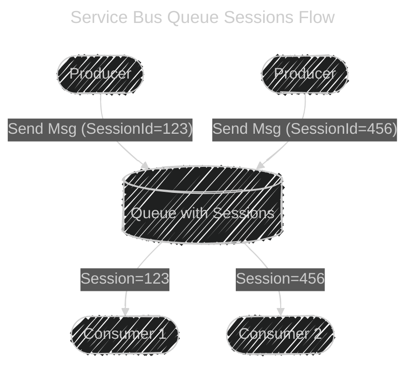

# 🛞 Azure Service Bus Queues with Sessions

## 📃 Basics: Service Bus Queue (without sessions)

- A **Service Bus Queue** is a **first-in, first-out (FIFO)** message broker.
- Producers (senders) push messages into the queue.
- Consumers (receivers) read messages.
- By default:

  - Messages may be processed **out of order** if you scale out consumers.
  - No guarantee that related messages are handled by the same consumer.

👉 Example:
If two customers (`Order123` and `Order456`) place orders, messages may be processed in parallel by different workers — but for a _single order_, events could get mixed up.

---

## ❌ The Problem

Some workflows require **strict ordering** and **stateful processing**:

- Chat conversations → messages must be delivered in order.
- Order processing → all steps of `Order123` must go to the same worker.
- Banking transactions → sequence of debit/credit must be respected.

👉 Standard queues **can’t guarantee this**, because multiple consumers may process in parallel.

---

## ✅ The Solution: Sessions

A **Session** in Service Bus is like a **sub-queue inside a queue**, grouped by a **Session ID**.

- Each message can include a `SessionId` property.
- Messages with the same `SessionId` are:

  - **Grouped together**.
  - Always delivered to the **same session-aware consumer**.
  - Processed **in order of arrival**.

👉 Sessions = **stateful, ordered, isolated processing** on top of the normal queue.

---

<div align="center" style="background-color: #ffffffff ;border-radius: 10px;border: 2px solid white">
  
</div>

---

## ⚙️ How It Works (Workflow)

<div align="center" style="background: #343739ff; border-radius: 20px">


</div>

- Messages tagged with `SessionId=123` all go to **Consumer 1**.
- Messages tagged with `SessionId=456` go to **Consumer 2**.
- No mixing between sessions.

---

## 🧑🏻‍💻 Example (Code)

### Sending messages with `SessionId` (C#)

```csharp
await sender.SendMessageAsync(new ServiceBusMessage("Order Item 1")
{
    SessionId = "Order123"
});

await sender.SendMessageAsync(new ServiceBusMessage("Order Item 2")
{
    SessionId = "Order123"
});

await sender.SendMessageAsync(new ServiceBusMessage("Order Item 3")
{
    SessionId = "Order456"
});
```

### Receiving with sessions (C#)

```csharp
// Accept session "Order123"
ServiceBusSessionReceiver receiver =
    await client.AcceptSessionAsync("queue-name", "Order123");

// Receive messages from this session
ServiceBusReceivedMessage msg = await receiver.ReceiveMessageAsync();
Console.WriteLine($"Received: {msg.Body.ToString()}");
```

👉 Only one consumer can **lock a session at a time**.
👉 Once done, another consumer can pick it up.

---

## ✨ Features of Sessions

- **Ordered delivery**: Messages in a session are processed in FIFO order.
- **Single active consumer**: At any point, one consumer owns the session lock.
- **Stateful**: Session state (like a shopping cart or conversation state) can be stored in the queue itself.
- **Scale-out**: Multiple sessions → distributed across multiple consumers.

---

## 💭 Real Use Cases

1. **E-commerce Orders**

   - All updates for `Order123` (Created → Packed → Shipped) go to the same worker.

2. **Chat Application**

   - Each chat room = one session. Messages delivered in order.

3. **IoT Devices**

   - Each device = one session, ensuring device telemetry arrives in sequence.

4. **Bank Transactions**

   - Session per account, guaranteeing sequential processing of debits and credits.

---

## 🔹 8. Visual Flow (Flowchart)

<div align="center" style="background: #343739ff; border-radius: 20px">



</div>

---

## ✅ Key Takeaways

- A **Service Bus Queue with sessions** is like having **mini-FIFOs inside one queue**.
- Sessions ensure:

  - **Order preservation**
  - **Stateful workflows**
  - **Isolation by SessionId**

- Perfect for **chat apps, order processing, IoT, banking**.
