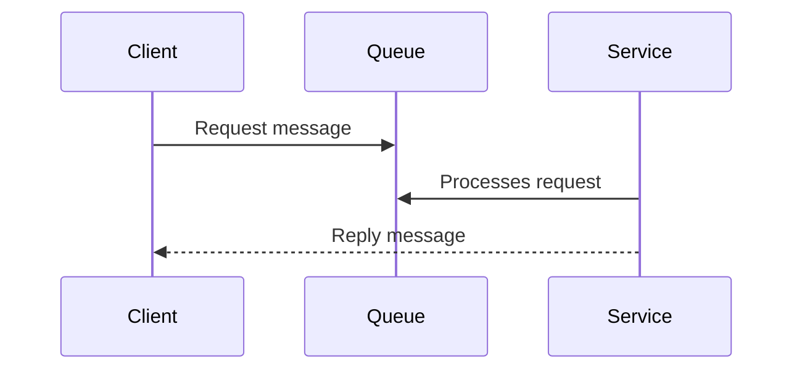
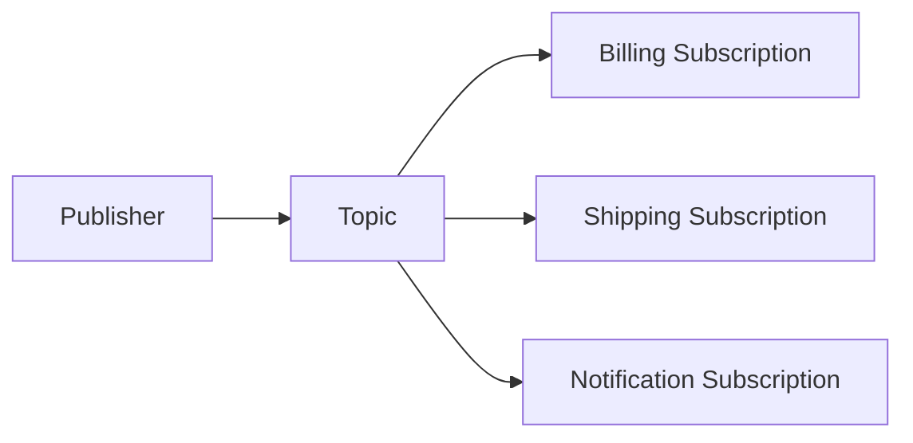

# 📦 Exploring Service Bus Message Payloads & Serialization

Azure Service Bus isn’t just about queues and topics. To really use it well, you need to understand two things:

1. **Message Routing & Correlation Patterns** (how messages flow between publishers and consumers).
2. **Message Payload Serialization** (how your objects are converted into bytes and back).

Both together decide how your distributed system behaves at scale. Let’s dive in 🔍.

---

## 🔀 Message Routing & Correlation Patterns

Service Bus gives you multiple ways to handle messaging flows. These patterns help you structure communications across microservices and applications.

---

  

---

### 1️⃣ Simple Request/Reply

- **Flow:**
  Publisher → Queue → Consumer → Direct Reply
- **Use case:** When you need an immediate response.
- **Example:** Inventory service responds with available stock.

⚡ Key point: Message is consumed **once** by one consumer only.

---

### 2️⃣ Multicast Request/Reply

- **Flow:**
  Publisher → Topic → Multiple Subscriptions → Multiple Consumers
- **Use case:** Notify several systems simultaneously.
- **Example:** _OrderPlaced_ event → Billing, Shipping, Notifications services all get copies.

⚡ Key point:

- Each **subscription** gets its own copy.
- Within a subscription, only **one consumer** processes the message.
- “Once-only” delivery still applies per subscription.

---

### 3️⃣ Multiplexing

- **Flow:**
  Multiple message types in **one queue/subscription**.
- **Use case:** Handle different but related message types in one processing pipeline.
- **Example:** Same queue handles _Order_ and _Shipment_ messages.

👉 Consumers look at **message properties** (e.g., `MessageType`) to decide what to do.

---

### 4️⃣ Multiplexed Request/Reply

- **Flow:**
  One request → multiple replies → correlated back to requester.
- **Use case:** Multi-step workflows where each step emits a different result.
- **Example:** A loan approval process → Credit check, Risk check, Compliance check → each replies separately.

👉 Correlation ID in message properties ensures replies are linked to the right request.

---

✅ **Summary of Patterns**

- **Queue** = Single consumer only.
- **Topic/Subscriptions** = Fanout, each sub gets a copy, still processed once within each.
- **Multiplexing** = Different message types in one stream.
- **Multiplexed Request/Reply** = One request can generate multiple correlated replies.

---

## 🧩 Message Payload Serialization

Now that we know _where_ messages flow, let’s see _how_ they’re packaged.

Serialization is how Service Bus turns objects → bytes → objects again.

---

### 📌 1. Content-Type Property

- Every message has a `ContentType`.
- Example: `application/json`, `application/xml`.
- Helps consumers know how to deserialize.

---

### 📌 2. .NET Framework API (Object Brokered Messages)

- In .NET, you can send objects directly (`Message(myObject)`), and Service Bus handles serialization.
- Great for simplicity in enterprise apps.

---

### 📌 3. SBMP Protocol (Legacy)

- Uses a **binary serializer**.
- Optional: plug in your own **custom serializer**.
- Still supported but not future-proof (AMQP is recommended).

---

### 📌 4. AMQP Protocol

- Industry standard protocol (used in Service Bus, RabbitMQ, etc.).
- Messages become a **byte stream** with properties + body.
- Ensures interoperability with other systems.

---

✅ **Serialization Tip**

- **Use JSON (with AMQP)** for modern apps (easy to debug, cross-platform).
- Use **custom binary serialization** only if performance-critical and tightly coupled.

---

## 🎯 Key Takeaways

- **Routing patterns** let you shape communication flows: simple, multicast, multiplexed.
- **Serialization** decides how your data travels across the wire.
- **Once-only delivery rule still holds**:

  - Queue = one consumer.
  - Topic = one delivery per subscription.

- **Best practice**: Pick the simplest routing pattern + standard serialization (JSON/AMQP) unless your scenario demands more complexity.
