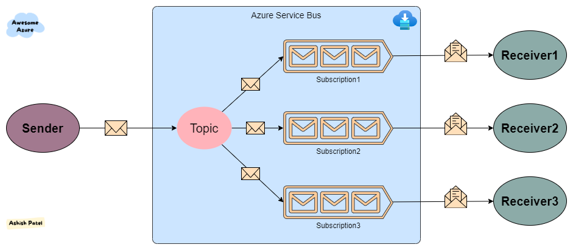
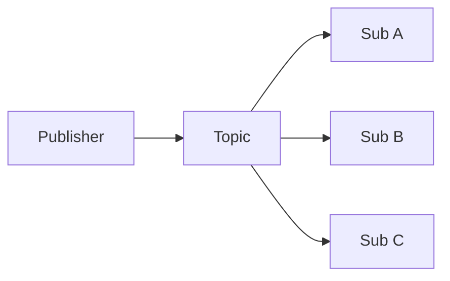
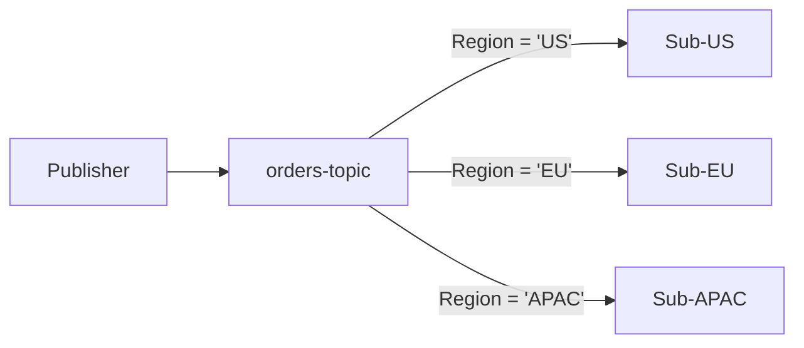
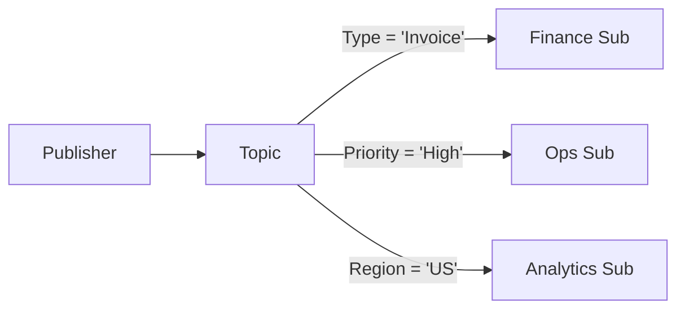

# 📢 **Azure Service Bus Topics, Subscriptions & Filtering**

Azure Service Bus isn’t just about **queues** (1-to-1 communication). Sometimes you need **pub/sub** → one publisher sends, but many subscribers listen, each possibly filtering out what they care about. That’s where **Topics + Subscriptions** shine.

---

<div align="center" >
  
</div>

## 🌍 What is a Topic?

A **Topic** is like a **broadcast channel**:

- **Sender** → publishes a message into a **Topic**.
- **Topic** → makes **copies** of that message into **Subscriptions**.
- **Subscriptions** → act like **virtual queues** (independent message stores).

👉 This means: each subscriber gets its **own copy** of the message. No fighting.

💡 **Key difference from Queue**:

- Queue = 1 message → 1 consumer (point-to-point).
- Topic = 1 message → N consumers (publish-subscribe).

---

## 📥 What is a Subscription?

- A **Subscription** is like a mailbox under a Topic.
- Each subscription has its **own queue-like storage** → messages are durable until consumed.
- Consumers attach to a subscription, not directly to the Topic.

🔑 Features of subscriptions:

- **Independent**: if `sub-A` processes a message, `sub-B` still has its copy.
- **Dead-letter Queue (DLQ)**: each subscription has its own DLQ.
- **Rules & Filters**: define which messages enter the subscription (powerful for selective routing).

---

## 🧾 **Rules, Filters & Actions**

Every subscription has **rules**:

- A rule = **Filter** + (optional) **Action**.
- Rules run **inside the broker** when a message arrives.
- **Default Rule**: Every new subscription has a rule named `$Default` with `TrueFilter` (accepts all messages, no action).

---

## 🔍 **Types of Filters**

### ✅ SQL Filters

- Use SQL-like expressions against message **properties** (not body!).
- Support: `EXISTS`, `IS NULL`, `NOT/AND/OR`, `=`, `<`, `>`, arithmetic, `LIKE`.
- System properties must be prefixed with `sys.`.

**.NET Example:**

```csharp
var adminClient = new ServiceBusAdministrationClient(connectionString);

await adminClient.CreateSubscriptionAsync(
    new CreateSubscriptionOptions(topicName, "BlueSize10Orders"),
    new CreateRuleOptions("BlueSize10Orders",
        new SqlRuleFilter("color = 'blue' AND quantity = 10")));

// SQL filter with action
await adminClient.CreateRuleAsync(topicName, "ColorRed",
    new CreateRuleOptions
    {
        Name = "RedOrdersWithAction",
        Filter = new SqlRuleFilter("user.color = 'red'"),
        Action = new SqlRuleAction("SET quantity = quantity / 2;")
    });
```

---

### ✅ Boolean Filters

- Two simple built-ins:

  - `TrueFilter` → accept all.
  - `FalseFilter` → accept none.

- Internally equivalent to SQL `1=1` or `1=0`.

**.NET Example:**

```csharp
await adminClient.CreateSubscriptionAsync(
    new CreateSubscriptionOptions(topicName, "AllOrders"),
    new CreateRuleOptions("AllOrders", new TrueRuleFilter()));
```

---

### ✅ Correlation Filters

- Efficient, fast, equality-based matching.
- Match on:

  - `CorrelationId` (most common)
  - `ContentType`, `Label`, `MessageId`, `ReplyTo`, `ReplyToSessionId`, `SessionId`, `To`
  - User-defined properties.

- Multiple conditions combine with **AND**.

**.NET Example:**

```csharp
await adminClient.CreateSubscriptionAsync(
    new CreateSubscriptionOptions(topicName, "HighPriorityRedOrders"),
    new CreateRuleOptions("HighPriorityRedOrdersRule",
        new CorrelationRuleFilter
        {
            Subject = "red",
            CorrelationId = "high"
        }));

// More advanced correlation filter with multiple props
var filter = new CorrelationRuleFilter();
filter.Label = "abc";
filter.ReplyTo = "xdeu@hotmail.com";
filter.Properties["prop1"] = "abc";
filter.Properties["prop2"] = "xyz";
```

💡 **Best practice**: Use Correlation Filters whenever possible → more efficient than SQL.

---

## 🛠 **Actions**

- Actions can **add/update/delete properties** before the message lands in the subscription.
- Syntax is SQL-like (`SET`, `REMOVE`).
- Action-applied messages carry `RuleName`.
- Changes are **private to that subscription** (publisher never sees them).

**.NET Example:**

```csharp
await adminClient.CreateRuleAsync(topicName, "ColorRed",
    new CreateRuleOptions
    {
        Name = "RedOrdersWithAction",
        Filter = new SqlRuleFilter("user.color = 'red'"),
        Action = new SqlRuleAction("SET quantity = quantity / 2;")
    });
```

⚠️ **Important caveats**:

- Some system properties behave oddly if modified in actions:

  - `ScheduledEnqueueTime` → ignored in subscription.
  - `MessageId` (with dedup enabled) → no dedup happens.
  - `SessionId` (with partitioning) → can break session routing.

---

## 🔑 **Key points On Rules:**

1. **Multiple rules without actions** → combined as OR.

   - If one message matches 3 rules, it still lands **once** in the subscription.

2. **Rules with actions** → each produces a **separate copy** of the message.

   - Each annotated copy gets a new property: `RuleName`.

3. **Mixed scenario**:

   - If 5 rules match (2 with actions, 3 without), subscription ends up with **3 messages** (2 modified + 1 original).

---

## 📊 **Usage Patterns with Filters**

### 1️⃣ Broadcast Pattern

- Every subscription gets all messages.
- Default scenario (no filters).



---

### 2️⃣ Partitioning Pattern

- Split traffic across subscriptions in a **mutually exclusive** way.
- Example: messages routed by `Region`.



---

### 3️⃣ Routing Pattern

- Like partitioning but **not exclusive**.
- A message can go to **multiple subscriptions** if rules overlap.
- Can chain with **Auto-forwarding** for complex routing graphs.



---

## ✅ **Best Practices**

- ✅ Use **Correlation Filters** first (fast, efficient).
- ⚠️ Use **SQL Filters** only when you need complex conditions.
- 📌 Remember: multiple rules with actions → multiple messages per match.
- 🧹 Remove `$Default` rule if you don’t want _everything_.
- 🔍 Monitor **subscription DLQs** separately.
- 📈 Watch throughput → SQL filters can reduce namespace performance.

---

## 🏁 **Summary**

- **Topic = pub/sub hub**, **Subscription = filtered queue**.
- Filters: **SQL, Boolean, Correlation**.
- Actions: **annotate/modify messages** on subscription entry.
- Multiple rules:

  - Without actions → OR-combined, 1 message max.
  - With actions → copies per action rule.

- Patterns: **Broadcast, Partitioning, Routing**.
- Best practice: prefer **Correlation Filters**, remove `$Default` rule, and use Actions wisely.

---

👉 Do you want me to now **write a full .NET demo project** that:

- Publishes orders with different properties,
- Creates 3 subscriptions (one with SQL filter, one with Correlation filter, one with Action),
- And shows how each subscription gets a different view of the same message?
