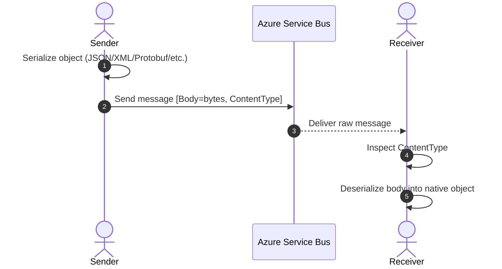

# 🧻 Azure Service Bus – Message Serialization

When you send/receive messages with Service Bus, you’re not just throwing objects across the network. You need to **serialize** (turn objects into a transport-friendly format like JSON, XML, or bytes) and **deserialize** (convert them back at the receiver). Azure Service Bus gives you multiple approaches depending on how modern (or legacy) your app stack is.

---

## 1️⃣ Content-Type Property

**What it is:**

- Every `ServiceBusMessage` has a `ContentType` property.
- This is a **hint** to the consumer: “Hey, the payload inside is JSON/XML/whatever”.

**Why it matters:**

- Without it, the receiver doesn’t know how to interpret the raw bytes.
- You can mix message formats in the same queue, as long as each message carries its own `ContentType`.

**.NET Example:**

```csharp
var msg = new ServiceBusMessage(Encoding.UTF8.GetBytes("{\"sku\":\"ABC-123\"}"))
{
    ContentType = "application/json"
};
await sender.SendMessageAsync(msg);

// Receiver
var received = await receiver.ReceiveMessageAsync();
if (received.ContentType == "application/json")
{
    var body = JsonSerializer.Deserialize<MyObj>(received.Body.ToString());
}
```

---

## 2️⃣ Service-Based API in .NET Framework (Old but comfy)

**What it is:**

- In the **classic .NET Framework Service Bus SDK** (`Microsoft.ServiceBus.Messaging`), you could do this:

```csharp
var order = new Order { Id = 123, Quantity = 2 };
var brokeredMsg = new BrokeredMessage(order);  // automatic serialization
```

- The SDK would **automatically serialize** your object (using DataContractSerializer by default).

**Pros:**

- Super convenient for .NET-only ecosystems.
- No need to manually encode/decode objects.

**Cons:**

- Not interoperable. A Java app or Python app won’t understand the binary serialization.
- This style is **legacy** (modern SDK uses explicit byte/JSON handling).

---

## 3️⃣ Legacy SBMP Protocol Serialization

**What it is:**

- SBMP = **Service Bus Messaging Protocol** (pre-AMQP era).
- Messages serialized using a **binary serializer** (e.g., `DataContractSerializer`, `BinaryFormatter`).

**Customization:**

- You could plug in your **own serializer** if you wanted fine-grained control.
  Example: send compressed Protobuf instead of default binary.

**Why it’s legacy:**

- SBMP is **proprietary**.
- Only worked in Microsoft stack.
- Not recommended for new projects (AMQP is now the standard).

---

## 4️⃣ AMQP Protocol Serialization (the modern hero)

**What it is:**

- AMQP = **Advanced Message Queuing Protocol**, an open, industry-standard binary wire protocol.
- Service Bus serializes messages into a **byte stream**, with properties + body encoded in AMQP sections.

**Why it rocks:**

- **Interoperability**: works with non-.NET stacks (Java, Python, Node.js, Go).
- **Performance**: binary framing, efficient over TCP.
- **Future-proof**: all modern Service Bus SDKs are AMQP-based.

**Message structure in AMQP:**

```ini
+-------------------+
| Header            |
| Properties        |
| ApplicationProps  |
| Body (bytes)      |
+-------------------+
```

**.NET Example:**

```csharp
var msg = new ServiceBusMessage(BinaryData.FromObjectAsJson(order))
{
    ContentType = "application/json"
};
await sender.SendMessageAsync(msg);

// Receiver (any language supporting AMQP)
var order = received.Body.ToObjectFromJson<Order>();
```

---

## Sequence: End-to-End Serialization Flow



---

## ⚖️ Quick Comparison Table

| Method                          | Era              | Format                          | Interoperable? | Status      |
| ------------------------------- | ---------------- | ------------------------------- | -------------- | ----------- |
| **Content-Type Property**       | Always           | JSON, XML, custom               | ✅ Yes         | Recommended |
| **Service-Based API (.NET)**    | Old SDK          | Binary (DataContractSerializer) | ❌ No          | Legacy use  |
| **SBMP Protocol Serialization** | Legacy           | Proprietary binary              | ❌ No          | Deprecated  |
| **AMQP Protocol Serialization** | Modern (default) | AMQP binary frame               | ✅ Yes         | Standard    |

---

## 💡 Best Practices Today

1. **Always set `ContentType`** → `"application/json"` is the safe standard.
2. **Use AMQP protocol** → all modern SDKs default to this.
3. **Prefer JSON or Protobuf** for cross-platform workflows.
4. **Avoid legacy SBMP & .NET auto-binary** unless maintaining old apps.
5. **Keep contracts versioned** → changes in JSON schema should be backward compatible.
