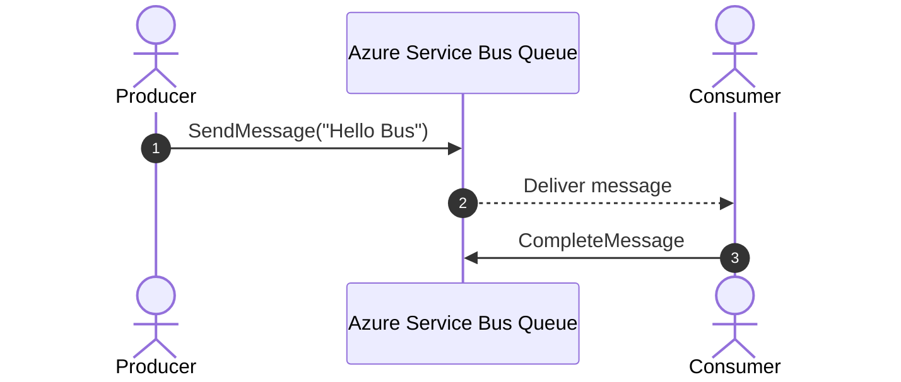

# 📬 Setting Up Azure Service Bus Queue

Azure Service Bus Queue = managed message broker → **decouples sender & receiver**, stores messages durably, supports retries, dead-lettering, and ordering.

We’ll go through:

1. 🔧 **Setup in Azure Portal**
2. 💻 **Setup with Azure CLI (Bash)**
3. 🟦 **Mini usage with .NET SDK**

---

## 1) 🔧 Setup via Azure Portal

### Step 1: Create a Service Bus Namespace

- Go to [Azure Portal](https://portal.azure.com).
- **Search** → _Service Bus_ → _Create_.
- Fill:

  - **Subscription**: choose your subscription.
  - **Resource group**: create new or use existing.
  - **Namespace name**: globally unique (e.g., `my-sb-namespace`).
  - **Pricing tier**: _Basic_, _Standard_, _Premium_.

    - Use _Standard_ or _Premium_ if you need topics/sessions.

### Step 2: Create a Queue inside the Namespace

- Open your namespace → **Queues** → _+ Queue_.
- Give it a name: `orders`.
- Configure options (defaults are fine for start):

  - **Max size**: 1 GB / 5 GB.
  - **Partitioning**: Off (unless scaling needed).
  - **Sessions**: On if you need per-conversation ordering.
  - **Dead-lettering**: Enabled by default.

👉 Done. You now have a queue named `orders`.

---

## 2) 💻 Setup via Bash (Azure CLI)

First, make sure you are logged in:

```bash
az login
```

### Step 1: Create a Resource Group

```bash
az group create --name my-rg --location eastus
```

### Step 2: Create a Service Bus Namespace

```bash
az servicebus namespace create \
  --resource-group my-rg \
  --name my-sb-namespace123 \
  --location eastus \
  --sku Standard
```

### Step 3: Create a Queue

```bash
az servicebus queue create \
  --resource-group my-rg \
  --namespace-name my-sb-namespace123 \
  --name orders
```

### Step 4: Get Connection String (for SDK use)

```bash
az servicebus namespace authorization-rule keys list \
  --resource-group my-rg \
  --namespace-name my-sb-namespace123 \
  --name RootManageSharedAccessKey \
  --query primaryConnectionString \
  --output tsv
```

Copy the connection string → will look like:

```ini
Endpoint=sb://my-sb-namespace123.servicebus.windows.net/;SharedAccessKeyName=RootManageSharedAccessKey;SharedAccessKey=XXXXX
```

---

## 3) 🟦 Mini Usage with .NET SDK

Install package:

```bash
dotnet add package Azure.Messaging.ServiceBus
```

### Producer: Send a message

```csharp
using Azure.Messaging.ServiceBus;

string connectionString = "<YOUR-CONN-STRING>";
string queueName = "orders";

await using var client = new ServiceBusClient(connectionString);
ServiceBusSender sender = client.CreateSender(queueName);

var message = new ServiceBusMessage("Hello, Azure Service Bus!");
await sender.SendMessageAsync(message);

Console.WriteLine("✅ Message sent!");
```

### Consumer: Receive a message

```csharp
ServiceBusReceiver receiver = client.CreateReceiver(queueName);

ServiceBusReceivedMessage received = await receiver.ReceiveMessageAsync();

Console.WriteLine($"📨 Received: {received.Body.ToString()}");

await receiver.CompleteMessageAsync(received); // mark as processed
```

---

## 📊 Sequence Overview



---

## ⚡ Best Practices

- **Use `ServiceBusProcessor`** for background event-driven consumption (instead of manual receive).
- **Enable sessions** if you need strict ordering per key.
- **Dead-letter queue (DLQ)** is automatic → always monitor it.
- Don’t hardcode secrets → use **Azure Managed Identity** with RBAC.

---

👉 Do you want me to extend the **.NET demo** into a **full working producer + processor example** (with event handlers, concurrency, and error handling), or keep this minimal “send/receive once” snippet?
