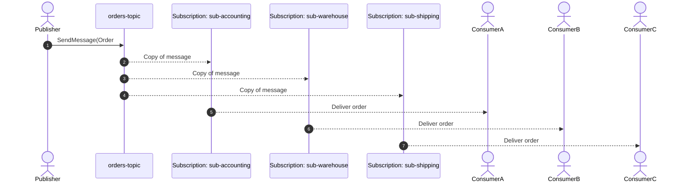

# 📢 Setting Up Azure Service Bus Topic

A **queue** is point-to-point (1 sender → 1 consumer group), while a **topic** gives you pub/sub (1 sender → many subscribers).

I’ll follow the same flow:

1. 🔧 **Setup in Azure Portal**
2. 💻 **Setup with Bash (Azure CLI)**
3. 🟦 **Mini usage with .NET SDK**
4. 📊 **Visual sequence**

---

## 1. 🔧 Setup via Azure Portal

### Step 1: Create a Service Bus Namespace

- Go to [Azure Portal](https://portal.azure.com).
- **Search** → _Service Bus_ → _Create_.
- Fill:

  - **Subscription**: choose your subscription.
  - **Resource group**: create new or use existing.
  - **Namespace name**: globally unique (e.g., `my-sb-namespace`).
  - **Pricing tier**: _Basic_, _Standard_, _Premium_.

    - Use _Standard_ or _Premium_.

### Step 2: Create a Topic

- In your namespace → **Topics** → _+ Topic_.
- Name it: `orders-topic`.
- Leave defaults unless you want size/session tweaks.

### Step 3: Create Subscriptions

- Open `orders-topic` → **Subscriptions** → _+ Subscription_.
- Add:

  - `sub-accounting` (for finance team).
  - `sub-warehouse` (for inventory).
  - `sub-shipping` (for logistics).

- Each subscription is like its own **virtual queue** that gets a copy of every published message.
- Optionally: add **filters** (SQL or correlation rules) so each subscription only gets what it cares about.

---

## 2. 💻 Setup via Bash (Azure CLI)

### Step 1: Create Namespace (if not already)

```bash
az servicebus namespace create \
  --resource-group my-rg \
  --name my-sb-namespace123 \
  --location eastus \
  --sku Standard
```

### Step 2: Create Topic

```bash
az servicebus topic create \
  --resource-group my-rg \
  --namespace-name my-sb-namespace123 \
  --name orders-topic
```

### Step 3: Create Subscriptions

```bash
az servicebus topic subscription create \
  --resource-group my-rg \
  --namespace-name my-sb-namespace123 \
  --topic-name orders-topic \
  --name sub-accounting

az servicebus topic subscription create \
  --resource-group my-rg \
  --namespace-name my-sb-namespace123 \
  --topic-name orders-topic \
  --name sub-warehouse

az servicebus topic subscription create \
  --resource-group my-rg \
  --namespace-name my-sb-namespace123 \
  --topic-name orders-topic \
  --name sub-shipping
```

---

## 3. 🟦 Mini Usage with .NET SDK

Install SDK:

```bash
dotnet add package Azure.Messaging.ServiceBus
```

### Producer: Publish a message to the Topic

```csharp
using Azure.Messaging.ServiceBus;

string connStr = "<YOUR-CONN-STRING>";
string topicName = "orders-topic";

await using var client = new ServiceBusClient(connStr);
ServiceBusSender sender = client.CreateSender(topicName);

var order = new { Id = 101, Item = "Laptop", Quantity = 2 };
var message = new ServiceBusMessage(BinaryData.FromObjectAsJson(order))
{
    ContentType = "application/json"
};

await sender.SendMessageAsync(message);

Console.WriteLine("📢 Published order to topic!");
```

### Consumer: Receive from a Subscription

```csharp
string subscriptionName = "sub-warehouse"; // choose any

ServiceBusReceiver receiver = client.CreateReceiver(topicName, subscriptionName);

ServiceBusReceivedMessage received = await receiver.ReceiveMessageAsync();

Console.WriteLine($"📦 {subscriptionName} got: {received.Body}");

await receiver.CompleteMessageAsync(received);
```

👉 If you want event-driven style, use `ServiceBusProcessor` with `topicName` + `subscriptionName`.

---

## 4) 📊 Visual Sequence



---

## ⚡ Best Practices for Topics

- Use **subscriptions with filters** (e.g., only `Region = 'US'`) to avoid unnecessary processing.
- Each subscription has its **own DLQ** → monitor separately.
- **Sessions** can be enabled on subscriptions if you need per-order FIFO inside each subscriber.
- Use **ServiceBusProcessor** for production-grade consumers (auto concurrency + error handling).

---

✅ Now you’ve got:

- **Portal steps**
- **Bash steps**
- **.NET mini usage**
- **Sequence diagram**

---

👉 Do you want me to extend the .NET demo into a **multi-subscriber simulation** (three processors running at once, each subscription printing its own copy of the order), so you can see pub/sub fan-out in action?
