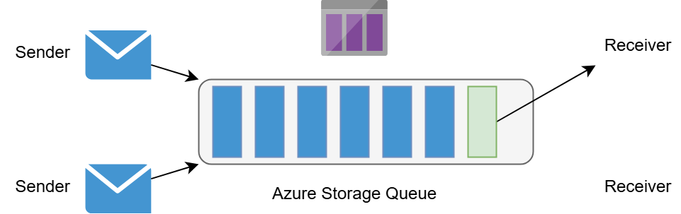

# 📦 Azure Queue Storage

Azure Queue Storage is a **lightweight, scalable messaging service** within the Azure Storage platform.
It is designed for **asynchronous communication** between application components, allowing you to **decouple producers and consumers**. This makes your system more **resilient, scalable, and maintainable**.

---

<div align="center" style="background-color: #ffffffff ;border-radius: 10px;border: 2px solid white">
  
</div>

---

## 🌍 URL Format & Storage Structure

Each queue in Azure Queue Storage has a globally accessible endpoint:

```ini
https://<storageAccountName>.queue.core.windows.net/<queueName>
```

- `storageAccountName` → your Azure Storage account (the **root namespace** & security boundary).
- `queueName` → the unique name of your queue.

👉 Similar to Blob Storage URLs, but using **`queue`** instead of `blob`.

---

## 📋 Queues and Messages

- A **storage account** can contain **multiple queues**.
- A **queue** contains an **ordered list of messages**.
- A **message**:

  - Max size **64 KB** (Base64 encoded).
  - Can hold text, JSON, or XML.
  - Each message has a **Time-to-Live (TTL)** (default 7 days, customizable).

- Queues **approximate FIFO ordering** (not strict under concurrency).

### 🔄 Visibility Timeout

When a consumer retrieves a message:

1. Message becomes **invisible** for `visibilityTimeout` (default 30s).
2. Consumer **processes** it.
3. If successful → consumer **deletes** it.
4. If not deleted before timeout → message **reappears** in the queue for another consumer.

This ensures **at-least-once delivery** ✅.

---

## 📊 Example Scenario

Imagine a storage account called **MyAccount** with two queues:

- `images-to-download` → holds URLs for images pending download.
- `images-to-resize` → holds references to images awaiting processing.

📌 Producers add work items, consumers (background apps, VMs, Functions) pick them up.
This pattern decouples workloads and allows elastic scaling.

---

## ⚡ Key Features

- **Durability**: Messages stored redundantly in Azure Storage.
- **Simplicity**: Easy to use, no advanced config.
- **Scalability**: Millions of messages per queue.
- **Limitations**:

  - Max message size: **64 KB** (workaround is to store larger data in Blob Storage & put reference in queue).
  - Max TTL: **7 days**.
  - No advanced messaging (like transactions, duplicate detection, sessions).

---

## 💻 Using the .NET SDK

### Install package

```bash
dotnet add package Azure.Storage.Queues
```

### Create queue & send messages

```csharp
using Azure.Storage.Queues;

var queueClient = new QueueClient("<connection_string>", "images-to-download");
await queueClient.CreateIfNotExistsAsync();

// Send message
await queueClient.SendMessageAsync("https://example.com/image1.jpg");
```

### Receive & process messages

```csharp
var response = await queueClient.ReceiveMessageAsync();

if (response.Value != null)
{
    Console.WriteLine($"📩 Received: {response.Value.MessageText}");

    // Simulate processing...
    await Task.Delay(1000);

    // Delete after processing
    await queueClient.DeleteMessageAsync(response.Value.MessageId, response.Value.PopReceipt);
}
```

---

## 💻 Hands-On Example

### 1. Create Queue in Portal

1. Go to **Azure Portal** → Storage Account.
2. Under **Data Storage** → Queues → **+ Queue**.

   - Name: `myqueue`.

---

### 2. Install SDK

```bash
dotnet add package Azure.Storage.Queues
```

---

### 3. Producer Code (Send Messages)

```csharp
using Azure.Storage.Queues;
using Azure.Storage.Queues.Models;
using System;
using System.Threading.Tasks;

class Program
{
    private const string connectionString = "<YOUR_STORAGE_CONNECTION_STRING>";
    private const string queueName = "myqueue";

    static async Task Main()
    {
        // Create client
        QueueClient queueClient = new QueueClient(connectionString, queueName);
        await queueClient.CreateIfNotExistsAsync();

        // Send message
        await queueClient.SendMessageAsync("Hello Queue Storage!");
        Console.WriteLine("✅ Sent message");

        // Send batch
        for (int i = 1; i <= 3; i++)
        {
            await queueClient.SendMessageAsync($"Order #{i}");
            Console.WriteLine($"✅ Sent: Order #{i}");
        }
    }
}
```

---

### 4. Consumer Code (Read & Process)

```csharp
using Azure.Storage.Queues;
using System;
using System.Threading.Tasks;

class Consumer
{
    private const string connectionString = "<YOUR_STORAGE_CONNECTION_STRING>";
    private const string queueName = "myqueue";

    static async Task Main()
    {
        QueueClient queueClient = new QueueClient(connectionString, queueName);

        // Receive message (default: 1 message)
        var response = await queueClient.ReceiveMessageAsync();

        if (response.Value != null)
        {
            string messageText = response.Value.MessageText;
            Console.WriteLine($"📩 Received: {messageText}");

            // Simulate work
            await Task.Delay(500);

            // Delete to confirm processing
            await queueClient.DeleteMessageAsync(response.Value.MessageId, response.Value.PopReceipt);
            Console.WriteLine("🗑️ Deleted after processing");
        }
        else
        {
            Console.WriteLine("No messages in queue");
        }
    }
}
```

---

## ⚖️ Service Bus Queue vs Queue Storage

| Feature            | Queue Storage | Service Bus Queue                   |
| ------------------ | ------------- | ----------------------------------- |
| Max Message Size   | 64 KB         | 256 KB (Std), 1 MB (Premium)        |
| FIFO               | Approximate   | Strict (with sessions)              |
| Delivery Guarantee | At-least-once | At-least-once + duplicate detection |
| Advanced Features  | ❌ None       | ✅ Sessions, DLQ, transactions      |
| Cost               | Low           | Higher                              |
| Best Use           | Simple jobs   | Enterprise workflows                |

---

## ❓ Can Multiple Consumers Process the Same Message?

👉 **Normally: No**. Azure Queue Storage is designed so **only one consumer processes a message** at a time:

- Once a consumer retrieves a message, it becomes **invisible** for the `visibilityTimeout`.
- No other consumer can see it during that window.
- If the consumer **deletes** it, the message is gone.

👉 **But sometimes: Yes**, multiple consumers may **end up processing the same message**, but only under specific conditions:

1. **Consumer fails before deleting** → The message becomes visible again after the visibility timeout → another consumer picks it up.

   - ✅ Ensures fault tolerance.
   - ❌ Can cause **duplicate processing** (so your app must be **idempotent**).

2. **Very short visibility timeout** compared to processing time → message reappears before being deleted.
3. **Network issues or crashes** after processing but before delete → duplicates again.

💡 That’s why **Queue Storage guarantees at-least-once delivery**, not exactly-once.
Developers must **design consumers to handle duplicates** gracefully.

---

## 🎯 Summary

Azure Queue Storage is your **lightweight, cloud-native queueing system**.

- It’s **cheap, simple, and reliable**.
- **Pull-based** message retrieval with visibility timeout.
- Great for **basic async workflows**.
- For complex scenarios → use **Service Bus** instead.
