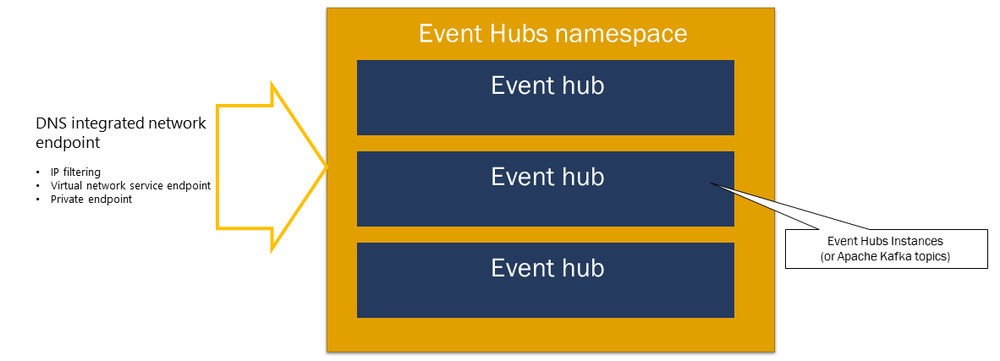
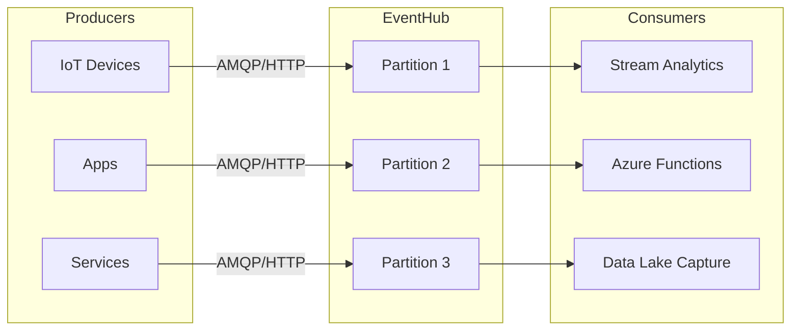

# ⚡ Azure Event Hubs – The Big Data Ingest Highway

[Features and terminology in Azure Event Hubs](https://learn.microsoft.com/en-us/azure/event-hubs/event-hubs-features)

## 📖 Official Definition

> **Azure Event Hubs is a big data streaming platform and event ingestion service capable of receiving and processing millions of events per second.**
> It provides a **durable buffer** for event data and enables **decoupling** between event producers and consumers.

---

<div align="center" style="background-color: #ffffffff ;border-radius: 10px;border: 2px solid white">
  
</div>

---

It’s designed to **ingest millions of events per second** and make them available for processing in real time or for batch analytics later.

It’s **not just a queue**. It’s a **big data streaming platform** that fits between producers (apps, IoT devices, services) and consumers (analytics engines, storage, real-time dashboards).

---

## 🔑 Key Concepts

### 1. **📌 Event Producers**

Anything that sends data into Event Hubs:

- 🚗 IoT devices
- 📱 Applications
- ⚙️ Microservices
- 🌨️ Cloud services (like Azure Functions, App Services)

👉 Producers send events using **AMQP 1.0 protocol** or **HTTPS**.

---

### 2. **📌 Event Hub Namespace**

- It is a management container for event hubs (or topics, in Kafka <u title="لغة">parlance</u>).

- It provides DNS-integrated network endpoints and a range of access control and network integration management features such as
  - IP filtering,
  - virtual network service endpoint, and
  - Private Link.

<div align="left">
  
</div>

### 3. **📌 Event Hub**

- the actual ingestion pipe where producers send data.

---

### 4. **📌 Partitions**

Think of them as **lanes on a highway**.

- Events are distributed across partitions.
- Consumers read from partitions independently.
- Partition count is **fixed when you create an Event Hub** <u> _(cannot change later)_ </u>.

<div align="left">
  
</div>

---

### 5. **📌 Event Consumers**

Anything that reads events:

- Azure Stream Analytics
- Azure Functions
- Apache Spark, Flink, Kafka
- Custom apps using SDKs

Consumers use the **Consumer Group** concept (explained below).

---

### 6. **📌 Consumer Groups**

- A **view of the event stream** for independent readers.
- Each consumer group has its **own offset (checkpoint)** so multiple apps can read the same stream **independently**.
- Example:

  - **Consumer Group A** → pushes to Power BI dashboard
  - **Consumer Group B** → stores raw events in Data Lake

---

### 7. **📌 Capture**

- Built-in feature to **automatically push events to Azure Storage or Data Lake** in AVRO format.
- Useful for archiving or batch analytics.

---

## 🔍 Event Flow

<div align="center" style="background-color: #3f4051ff ;border-radius: 10px;border: 2px solid white">



</div>

---

## 🧩 Event Hub vs Event Grid vs Service Bus

| Feature   | **Event Grid**                            | **Event Hub**                                | **Service Bus**                           |
| --------- | ----------------------------------------- | -------------------------------------------- | ----------------------------------------- |
| Purpose   | Reactive **eventing** (serverless, light) | High-scale **data ingestion**                | Enterprise **messaging** (queues, topics) |
| Scale     | 100s–1000s events/sec                     | **Millions/sec**                             | 1000s/sec                                 |
| Use Case  | Blob created → notify Function            | IoT telemetry, logs, analytics               | Order processing, workflows               |
| Retention | 24h (default, up to 7 days)               | 1–7 days (default), extended via **Capture** | Until processed (FIFO)                    |

👉 Easy memory trick:

- **Event Grid** = “Notification system” (small, push style).
- **Event Hub** = “Big data pipeline” (firehose).
- **Service Bus** = “Business workflow messaging”.

---

## 🔐 Security

- **Shared Access Signatures (SAS)** keys
- **Managed Identities (MSI)**
- **RBAC roles** (like `Azure Event Hubs Data Sender` and `Data Receiver`)

---

## 🛠️ Example: Hands-On with CLI

### Create an Event Hub Namespace + Hub

```bash
# Variables
rg="myResourceGroup"
ns="myeventhubns"
eh="myeventhub"

# Create namespace
az eventhub namespace create \
  --resource-group $rg \
  --name $ns \
  --location eastus

# Create event hub with 4 partitions
az eventhub eventhub create \
  --name $eh \
  --resource-group $rg \
  --namespace-name $ns \
  --partition-count 4 \
  --message-retention 3
```

---

### Send an Event

```bash
az eventhub eventhub send \
  --name $eh \
  --namespace-name $ns \
  --resource-group $rg \
  --body "Hello Event Hub!"
```

---

### Receive Events

Using **.NET SDK**:

```csharp
var consumer = new EventHubConsumerClient(
    EventHubConsumerClient.DefaultConsumerGroupName,
    connectionString,
    eventHubName);

await foreach (PartitionEvent partitionEvent in consumer.ReadEventsAsync())
{
    Console.WriteLine($"Message: {Encoding.UTF8.GetString(partitionEvent.Data.Body.ToArray())}");
}
```

---

## 🏆 Summary

- **Azure Event Hub = Big Data Ingestion Service**
- Producers → Hub (with partitions) → Consumers (via consumer groups)
- **Capture** helps long-term storage
- Best for **IoT, telemetry, logging, analytics pipelines**
- Don’t confuse with **Event Grid (notifications)** or **Service Bus (messaging)**
