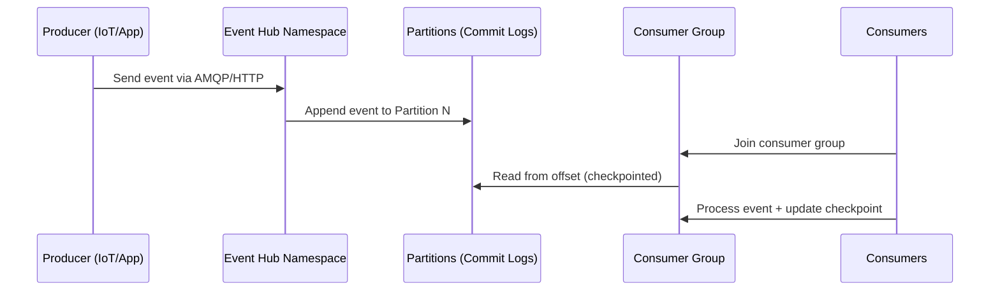

# 🛠️ Azure Event Hubs Internals

At its heart, Event Hubs is **not a queue**. It’s a **distributed streaming platform**, built to handle **millions of events per second** with **low latency**. Internally, it shares design principles with **Apache Kafka**, but it’s a **fully managed Azure PaaS service** (you don’t manage clusters, partitions, brokers, etc.—Azure does that for you).

---

## 🧩 Core Internal Components

### 1. **Partitions (The Parallel Lanes)**

- Events inside an Event Hub are stored in **partitions**.
- Each partition is like an **ordered commit log** where events are appended sequentially.
- Producers don’t directly control partitions (they can optionally set a partition key, which ensures ordering within the same key).
- Partitions = **scalability + parallelism**.

  - Example: With 4 partitions, you can have 4 readers working independently at the same time.

---

### 2. **Offset & Sequence Number (Pointers)**

- Every event stored in a partition has:

  - **Offset** = position marker inside the log.
  - **Sequence number** = increasing number for ordering.

- Consumers use offsets to **track where they left off**.

👉 Unlike queues (where a message disappears once read), in Event Hubs **events remain in partitions** until retention period expires (default 1 day, max 7 days). Multiple consumers can read the same event stream independently.

---

### 3. **Consumer Groups (Views of the Stream)**

- Each consumer group maintains its **own cursor (offset tracking)**.
- Example:

  - Consumer Group A (real-time dashboard) reads from offset 100.
  - Consumer Group B (batch analytics) reads from offset 50.
    Both operate independently.

This is how Event Hubs enables **fan-out** without duplicating data.

---

### 4. **Checkpointing (Remembering Where You Stopped)**

- Consumers must store their last read offset.
- Event Processor Host SDK (for .NET/Java/Python) handles this automatically using **Azure Blob Storage** or **Azure Storage Tables**.
- Without checkpointing → consumer restarts from beginning (or latest).

---

### 5. **Throughput Units (TUs)**

This is the **currency of Event Hub capacity**.

- **1 Throughput Unit =**

  - Up to **1 MB/s ingress** (~1000 events/sec if 1 KB each).
  - Up to **2 MB/s egress**.
  - Max **84 GB per day**.

👉 Scale by buying more TUs. For huge workloads, there’s a **Dedicated Event Hub Cluster** option.

---

### 6. **Event Retention**

- Events are not deleted when consumed.
- They stay in partitions until retention period expires (1–7 days in Standard tier, longer in Dedicated).
- If you need long-term, structured storage → use **Event Hubs Capture** (auto-archive to Blob or Data Lake).

---

### 7. **Protocol Internals**

- Event Hubs uses **AMQP 1.0** (Advanced Message Queuing Protocol) under the hood.
- HTTPS is also supported (but less efficient).
- This makes Event Hubs compatible with many messaging frameworks and SDKs.

---

## 🔍 Internal Flow (Simplified)

---

## 📊 Comparison with AWS (since you know AWS)

| Feature         | **Azure Event Hubs**  | **AWS Equivalent**             |
| --------------- | --------------------- | ------------------------------ |
| Partitions      | Fixed lanes           | **Kinesis Shards**             |
| Offset          | Position marker       | **Sequence number in Kinesis** |
| Retention       | 1–7 days (default)    | 24h (extendable to 7d)         |
| Capture         | Auto → Blob/Data Lake | **Kinesis Firehose**           |
| Throughput Unit | Capacity purchase     | **Shard scaling**              |
| Protocol        | AMQP 1.0, HTTPS       | Proprietary Kinesis APIs       |

👉 If you know **AWS Kinesis Streams**, Event Hubs will feel **almost identical**, but managed in Azure style.

---

## 🏆 Key Takeaways

- Internally built like **Kafka/Kinesis** → partitions, offsets, consumer groups.
- **TUs = performance currency** (scale-out model).
- Consumers track **offsets via checkpointing** (stored in Blob).
- Events are **retained, not deleted** when read.
- Perfect for **telemetry ingestion, IoT, logs, analytics pipelines**.

---

Would you like me to also show you a **hands-on demo (Portal + CLI) of scaling partitions, checkpointing, and Capture** — so you see how these internals actually apply in practice?
