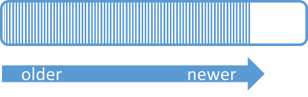
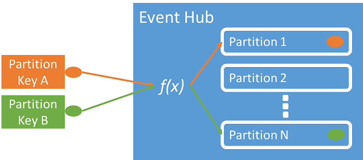

# 📂 Partitions in Azure Event Hubs

## 📝 What is a Partition?

A **partition** is like a **commit log (append-only log file)** inside Event Hubs.

- Every new event is appended at the end.

<div align="left">
  
</div>

- Events are immutable → once written, they can’t be changed.
- Each event carries:

  - **Body** (the payload / message).
  - **User properties** (custom metadata).
  - **System metadata** (offset, sequence number, enqueue timestamp).

👉 Think of partitions as **parallel lanes of data flow**.

---

<div align="center" style="background-color: #ffffffff ;border-radius: 10px;border: 2px solid white">
  
</div>

---

## 📊 Why Partitions Exist

1. **Throughput Scaling (IO limits)**

   - A single log has a physical throughput ceiling.
   - Partitioning = multiple logs working in parallel → multiplied throughput.

2. **Parallel Processing**

   - One process can’t handle millions of events/sec.
   - Splitting data across partitions lets **multiple consumers** work independently.

💡 Without partitions, Event Hubs would <u title="يختنق">choke</u> on high-volume workloads.

---

## 🔢 Number of Partitions

- You **choose partition count when creating an Event Hub**.
- Rules:

  - Standard tier: **1–32 partitions**.
  - Premium tier: can increase later (not decrease).
  - Dedicated tier: more flexibility.

- ⚠️ In Standard → **cannot change partition count later**.
- Cost → Not affected by partition count (depends on **Throughput Units (TUs)** or **Processing Units (PUs)**).

📏 **Rule of Thumb**:

- 1 partition ≈ 1 MB/s throughput.
- Example: Need 20 MB/s → create **≥20 partitions**.

---

## ⚖️ Trade-offs of Partition Count

- ✅ More partitions → better scaling + higher throughput.
- ❌ Too many partitions →

  - Harder to process and coordinate.
  - Can’t guarantee global ordering across partitions.

- ✅ Fewer partitions → simpler, but limits throughput.

💡 Best practice: Match **partition count to your peak expected throughput / parallelism**.

---

## 🎯 Event-to-Partition Mapping

How does Event Hubs decide which event goes into which partition?

1. **Partition Key (preferred)**

   - Sender provides a **partition key** (e.g., customerId, deviceId).
   - Guarantees **ordering per key** (all events from same device go to same partition).
   - Event Hubs runs it through a **hashing function** → assigns to partition.

    <div align="left">
    
    </div>

2. **Round-Robin (default)**

   - If no partition key is provided → Event Hubs assigns partitions randomly in round-robin.
   - Good for balancing load, but **ordering is not guaranteed**.

💡 Example:

- Device telemetry → use `deviceId` as partition key.
- High-throughput logs → use round-robin.

---

## 🧾 Metadata Inside a Partition

Each event has:

- **Offset** → pointer inside partition (used for resuming).
- **Sequence number** → increasing counter.
- **Enqueue time** → service timestamp when event was accepted.
- **Partition ID** → which partition it belongs to.

👉 Consumers use these for **checkpointing** and replaying events.

---

## 🖥️ Processing Model

- **One partition → One consumer (per consumer group)**.
- Multiple consumers can exist, but Event Hubs assigns **ownership** so only one reads from a partition at a time in a group.
- Scaling consumers = scaling partitions.

---

## 🔍 Example

Let’s say we create an Event Hub with **4 partitions**:

```ini
P0: DeviceA1, DeviceA2
P1: DeviceB1, DeviceB2
P2: DeviceC1, DeviceC2
P3: DeviceD1, DeviceD2
```

- Producers send events with partition key = deviceId.
- DeviceA1 always maps to **P0**, DeviceB1 to **P1**, etc.
- If a consumer crashes, another takes over its partition.

---

## 📊 Comparison with AWS

| Concept    | Azure Event Hubs                 | AWS Kinesis             |
| ---------- | -------------------------------- | ----------------------- |
| Partition  | Partition                        | Shard                   |
| Order      | Guaranteed within partition      | Guaranteed within shard |
| Assignment | Partition key hash / Round-robin | Partition key hash      |
| Retention  | 1–7 days (extendable)            | 1–7 days                |
| Scaling    | Fixed count (Standard)           | Resharding supported    |

---

## 🏆 Best Practices for Partitions

- 🔹 Choose partition count wisely → can’t reduce later in Standard.
- 🔹 Use **partition keys** when order matters (e.g., per device/customer).
- 🔹 Use round-robin when order doesn’t matter, but load must balance.
- 🔹 Align **TUs and partitions** → don’t create 100 partitions if you only have 1 TU.
- 🔹 Rule of thumb → **1 MB/s per partition**.

---

## 🎯 Key Takeaway

Partitions = **the parallel lanes of Event Hubs**. They allow scaling, order preservation (per key), and efficient fan-out processing. Correctly sizing and keying partitions is the difference between a **smooth, scalable pipeline** and a **bottlenecked system**.
