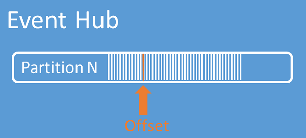
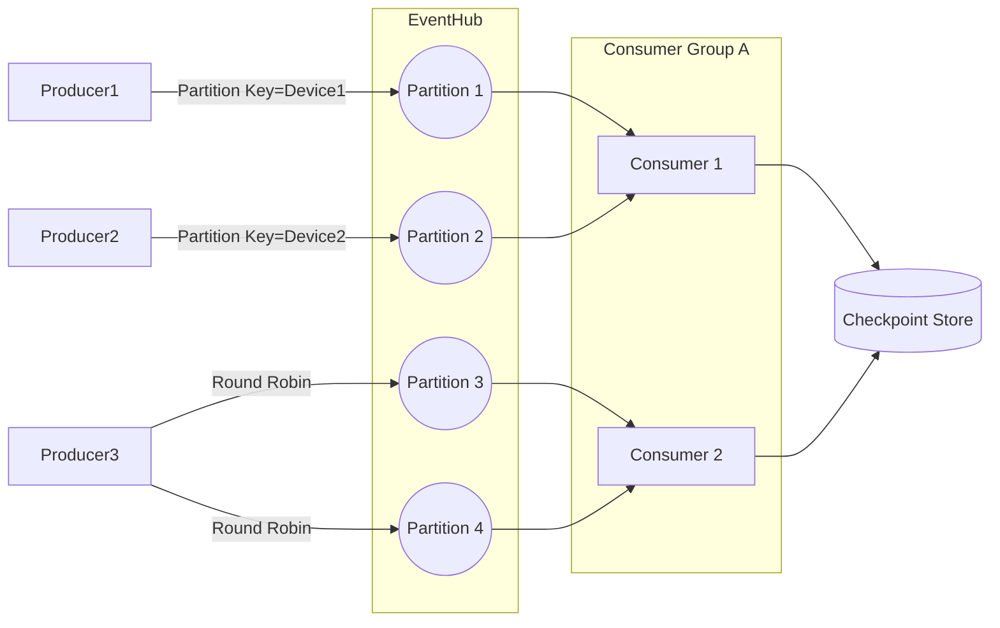

# 🧑‍💻 Azure Event Hubs Consumers Explained

## 🚦 1. What is a Consumer?

- A **consumer** = any application/agent that reads data from Event Hubs.
- Consumers use **AMQP 1.0** (or Kafka protocol) to pull events.
- It’s always **pull model** → Event Hubs never pushes data automatically; consumers fetch events.

👉 Think of a consumer as a "reader" pulling logs out of partitions.

---

  

## 👥 2. Consumer Groups

- A **consumer group** is a **view of the event stream**.
- Multiple consumer groups can read the same events **independently**.
- Example:

  - Consumer Group A → Writes raw data to Data Lake.
  - Consumer Group B → Performs real-time analytics.
  - Consumer Group C → Powers dashboards.

- Each consumer group tracks **its own offsets**.

💡 **Rule:** Within a consumer group, ideally **only one active reader per partition** → avoids duplicates.

---

## 🧾 3. Offsets and Sequence Numbers

### 🔹 Offset

- An **offset** = pointer (byte position) inside a partition.
- Think of it like a **bookmark in a log file**.
- Consumers use offsets to:

  - Start reading from a specific position.
  - Resume after a crash without rereading everything.

### 🔹 Sequence Number

- A **monotonic counter** assigned to each event in a partition.
- Useful for **ordering and debugging**.
- Example:

  - Event A → Sequence 101, Offset 5000.
  - Event B → Sequence 102, Offset 5050.

👉 Offset = "where" in bytes.  
👉 Sequence number = "which event" in order.

---

## 🏷️ 4. Checkpointing

### What is Checkpointing?

- The process of **committing the offset** after successfully processing events.
- Stored **outside Event Hubs** (commonly in **Azure Blob Storage**).

### Why?

- If consumer crashes → new consumer can resume **from last checkpointed offset**, not from the beginning.
- Prevents duplicates, enables replay if needed.

### Example Flow

1. Consumer reads Event A, Event B.
2. Processes them successfully.
3. Writes checkpoint = “Offset 5050” to Blob Storage.
4. If consumer dies → replacement starts reading from offset 5050 + 1.

---

## 🚨 Consumer Groups vs Consumers (VMs / Instances)

### 🧩 Consumer Group ≠ Number of VMs

- A **consumer group** is just a **logical view of the stream**.
- You can think of it as a "subscription" to the event log.
- The number of consumer groups does **not** depend on how many VMs or apps you have.
- It’s more about **use cases**, not scaling.

👉 Example:

- Consumer Group **A**: feeds analytics pipeline.
- Consumer Group **B**: feeds monitoring dashboard.
- Both read the same stream but **independently**, each with their own offsets/checkpoints.

---

### 🖥️ Consumers = Actual Instances (VMs, Pods, Functions)

- A **consumer** = actual running process reading from Event Hubs (e.g., your app on a VM).
- If you deploy your app on 5 VMs, you now have **5 consumers**.
- These consumers typically belong to **one consumer group** and share partitions among themselves.

👉 Example:

- Event Hub with 4 partitions.
- Consumer Group **A**.
- You run your app on 4 VMs.
- SDK load balances → each VM reads from 1 unique partition.

---

## ⚖️ Why Not More Than One Consumer per Partition in a Group?

- Within a **consumer group**, only **one active consumer per partition** is recommended.
- If 2 consumers in the same group read from the same partition → they’ll both get the same events = **duplicates**.
- Azure SDKs (like `EventProcessorClient`) ensure **partition ownership leasing** to prevent conflicts.

### 🧬 Relationship Between Them

Think of it like this:

- **Consumer group** = "team".
- **Consumers (VMs, Pods, Functions)** = "team members".
- Each team member gets a **partition assignment**.
- Different teams (consumer groups) don’t interfere with each other.

### 💭 Example:

Event Hub: 4 partitions

- Consumer Group **A** → Analytics

  - 4 VMs (4 consumers).
  - Each VM owns 1 partition.

- Consumer Group **B** → Monitoring

  - 2 VMs (2 consumers).
  - Each VM owns 2 partitions.

👉 Both A and B can read **all events independently** because they are separate consumer groups.

---

## ⚖️ Scaling Consumers Without Duplicates

### 🔹 Partition Ownership

- Each partition is "leased" by one consumer **per group**.
- Event Hubs ensures **no two consumers in the same group own the same partition**.

### 🔹 Intelligent SDKs

- Azure SDKs (like `EventProcessorClient`) handle:

  - **Load balancing** (assigning partitions evenly).
  - **Checkpointing** (storing offsets safely).
  - **Recovery** (reassigning partitions when a consumer dies).

### 🔹 Scaling Out Example

- Event Hub with **4 partitions**.
- Consumer Group X.
- Start with 2 consumers → each gets 2 partitions.
- Add 2 more consumers → SDK redistributes, now each gets 1 partition.

👉 Scaling consumers = scaling partitions.

---

## 💀 What If a Consumer Fails?

### Scenario:

- Consumer 1 owns Partition 0 and Partition 1.
- Consumer 1 crashes.

### Recovery:

1. The **lease expires** for those partitions.
2. Another consumer takes ownership of Partition 0 and 1.
3. It starts reading **from last checkpoint** (offset stored in Blob Storage).

👉 This ensures **no message loss**.
👉 Duplicates only happen if checkpointing is too infrequent (you may reread last few events).

---

## 🎯 Avoiding Duplicates and Conflicts

- ✅ Use **one active consumer per partition per consumer group**.
- ✅ Checkpoint **after processing events**, not before.
- ✅ Keep **checkpoint store unique** per consumer group (separate Blob container).
- ✅ Use **SDK’s built-in partition manager** → don’t reinvent leasing logic.

💡 Even if duplicates happen (e.g., crash before checkpoint), your downstream processing should be **idempotent** (safe to process the same event twice).

---

## 📊 Example Architecture

---

> 🔹 Each partition → one consumer.  
> 🔹 Blob Storage keeps offsets (checkpoints).  
> 🔹 If `C1` dies, `C2` takes ownership → resumes from checkpoint.

---

## 🏆 Key Takeaways

- **Consumers** pull events → grouped by **consumer groups**.
- **Offset = cursor**; **Sequence Number = event index**.
- **Checkpointing** = committing cursor to persistent store (Blob).
- Scaling = partitions evenly divided across consumers.
- Consumer failure → another picks up from checkpoint.
- Always design for **idempotency** to avoid duplicate processing.

---

👉 Do you want me to also show you a **hands-on demo with code** (C# / Python) on how checkpointing works in practice with `EventProcessorClient` and Blob Storage? This will make the concept even more real.
