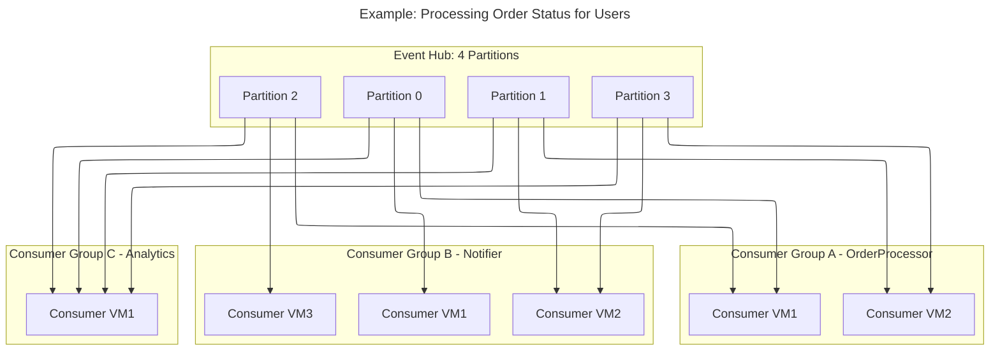

# 🛒 Example: Processing Order Status for Specific Users

## 📦 Scenario

You’re building an **e-commerce system** where:

- Users place orders (events).
- Each order goes through statuses: _Created → Paid → Shipped → Delivered_.
- Multiple systems need the same events:

  1. **Order Processing App** (updates backend DB).
  2. **Customer Notification App** (sends SMS/email updates).
  3. **Analytics App** (tracks sales trends).

---

## 🧩 Step 1: Event Hub Setup

- Event Hub with **4 partitions**.
- Partition key = `UserId`.
  👉 Ensures **all orders of the same user go to the same partition** (so order statuses are in correct sequence).

---

## 👥 Step 2: Consumer Groups

- **Consumer Group A – OrderProcessor**

  - Backend microservice updating order DB.

- **Consumer Group B – Notifier**

  - Sends status notifications to users.

- **Consumer Group C – Analytics**

  - Tracks order metrics in Power BI.

Each group has its **own independent view** of the stream, with its own offsets.

---

## 🖥️ Step 3: Consumers (Instances/VMs)

- Consumer Group A → running on 2 VMs.
- Consumer Group B → running on 3 VMs.
- Consumer Group C → running on 1 VM (batch analytics).

👉 Within each group, Event Hubs SDK load-balances partitions across VMs.

---

## 📊 Flow Example

### User `U123` places an order:

1. Event published:

   ```json
   {
     "UserId": "U123",
     "OrderId": "O456",
     "Status": "Created",
     "Timestamp": "2025-09-25T10:00:00Z"
   }
   ```

2. Event goes to **Partition 2** (based on hash of `UserId`).

3. Delivery to Consumer Groups:

   - **OrderProcessor (Group A)** → VM1 picks up from Partition 2 → updates DB.
   - **Notifier (Group B)** → VM2 picks up → sends SMS/email: "Order Created".
   - **Analytics (Group C)** → VM3 picks up → stores metrics for reporting.

---

## 🔑 Why Partition & Consumer Group Matter?

1. **Partition Key = Order Sequencing**

   - All events for `U123` always land in Partition 2.
   - Guarantees: _Created → Paid → Shipped → Delivered_ is processed **in order**.

2. **Consumer Groups = Independent Use Cases**

   - Notifications can lag or retry without affecting analytics.
   - Analytics can replay from offset = "yesterday" without affecting live order processing.

3. **Consumers = Scale Within Group**

   - If orders grow, add more VMs in Group A.
   - Each VM will claim partitions (leasing mechanism) → no duplicates.

---

## 🖼️ Visual Diagram

<div align="center" style="background-color: #04132eff ;border-radius: 10px;border: 2px solid white">



</div>

---

## ⚡ What If…

- **Consumer fails (VM down):**
  → SDK reassigns partition lease to another VM in same group.
- **Replay analytics from last week:**
  → Reset Group C offset back in time, no impact on Group A/B.
- **Too many users/orders:**
  → Increase partitions + VMs. SDK spreads load automatically.

---

✅ **Bottom Line:**

- **Consumer group** = different _business use case_ (Order Processor, Notifier, Analytics).
- **Consumers** = _scaling instances_ (VMs, Pods).
- **Partition key** = ensures _ordering per user/order_.

---

👉 Do you want me to also **show code (C# or Python)** that demonstrates how a consumer checkpoint works with `UserId` partition key for order events? That would make the example even more practical.
