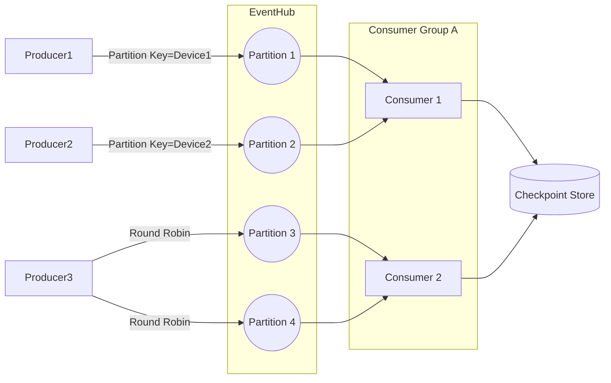

# ⚙️ Scaling & Failure Handling in Consumer Group A

## 🖼️ Visual Diagram

<div align="center" style="background-color: #21242bff ;border-radius: 10px;border: 2px solid white">



</div>

---

## 📌 Current Setup

- **Event Hub** = 4 partitions.
- **Consumer Group A** = _OrderProcessor_.
- **_VMs = 2 (VM1 + VM2)_**, each running one consumer process.
- The Event Hubs **SDK (EventProcessorClient)** handles partition **<u title="تأجير">leasing</u>** and **checkpointing** automatically.

👉 <u title="القاعدة العامة">Rule of thumb</u>: **1 active consumer per partition per consumer group**.

---

## 1️⃣ If You Add **5 VMs** (with only 4 partitions)

- Event Hub has **4 partitions**, but **5 consumers** want to join.
- The Event Hubs SDK runs a **load balancer**:

  - 4 partitions get distributed to 4 VMs.
  - The **5th VM has no partition assigned → sits idle** (effectively useless).

- Example distribution:

  ```ini
  VM1 → Partition 0
  VM2 → Partition 1
  VM3 → Partition 2
  VM4 → Partition 3
  VM5 → No assignment (idle)
  ```

⚠️ Adding more consumers than partitions doesn’t improve throughput — **extra VMs are wasted**.

---

## 2️⃣ If **VM2 goes down**

- Let’s say VM2 was handling **Partition 1**.
- EventProcessorClient detects the lost lease after a short timeout (usually ~30s).
- Partition 1’s lease is **reassigned automatically** to another active VM (say VM1).
- Now VM1 is handling **Partition 0 + Partition 1** until VM2 comes back.

👉 No messages are lost because **offset + checkpoint** tracking ensures the next VM picks up exactly where VM2 left off.

---

## 3️⃣ If You Add **More VMs Later** (e.g., from 2 → 3 → 4)

- With 2 VMs, partition distribution might look like:

  ```ini
  VM1 → Partitions 0, 1
  VM2 → Partitions 2, 3
  ```

- If you add a **3rd VM**:

  - Load balancer **rebalances** partitions across VMs.
  - Example:

    ```ini
    VM1 → Partition 0
    VM2 → Partition 2
    VM3 → Partitions 1, 3
    ```

- If you add a **4th VM**:

  - Perfect balance:

    ```ini
    VM1 → Partition 0
    VM2 → Partition 1
    VM3 → Partition 2
    VM4 → Partition 3
    ```

- Scaling up is **dynamic & automatic** — you don’t manually assign partitions.

---

## 🧠 Key Takeaways

1. **Partitions = upper limit of active consumers** per group.

   - More consumers than partitions → some idle.

2. **Failure = automatic reassignment.**

   - Another consumer picks up from the last checkpoint.

3. **Scaling = automatic rebalance.**

   - Adding/removing VMs redistributes partition leases.

---

## ✅ So, for your **OrderProcessor group**:

- With 5 VMs: 1 will idle (since 4 partitions).
- If VM2 fails: remaining VMs cover its partitions.
- Adding VMs later → load balancer redistributes partitions automatically.

---

👉 Do you want me to also explain **checkpoint conflicts** (e.g., two consumers writing checkpoints at the same time) and how the SDK resolves them? That’s the next tricky bit when scaling large consumer groups.
