# 📈 Scaling Processors (Consumers)

👉 Bottom line: You focus on **processing events**, Event Hubs handles the hard distributed systems problems for you.

---

## 1. 📌 Normal operation (balanced across instances)

**What’s happening:**

- One **active reader per partition** inside the consumer group (keeps per-partition order).
- Each instance **updates its partition’s checkpoint** after processing (offset/sequence).

---

## 2. 📌 Failover: VM2 goes down → ownership reassigns automatically

```mermaid
flowchart LR
    subgraph EH["Event Hub (4 partitions)"]
      P0[(Partition #0)]
      P1[(Partition #1)]
      P2[(Partition #2)]
      P3[(Partition #3)]
    end

    subgraph CG[Consumer Group A]
      VM1[VM1</br>EventProcessorClient]
      VM2x[VM2 ❌ down]
    end

    subgraph CP["Checkpoint Store (Blob)"]
      C0[[P0 offset]]
      C1[[P1 offset]]
      C2[[P2 offset]]
      C3[[P3 offset]]
    end

    P0 --> VM1
    P1 --> VM1
    P2 -.reassign.-> VM1
    P3 -.reassign.-> VM1


    VM1 -- Uses --> C0
    VM1 -- Uses --> C1
    VM1 -- resumes from --> C2
    VM1 -- resumes from --> C3
```

**Key points:**

- The SDK detects lost ownership (lease expiry) and **reassigns P2/P3 to VM1**.
- VM1 **resumes from the last checkpoints** (`C2`, `C3`) → no data loss; at-least-once semantics.

---

## 3. 📌 Scale-out: add VM3 & VM4 → automatic rebalancing

**Key points:**

- Adding instances triggers **rebalance** (no manual partition pinning needed).
- Each instance owns ~1 partition (since we have 4 partitions, 3 instances).

---

## ✅ TL;DR (rules you can run with)

- **Max active readers per consumer group = number of partitions.**
- **Use EventProcessorClient** → it handles **ownership, balancing, failover, and checkpointing**.
- **Checkpoint after processing** (periodically) → safe restarts, minimal replays.
- **Design idempotent handlers** → tolerate at-least-once (tiny duplicates on failover).

> 🚨 If you want, I can turn this into a **small .NET sample repo structure** (producer + consumer + checkpoint config) you can paste into your project.
