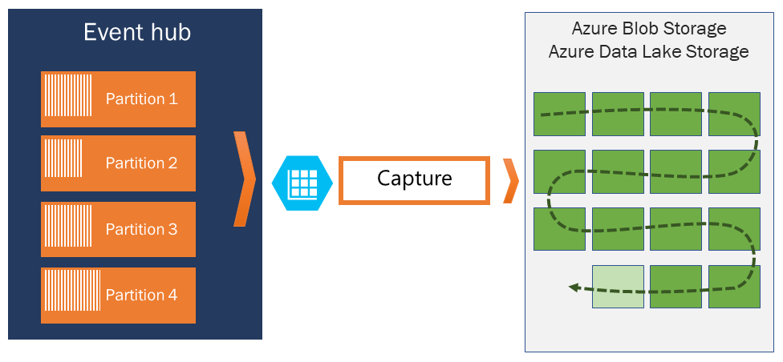
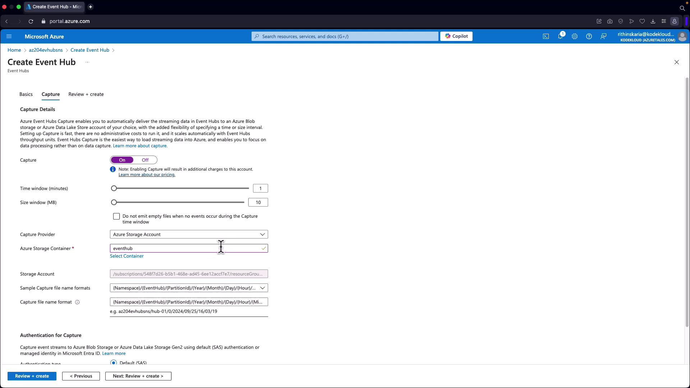

# 📝 **Azure Event Hubs Capture**

## 📌 **What It Is**

> _📖 Official Definition:  
> Event Hubs Capture enables you to automatically capture the streaming data in Event Hubs and save it to your choice of either a Blob storage account, or an Azure Data Lake Storage account._

Event Hubs **Capture** is a **built-in auto-archival feature** that:

- Collects all streaming data (from each partition).
- Batches them by **time window** or **file size window**.
- Stores them in **Azure Blob Storage** or **Data Lake Storage Gen2**.
- Writes files in **Apache Avro format** (compact, binary, schema-based).
- (Bonus 🎉) If you use **no-code editor in Azure Portal**, you can save in **Parquet format** for direct analytics with Synapse. [Learn More](https://learn.microsoft.com/en-us/azure/stream-analytics/capture-event-hub-data-parquet?toc=%2Fazure%2Fevent-hubs%2Ftoc.json)

> 👉 This turns your raw event stream into **structured, queryable files** — ready for **batch analytics, ML pipelines, or archival**.

---

<div align="center" style="background-color: #ffffffff ;border-radius: 10px;border: 2px solid white">
  
</div>

---

## ⚙️ **How Capture Works** (Internals)

### 1. **Windowing**

- Data is written **per partition**.
- Two triggers decide when to write a file:

  - **Time Window** → e.g., every 5 minutes.
  - **Size Window** → e.g., every 10 MB.

- At the end of the window → Event Hubs flushes events into a blob.

🕒 Example:

- Partition 0 → flushes every 5 min (even if not full).
- Partition 1 → flushes when 10 MB reached (even before 5 min).

> 📂 File name includes: namespace / hub name / partition / timestamp.

---

### 2. **Scaling with Throughput Units**

- Capture works **independent of TU quotas**.
- Even if you’re hammering Event Hubs with millions of events/sec → Capture won’t “steal” your processing throughput.
- Files still land in storage consistently.

---

### 3. **Automatic Start**

- No code, no extra pipeline.
- As soon as the **first event** hits Event Hubs → Capture starts writing files.

---

### 4. **Data Format**

- Default: **Apache Avro** → compact binary, schema is embedded.
- Optional: **Parquet** (if using no-code path in portal) → perfect for querying via Synapse/Databricks.

📊 Avro Schema (simplified):

```json
{
  "records": [
    {
      "time": "2024-09-25T16:06:06Z",
      "resourceId": "/subscriptions/xxx/resourceGroups/RG/providers/Microsoft.Web/sites/App",
      "category": "AppServiceAppLogs",
      "operationName": "Microsoft.Web/sites/log",
      "level": "Information",
      "message": "Application started..."
    }
  ]
}
```

---

## 🛠️ **Hands-On Setup** (Portal)

### Step 1: Upgrade Tier

- Ensure Event Hub is **Standard or higher** (Capture not in Basic).

### Step 2: Create an Event Hub

- Example: Name = **Hub01**
- Partitions = 1 (for demo).
- Retention = 1 hr (cleanup policy = delete).

### Step 3: Enable Capture

- Check “Enable Capture.”
- Configure:

  - **Window size** → 5 minutes.
  - **Size window** → 10 MB.

- Select **Storage account / Data Lake container**.
- Authentication for Capture: SAS or Managed Identity.

<div align="left">
  
</div>

---

## 🔬 **Demo** (Testing Capture)

### 1. Generate Events

- Option A → .NET SDK, Python SDK.
- Option B → Diagnostic Settings from another Azure service (e.g., App Service logs → Event Hub).

Example: configure App Service diagnostic settings → send logs to **Hub01**.

### 2. Verify Data

- Go to your Storage account → container.
- You’ll see folders like:

```ini
/eventhub-namespace/Hub01/0/2024/09/25/16/06/06.avro
```

### 3. Open Data

- Download `.avro` file.
- Tools: Azure Data Explorer, Avro tools, or load into Databricks/Synapse.

---

## 🔄 **Capture Window Tuning**

- **Small windows** → More, smaller files (good for near real-time).
- **Large windows** → Fewer, larger files (good for batch jobs).

Example:

- Demo: 1 min / 10 MB → fast feedback.
- Production: 5 min / 100 MB → efficient storage.

---

## 📊 **Comparison with AWS**

| Feature             | Event Hubs Capture  | AWS Equivalent            |
| ------------------- | ------------------- | ------------------------- |
| Storage Destination | Blob / Data Lake    | S3 (via Kinesis Firehose) |
| File Format         | Avro / Parquet      | Parquet / ORC             |
| Window Trigger      | Time / Size         | Buffer Size / Interval    |
| Setup               | One-click in Portal | Needs Firehose config     |

---

## 🏆 **Key Benefits**

- ✅ **No code ingestion pipeline** (native to Event Hubs).
- ✅ **Reliable + Scalable** (doesn’t eat TUs).
- ✅ **Batch-friendly** → great for analytics.
- ✅ **Format-ready** → Avro (compact) or Parquet (analytics).

---

👉 In short: **Event Hubs Capture = Your Always-On “Flight Recorder”**. It guarantees that no event stream is lost and makes analysis easy with downstream Azure services.

---

Would you like me to also give you a **CLI hands-on guide** (az cli commands) for enabling and verifying Event Hubs Capture — so you see the automation side as well, not just Portal setup?
