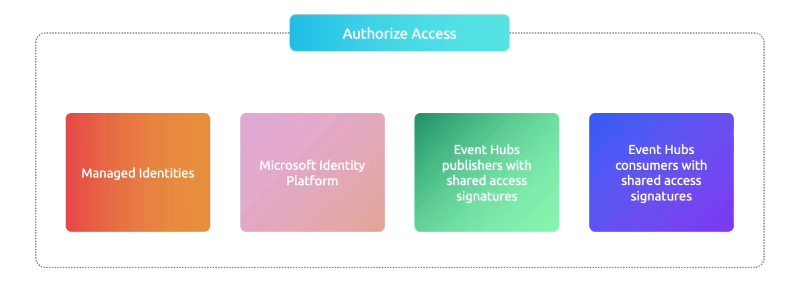
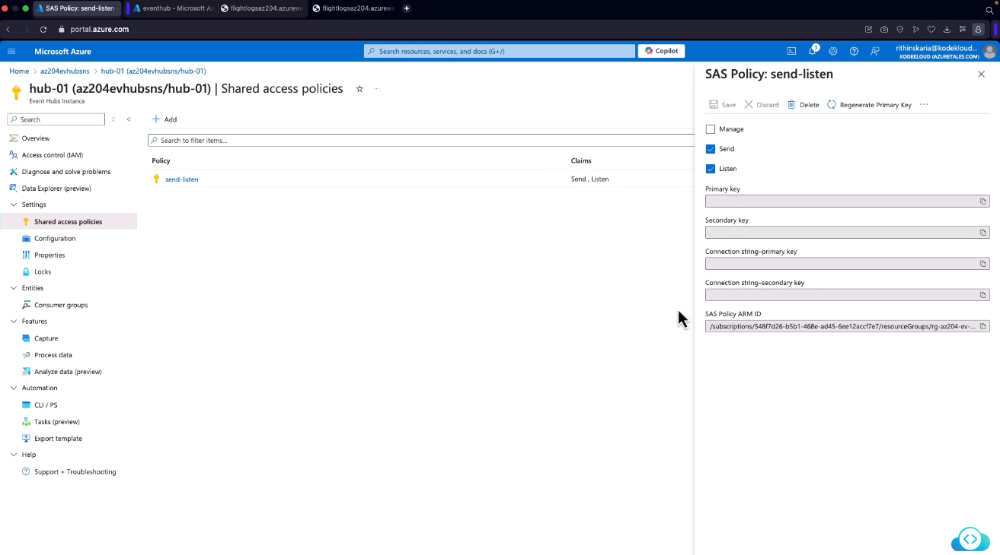

# 🔐 Access to Events in Azure Event Hubs

When you start building with **Azure Event Hubs**, one of the first questions is: _“Who can send and who can read events?”_ This is where **access control** comes in. Event Hubs gives you a **secure, role-based, and token-driven model** to make sure the right apps or users can only do what they’re supposed to.

---

## 🎭 Built-in Roles for Event Hubs

Azure provides **three built-in RBAC roles** that you can assign at the **namespace, hub, or resource group level**:

| Role                        | What it Can Do                                                           | Use Case                                            |
| --------------------------- | ------------------------------------------------------------------------ | --------------------------------------------------- |
| **Event Hub Data Owner**    | Full control → Send, Receive, Manage (subscriptions, configs, policies). | Admins or services that need _all permissions_.     |
| **Event Hub Data Sender**   | Only send events. No read or management rights.                          | Apps or APIs pushing telemetry/logs into Event Hub. |
| **Event Hub Data Receiver** | Only receive (consume) events. No sending rights.                        | Analytics apps, consumers, or processing pipelines. |

👉 These roles follow the **Principle of Least Privilege** — always give the _minimum_ required role.

---

  

---

## 🔑 2. Authorization Methods

Event Hubs supports **three main authorization models**:

### (a) 🆔 Managed Identity + RBAC

- Works only for **Azure-hosted resources** (VMs, App Services, Functions, AKS, etc.).
- No secrets needed — Azure injects a **Managed Identity** into your app.
- Your app requests a **token** from Entra ID → Event Hubs validates token → checks **RBAC role**.
- Most secure option ✅.

🔹 Example: An **Azure Function with Managed Identity** writes messages to Event Hub. The Function has **Data Sender** role on the Event Hub namespace.

---

### (b) 🎭 Microsoft Identity Platform (App Registration + OAuth2)

- Used when apps are **outside Azure** (on-prem, other clouds, local dev).
- You register your app in **Entra ID**, get a **client ID + secret/cert**.
- App requests a **JWT access token** from Microsoft Identity Platform.
- Event Hubs validates token and checks **RBAC role assignment**.

🔹 Example: A .NET Core API running on-prem authenticates with Entra ID, gets a token, and consumes messages if it has **Data Receiver** role.

---

### (c) 🔑 Shared Access Signatures (SAS)

- Traditional connection-string model.
- **Shared Access Policies** are created at namespace or hub level.
- Each policy has **send**, **listen**, or **manage** rights.
- Apps use the **connection string** (which embeds a SAS key) or generate a short-lived **SAS token**.
- No RBAC involved here — access is controlled purely by SAS key.

🔹 Example: A **lightweight IoT device** uses SAS token with **send-only rights** to push telemetry to Event Hub.

⚠️ SAS = easier to bootstrap but less secure (keys can leak). Use **least privilege** and rotate keys.

---

## 🧭 Shared Access Policies (For SAS)

- Found under **Event Hub Namespace → Shared Access Policies**.
- You can create policies like:

  - `SendOnlyPolicy` → only send rights
  - `ListenOnlyPolicy` → only consume events
  - `ManagePolicy` → manage Event Hub and keys

Each policy provides:

- **Primary Key & Secondary Key** (rotate safely)
- **Connection Strings** (used by SDKs and apps)

---

  

---

> 👉 Good for **legacy apps** or **quick POCs**, but use Managed Identity or Microsoft Identity for production.

---

## 🛠️ Configuring Access in Azure Portal

### Using RBAC (Recommended):

1. Go to your Event Hub Namespace in Azure Portal.
2. Open **Access Control (IAM)**.
3. Click **Add Role Assignment**.
4. Select one of the built-in roles: Data Owner, Sender, or Receiver.
5. Assign to a **User, Service Principal, or Managed Identity**.

### Using SAS:

1. Go to **Shared Access Policies**.
2. Create a policy with permissions (Send / Listen / Manage).
3. Copy **Primary Connection String**.
4. Use it in your producer/consumer app.

---

## ⚖️ Choosing the Right Method

| Method                                 | Best For                             | Security Level                 |
| -------------------------------------- | ------------------------------------ | ------------------------------ |
| **Managed Identity + RBAC**            | Apps in Azure (VM, Function, AKS)    | 🔒🔒🔒 (best)                  |
| **Microsoft Identity Platform + RBAC** | External apps (on-prem, multi-cloud) | 🔒🔒                           |
| **SAS (Shared Access Policies)**       | IoT, legacy apps, quick POCs         | 🔒 (weaker, rotate keys often) |

---

## 📌 Best Practices

- Always follow **least privilege principle** (don’t assign Data Owner if Sender/Receiver is enough).
- Prefer **Managed Identity** (no secret rotation).
- If SAS is required → create **separate policies per app** and rotate keys.
- For external apps → use **Microsoft Identity Platform + RBAC**.

---

## 🔥 **In short**:

Event Hubs access control = **RBAC Roles + Auth Method**.

- Roles decide _what you can do_ (send, receive, manage).
- Auth decides _how you prove it_ (MI, OAuth, SAS).
