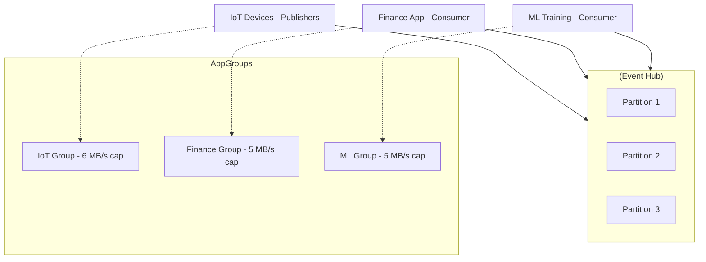

# 🚦 Azure Event Hubs – Application Groups

## 🌟 What Are Application Groups?

An **Application Group** is a **logical grouping of client identities** (apps, users, services) that connect to an Event Hub.
It allows you to:

- Apply **throttling rules** (limit requests or bandwidth).
- Ensure **fair resource sharing** between apps.
- Monitor **consumption metrics per group**.

👉 They are about **fair usage and governance**, not about offsets (that’s Consumer Groups).

---

## 🧩 Why Do We Need Them?

- **Multi-team or multi-tenant Event Hub**: prevent one app from hogging all throughput.
- **Critical workloads**: guarantee bandwidth for priority apps.
- **Governance**: visibility into per-app usage.
- **Fairness**: smooth spikes from noisy publishers or consumers.

---

## ⚙️ Key Components

| Component                  | Description                                                                     |
| -------------------------- | ------------------------------------------------------------------------------- |
| **Application Group Name** | Unique identifier for the group.                                                |
| **Members**                | Client identities (SAS key, AAD App ID, or Managed Identity).                   |
| **Throttling Policies**    | Limits applied to metrics like incoming bytes, outgoing bytes, or requests/sec. |
| **Metrics**                | Track usage and throttling per group via Azure Monitor.                         |

---

## 📊 Example

Imagine an Event Hub namespace with **10 Throughput Units (TUs)** = 10 MB/s ingress + 20 MB/s egress.

- **IoT devices** flood data at 8 MB/s.
- **Finance dashboard** needs 2 MB/s guaranteed.
- **ML training app** needs 5 MB/s.

👉 Without groups: IoT spikes → Finance and ML suffer.
👉 With groups:

- `iot-group`: throttle at 6 MB/s ingress
- `finance-group`: throttle at 2 MB/s ingress, 5 MB/s egress
- `ml-group`: throttle at 5 MB/s egress

Each app stays in its lane 🚗.

---

## 🖼 Architecture Flow



---

## ⚡ CLI Example

```bash
az eventhubs application-group create \
  --resource-group myRG \
  --namespace-name myNamespace \
  --eventhub-name myEventHub \
  --name finance-group \
  --throttling-policy "[
    {\"metricId\":\"OutgoingBytes\", \"rateLimitThreshold\": 5242880},
    {\"metricId\":\"IncomingBytes\", \"rateLimitThreshold\": 2097152}
  ]" \
  --client-app-group-identifiers "finance-app-client-id"
```

✅ This creates an app group with 5 MB/s egress and 2 MB/s ingress limits for the **finance app**.

---

## 🧠 Application Groups vs Consumer Groups

| Feature      | Consumer Groups 🟢          | Application Groups 🔵           |
| ------------ | --------------------------- | ------------------------------- |
| **Purpose**  | Independent read state      | Fair usage & throttling         |
| **Scope**    | Consumers only              | Publishers + Consumers          |
| **Controls** | Offset/checkpoint           | Requests/sec, bytes/sec         |
| **Use case** | Analytics, multiple readers | Multi-team fairness, noisy apps |

---

## 📉 Monitoring

Azure Monitor provides per-application group metrics:

- `IncomingRequests`
- `OutgoingBytes`
- `ThrottledRequests`

👉 Use this to see **which app is hitting limits**.

---

## ✅ Key Takeaways

- **Application Groups** = governance tool for **fair usage**.
- They **apply to both publishers and consumers** (unlike Consumer Groups).
- Define **throttling policies** for bandwidth and requests/sec.
- Perfect for **multi-team, multi-tenant, or spiky workloads**.
- Supported in **Standard, Premium, and Dedicated** tiers.
- Consumer Groups = _where apps read_, Application Groups = _how much they can use_.

---

🔥 Final mnemonic for exams/interviews:

> **Consumer Groups = Reading Positions.
> Application Groups = Resource Limits.**
