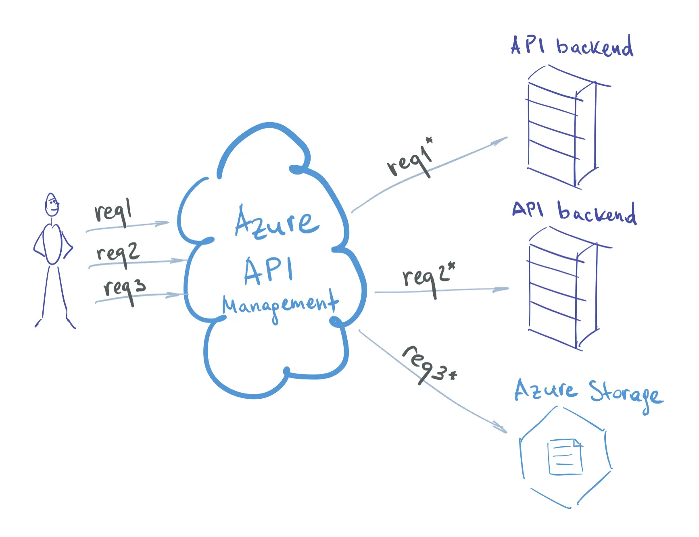

# 🌐 **Azure API Management (APIM)**

## 📖 **What is APIM?**

Azure **API Management** is a **PaaS gateway** that sits between **your APIs** (backend services: AKS, ACA, ACI, App Services, Functions, even on-prem) and **consumers** (apps, devs, partners).

**It provides:**

- 🛡️ **Security & Auth** protect backend services, improve performance(OAuth2, Entra ID, JWT validation, rate-limiting, quotas)
- 🔄 **Transformation** (rewrite headers, modify payloads, versioning)
- 📊 **Observability** (monitoring, logging, analytics)
- 🤝 **Developer Experience** (self-service dev portal, API docs, try-it-out console)
- 🤑 **Partner Subscriptions** manage developer and partner subscriptions, enforce usage quotas and throttling.
- 🌍 **Global Distribution** (deploy API gateways closer to consumers with multi-region scaling)

> 👉 **NGINX/Envoy gateway + Istio control plane + Swagger portal** — but as a single Azure-managed product.

---

## 🏛️ **APIM Architecture**

<div align="center" style="background-color: #ffffffff ;border-radius: 10px;border: 2px solid white">
  
</div>

### 1️⃣ **API Gateway (Data Plane)** 🚦

- The **front door** of APIM.
- Every client request hits the **gateway endpoint** first.
- Handles:

  - **Routing** → send request to correct backend (Functions, ACA, AKS, App Service, on-prem API, etc.)
  - **Security** → JWT validation, OAuth2, subscription keys, mTLS
  - **Policies** → rate limiting, caching, request/response transforms, header injection
  - **Analytics capture** → logs every call for monitoring
  - Transforms APIs on the fly
  - Supports multi-region deployment
  - Can scale up and out

> 📍 Runs in Azure’s **multi-tenant infrastructure** unless you pick **Premium/Isolated** (dedicated VNet integration).

---

### 2️⃣ **Azure Portal (Admin Plane)** 🛠️

- Where **admins/API publishers** manage APIM.

<div align="left">
  
</div>

- Use cases:

  - Import APIs from **OpenAPI**, **Functions**, **Logic Apps**, **App Services**, **AKS/ACA**, or even external endpoints.
  - Configure **policies** (like Istio filters but declarative XML-based).
  - Monitor traffic, latency, errors.
  - Configure **Products, Groups**.
  - Manage users and subscriptions

> 💡 Think of this as the **control plane UI/API**.

---

### 3️⃣ **Developer Portal (Consumer Plane)** 🌐

- A **self-service site** for API consumers.
- Automatically generated website with documentation of APIs
- Features:

  - Browse APIs (with auto-generated Swagger docs).
  - Can be customized with content, custom styles and branding (visual in-page editor for admins)
  - Test APIs interactively.
  - Get **subscription keys** after registering.
  - Manage **subscriptions & quotas**.
  - Devs can sign up with social providers, Azure AD or regular login/passwords
  - Developers can access analytics of their own usage

- Admin View

<div align="left">
  
</div>

- Developer View

<div align="left">
  
</div>

This is like **SwaggerHub + Postman docs**, but wired into your auth & products. [Learn More](https://docs.azure.cn/en-us/api-management/developer-portal-overview)

---

### 🧩 **Supporting Components**

<div align="center" style="background-color: #ffffffff ;border-radius: 10px;border: 2px solid white">
  
</div>

---

#### 🔹 **APIs**

- Logical representation of your backend.
- Each API has **operations** (endpoints like `/orders`, `/products/{id}`).
- Can import via **OpenAPI spec** or point directly at Azure resources.

---

#### 🔹 **Products**

- A **bundle of APIs** exposed to consumers.
- Example:

  - **Free tier** → limited calls, fewer APIs
  - **Premium tier** → more calls, extra APIs

- Products let you **control access + apply quotas + monetization**.

---

#### 🔹 **Groups**

- Define **who can see what products**.
- Built-in:

  - **Administrators** → manage APIM
  - **Developers** → registered users
  - **Guests** → anonymous portal visitors

- Can sync with **Azure Entra ID groups** for enterprise integration.

---

#### 🔹 **Developers**

- The **end-users (API consumers)**.
- Register via **Developer Portal**.
- Belong to one or more **Groups**.
- Get **subscription keys** to call APIs in their allowed Products.

---

#### 🔹 **Policies**

- The **Istio EnvoyFilter** of APIM.
- Declarative XML snippets executed in **inbound**, **backend**, **outbound**, and **on-error** pipelines.
- Common policies:

  - **Security** → validate JWT, require subscription key, check IP whitelist
  - **Traffic shaping** → rate-limit, quota, caching
  - **Transformation** → rewrite URL, strip/rename headers, change response JSON shape
  - **Integration** → call external services, set backend dynamically

- Example (rate-limit + JWT):

  ```xml
  <inbound>
  <validate-jwt header-name="Authorization" require-scheme="Bearer">
      <openid-config url="https://login.microsoftonline.com/{tenant}/v2.0/.well-known/openid-configuration" />
  </validate-jwt>
  <rate-limit-by-key calls="10" renewal-period="60" counter-key="@(context.Request.IpAddress)" />
  <base />
  </inbound>
  ```

---

## ⚙️ **APIs and Operations**

- As an admin of the API Management instance, you create and expose APIs.
- Each APIM API has reference to a backend API.
- Each API has one or more Operations.
- Operations configure path mapping between APIM and backend API.
- You can define Operations manually or you can upload an OpenAPI specification file and they will be created automatically.
- API can be public or it can require a subscription

<div align="left">
  
</div>

---

## 🤑 **Products and Subscriptions**

- Product is a way to logically group multiple APIs and provide access to those APIs for a developer.
- You can assign usage quota to a product.
- In order to use a product, a developer must have a subscription.
- Subscription is a pair of access keys, Key must be sent in the request header to authenticate with API.
- Developers can subscribe via Developer Portal or an admin can create a subscription for them.
- Product is not available to developers before it's published.
- Products can be further organized into Groups.

<div align="left">
  
</div>

---

## 🔀 **API Revisions**

- Create a new revision to introduce `non-breaking changes` to the existing API.
- Multiple revisions can co-exist (they have different URLs).
- When new revision is properly tested, make it Current so it's published to the primary URL.
- Making revision current creates a change log in Developer Portal.

<div align="left">
  
</div>

---

## 🏷️ **API Versions**

- Create a new version to introduce `breaking changes` to the API.
- Each API version must have a unique name, since technically it's another API.
- Multiple versions can co-exist (they have different URLs).
- You can choose versioning scheme: path `(api.com/v1)` or header or query.

<div align="left">
  
</div>

---

## 💰 **Pricing tiers**

- 5 pricing tiers are: `Consumption`, `Developer`, `Basic`, `Standard`, `Premium`.
- A new tier was added recently: `Isolated` (in preview now), It has the same performance characteristics as Premium but guarantees compute isolation which may be required in highly regulated environments.
- Serverless tier has lower SLA and is lacking many features: VNET integration, Developer Portal, internal cache, multi-region, and more.
- You can find full comparison of pricing tiers [Press Here](https://azure.microsoft.com/en-us/pricing/details/api-management/).

<div align="left">
  
</div>

---

## 🌍 **Multi-region deployment**

- Multi-region deployment is available in `Premium` and `Isolated` tiers only.
- Improve latency for end users.
- Add **failover support** in case one of the regions becomes unavailable.
- Only API Gateways can be deployed to multiple regions. **Azure and Development Portals are hosted in the primary region.**

<div align="left">
  
</div>

---

## ➕ **Scaling**

- You can scale your API Management instance vertically (by upgrading to the next tier), horizontally (by adding scaling units), or both at the same time.
- Both upgrading instance size and adding new unit take considerable time.
- Good metric to use when deciding to scale is Capacity - an abstraction over server resources like CPU, Memory and IO.
- There's an Autoscaling feature (Standard and Premium tiers).

<div align="left">
  
</div>

---

## 💭 **Use Cases**

🔹 **Modify backend requests:**

- Example: Alter headers, add new fields to the request body or change the request format completely.

<div align="left">
  
</div>

🔹 **Modify backend responses:**

- Example: Transform the backend response format from XML to JSON.

<div align="left">
  
</div>

🔹 **Route requests to different backends:**

- With route mapping you can forward requests to different backends. Backend can be a HTTP service or another Azure service (e.g. Storage).

<div align="left">
  
</div>

🔹 **Rate-limit requests:**

- Apply rate limits and quotas per subscription or dynamically computed key (visitor IP address, user ID from incoming JWT).

<div align="left">
  
</div>

🔹 **Cache backend responses:**

- Apply cache policies with dynamic cache keys and configurable expire time.

<div align="left">
  
</div>

🔹 **Verify JWT:**

- Restrict access to the API by validating JWT token in the request.

<div align="left">
  
</div>

🔹 **Authorize requests with external authorizers:**

- You can make requests to external services (managed by you or by a 3rd party) to verify authentication status for the current request.

<div align="left">
  
</div>

🔹 **Black- and whitelist IPs:**

- Protect your API by configuring which IPs can access the resources.

<div align="left">
  
</div>

🔹 **Reduce potential attack surface:**

- Protect you backend services by placing them behind (and securing access to) the APIM instance.

<div align="left">
  
</div>

---

## 🧪 **Hands-On Mini Demo**

### 1️⃣ Create APIM instance

```bash
az apim create \
  --name myapim \
  --resource-group myrg \
  --publisher-name "My Company" \
  --publisher-email "admin@myco.com" \
  --sku Consumption
```

- **Consumption** → serverless, pay-per-call (good for startups).
- **Developer / Basic / Premium** → scale, multi-region, VNET integration.

---

### 2️⃣ Import a Backend API (Function App)

```bash
az apim api import \
  --resource-group myrg \
  --service-name myapim \
  --path myapi \
  --api-id myapi \
  --specification-format OpenApi \
  --specification-url "https://myfunc.azurewebsites.net/swagger.json"
```

---

### 3️⃣ Apply a Policy

Throttle to 5 calls/min per subscription:

```xml
<policies>
  <inbound>
    <rate-limit calls="5" renewal-period="60" />
    <base />
  </inbound>
  <backend>
    <base />
  </backend>
  <outbound>
    <base />
  </outbound>
</policies>
```

---

### 4️⃣ Expose to Developers

- Enable **Developer Portal** → auto-generated Swagger docs + try-it-out UI.
- Give devs subscription keys (or force OAuth2 if production).

---

## ⚖️ **APIM vs Alternatives**

| Feature                  | APIM               | NGINX/Kong/Traefik  |
| ------------------------ | ------------------ | ------------------- |
| Managed by Azure         | ✅                 | ❌ (self-manage)    |
| OAuth2/JWT/OIDC built-in | ✅                 | 🔧 (plugins needed) |
| Global scaling           | ✅ Premium tier    | manual setup        |
| Dev portal               | ✅ built-in        | separate project    |
| Policies engine          | ✅ XML declarative | Lua/Go/Custom code  |

---

### 🧠 **Mental Model for Experts**

- **API Gateway = Envoy Proxy** (but managed)
- **Policies = Istio filters** (XML instead of YAML)
- **Products = API monetization & bundles**
- **Groups = RBAC for consumers**
- **Developer Portal = SwaggerHub + onboarding site**
- **Azure Portal = Control plane UI/API**

---

## ✅ **TL;DR**

- **APIM = API Gateway + Policy Engine + Dev Portal + Analytics**.
- It’s the go-to service for **securely publishing, scaling, and managing APIs** in Azure.

## 📚 References

[Azure API Management visually explained](https://www.maxivanov.io/azure-api-management-visually-explained/)
