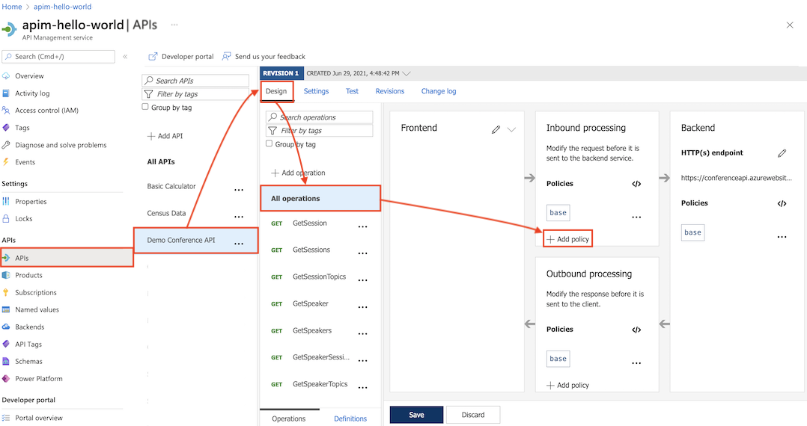

# 🌐 **Azure API Management (APIM)**

## 📖 **What is APIM?**

Azure **API Management** is a **PaaS gateway** that sits between **your APIs** (backend services: AKS, ACA, ACI, App Services, Functions, even on-prem) and **consumers** (apps, devs, partners).

**It provides:**

- 🛡️ **Security & Auth** (OAuth2, Entra ID, JWT validation, rate-limiting, quotas)
- 🔄 **Transformation** (rewrite headers, modify payloads, versioning)
- 📊 **Observability** (monitoring, logging, analytics)
- 🤝 **Developer Experience** (self-service dev portal, API docs, try-it-out console)
- 🌍 **Global Distribution** (deploy API gateways closer to consumers with multi-region scaling)

> 👉 **NGINX/Envoy gateway + Istio control plane + Swagger portal** — but as a single Azure-managed product.

---

## 🏛️ **APIM Architecture**

<div align="center">
  
</div>

### Components:

🔹 **API Gateway** → the runtime that receives calls, applies policies, routes to backend.  
🔹 **Policies** → declarative rules applied per API/operation (XML-based).  
🔹 **Developer Portal** → auto-generated portal for devs to discover, subscribe, test.  
🔹 **Analytics** → built-in logging, metrics, export to Log Analytics / App Insights.  
🔹 **Backends** → anything from Azure Functions to on-prem APIs (via VPN/ExpressRoute).

---

### 1️⃣ **API Gateway (Data Plane)** 🚦

- The **front door** of APIM.
- Every client request hits the **gateway endpoint** first.
- Handles:

  - **Routing** → send request to correct backend (Functions, ACA, AKS, App Service, on-prem API, etc.)
  - **Security** → JWT validation, OAuth2, subscription keys, mTLS
  - **Policies** → rate limiting, caching, request/response transforms, header injection
  - **Analytics capture** → logs every call for monitoring

📍 Runs in Azure’s **multi-tenant infrastructure** unless you pick **Premium/Isolated** (dedicated VNet integration).

---

### 2️⃣ **Azure Portal (Admin Plane)** 🛠️

- Where **admins/API publishers** manage APIM.
- Use cases:

  - Import APIs from **OpenAPI**, **Functions**, **Logic Apps**, **App Services**, **AKS/ACA**, or even external endpoints.
  - Configure **policies** (like Istio filters but declarative XML-based).
  - Monitor traffic, latency, errors.
  - Configure **Products, Groups, Subscriptions**.

Think of this as the **control plane UI/API**.

---

### 3️⃣ **Developer Portal (Consumer Plane)** 🌐

- A **self-service site** for API consumers.
- Features:

  - Browse APIs (with auto-generated Swagger docs).
  - Test APIs interactively.
  - Get **subscription keys** after registering.
  - Manage **subscriptions & quotas**.

This is like **SwaggerHub + Postman docs**, but wired into your auth & products.

---

## 🧩 **Supporting Components**

<div align="center">
  
</div>

---

### 🔹 **APIs**

- Logical representation of your backend.
- Each API has **operations** (endpoints like `/orders`, `/products/{id}`).
- Can import via **OpenAPI spec** or point directly at Azure resources.

---

### 🔹 **Products**

- A **bundle of APIs** exposed to consumers.
- Example:

  - **Free tier** → limited calls, fewer APIs
  - **Premium tier** → more calls, extra APIs

- Products let you **control access + apply quotas + monetization**.

---

### 🔹 **Groups**

- Define **who can see what products**.
- Built-in:

  - **Administrators** → manage APIM
  - **Developers** → registered users
  - **Guests** → anonymous portal visitors

- Can sync with **Azure Entra ID groups** for enterprise integration.

---

### 🔹 **Developers**

- The **end-users (API consumers)**.
- Register via **Developer Portal**.
- Belong to one or more **Groups**.
- Get **subscription keys** to call APIs in their allowed Products.

---

### 🔹 **Policies**

- The **Istio EnvoyFilter** of APIM.
- Declarative XML snippets executed in **inbound**, **backend**, **outbound**, and **on-error** pipelines.
- Common policies:

  - **Security** → validate JWT, require subscription key, check IP whitelist
  - **Traffic shaping** → rate-limit, quota, caching
  - **Transformation** → rewrite URL, strip/rename headers, change response JSON shape
  - **Integration** → call external services, set backend dynamically

- Example (rate-limit + JWT):

  ```xml
  <inbound>
  <validate-jwt header-name="Authorization" require-scheme="Bearer">
      <openid-config url="https://login.microsoftonline.com/{tenant}/v2.0/.well-known/openid-configuration" />
  </validate-jwt>
  <rate-limit-by-key calls="10" renewal-period="60" counter-key="@(context.Request.IpAddress)" />
  <base />
  </inbound>
  ```

---

## 🧠 **Mental Model for Experts**

- **API Gateway = Envoy Proxy** (but managed)
- **Policies = Istio filters** (XML instead of YAML)
- **Products = API monetization & bundles**
- **Groups = RBAC for consumers**
- **Developer Portal = SwaggerHub + onboarding site**
- **Azure Portal = Control plane UI/API**

---

## 🔐 **AuthN & AuthZ in APIM**

- **Inbound security**: validate OAuth2 tokens (Entra ID, GitHub, Google, etc.).
- **Internal API keys**: consumers can use subscription keys.
- **Managed identities**: APIM authenticates to backend services securely (no secrets).

### 📄 Example Policy (JWT validation):

```xml
<validate-jwt header-name="Authorization" failed-validation-httpcode="401" failed-validation-error-message="Unauthorized">
  <openid-config url="https://login.microsoftonline.com/{tenantid}/v2.0/.well-known/openid-configuration" />
  <required-claims>
    <claim name="aud" match="any">
      <value>api://myapi</value>
    </claim>
  </required-claims>
</validate-jwt>
```

---

## 🧪 **Hands-On Mini Demo**

### 1️⃣ Create APIM instance

```bash
az apim create \
  --name myapim \
  --resource-group myrg \
  --publisher-name "My Company" \
  --publisher-email "admin@myco.com" \
  --sku Consumption
```

- **Consumption** → serverless, pay-per-call (good for startups).
- **Developer / Basic / Premium** → scale, multi-region, VNET integration.

---

### 2️⃣ Import a Backend API (Function App)

```bash
az apim api import \
  --resource-group myrg \
  --service-name myapim \
  --path myapi \
  --api-id myapi \
  --specification-format OpenApi \
  --specification-url "https://myfunc.azurewebsites.net/swagger.json"
```

---

### 3️⃣ Apply a Policy

Throttle to 5 calls/min per subscription:

```xml
<policies>
  <inbound>
    <rate-limit calls="5" renewal-period="60" />
    <base />
  </inbound>
  <backend>
    <base />
  </backend>
  <outbound>
    <base />
  </outbound>
</policies>
```

---

### 4️⃣ Expose to Developers

- Enable **Developer Portal** → auto-generated Swagger docs + try-it-out UI.
- Give devs subscription keys (or force OAuth2 if production).

---

## ⚖️ **APIM vs Alternatives**

| Feature                  | APIM               | NGINX/Kong/Traefik  |
| ------------------------ | ------------------ | ------------------- |
| Managed by Azure         | ✅                 | ❌ (self-manage)    |
| OAuth2/JWT/OIDC built-in | ✅                 | 🔧 (plugins needed) |
| Global scaling           | ✅ Premium tier    | manual setup        |
| Dev portal               | ✅ built-in        | separate project    |
| Policies engine          | ✅ XML declarative | Lua/Go/Custom code  |

---

## 💭 **Use Cases**

- Expose **internal microservices** to partners securely.
- Standardize APIs across hybrid cloud (AKS + On-Prem).
- Monetize APIs with usage plans.
- Protect backend Functions from DDoS/abuse.
- Centralize governance in multi-team orgs.

---

## ✅ **TL;DR**

- **APIM = API Gateway + Policy Engine + Dev Portal + Analytics**.
- It’s the go-to service for **securely publishing, scaling, and managing APIs** in Azure.
