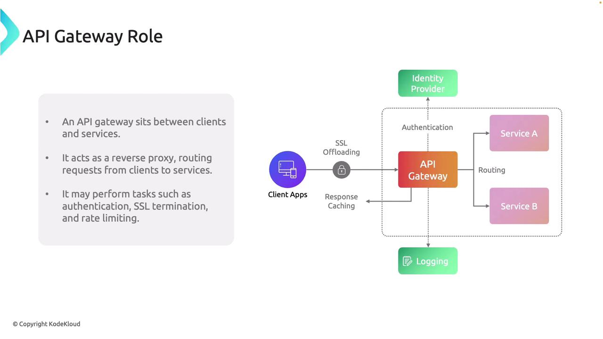
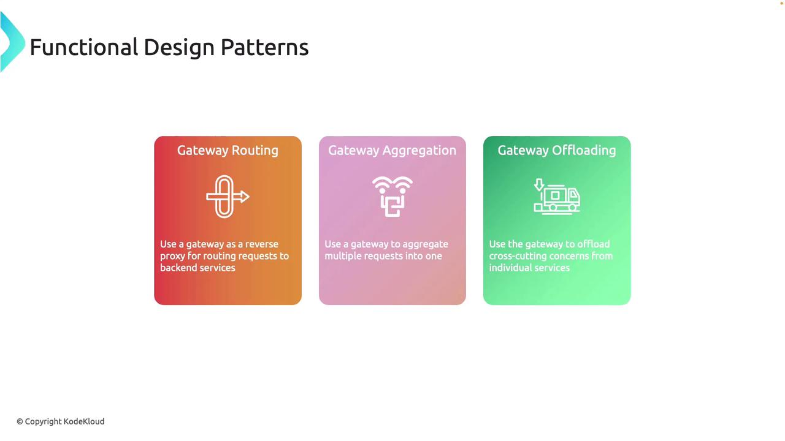
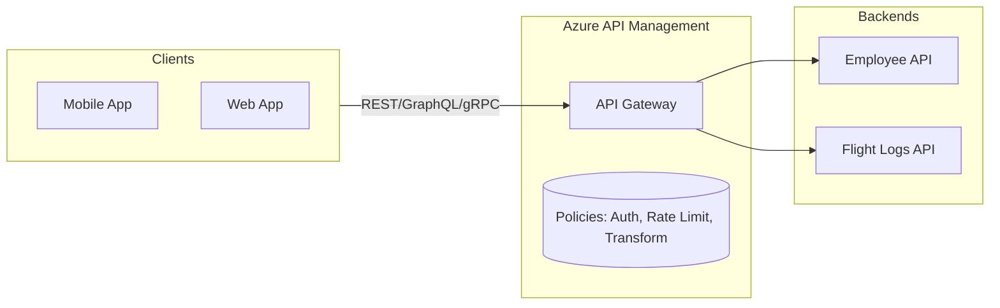

# 🚪 **API Gateway in Azure API Management**

## 📖 **What is an API Gateway?**

An **API Gateway** is a **reverse proxy** that sits between **API clients (consumers)** and **backend services (providers)**.
It’s the **entry point for all traffic**, ensuring that **every request** goes through a **centralized policy and security layer** before touching your backend.

**Think of it as:**

- 🔒 **Firewall for APIs** → blocks bad traffic, enforces auth
- 🕹️ **Traffic controller** → routes to correct backend or multiple services
- 🔄 **Protocol translator** → makes APIs consumer-friendly (e.g., REST → gRPC, SOAP → REST, GraphQL → REST)
- 📊 **Metrics collector** → logs and monitors every API call

---

<div align="center" style="background-color: #ffffffff ;border-radius: 10px;border: 2px solid white">
  
</div>

---

## ⚡ **Why do we need it?**

**🔹 Without an API gateway:**

- Clients must **talk directly** to each microservice/backend.
- Each service must implement **its own auth, rate limiting, logging, SSL termination**.
- Client code becomes **tightly coupled** → fragile when backends change.
- Security is inconsistent (one service may validate tokens differently than another).

> 👉 Result: A **fragile, unscalable, and insecure system**.

**🔹 With a gateway:**

- **One entry point** to manage all cross-cutting concerns.
- **Backends stay simple** → only focus on business logic.
- **Consumers get consistency** → one auth model, one documentation set.

---

## 🏗️ **API Gateway Core Functions**

1. **Routing**

   - Routes requests to the correct backend service (e.g., `/employee → HR API`, `/flights → Flight API`).
   - Supports **path-based, host-based, or header-based routing**.

2. **Authentication & Authorization**

   - Validate **OAuth2/JWT tokens**.
   - Enforce **subscription keys** (unique API keys per consumer).
   - Integrate with **Entra ID, GitHub, Google, Facebook** for federated auth.

3. **Rate Limiting & Quotas**

   - Prevent abuse by limiting requests per time window.
   - Example: `100 requests/min per IP`.

4. **Caching**

   - Cache frequent responses at the gateway → reduces backend load.

5. **Transformation**

   - Modify requests/responses (headers, query params, or body).
   - Example: backend returns XML → transform to JSON for clients.

6. **SSL Termination**

   - Gateway handles TLS/SSL → backend can use plain HTTP internally.

7. **Analytics & Monitoring**

   - Captures request logs, response times, error rates.
   - Integrates with **Log Analytics, Application Insights, Defender for APIs**.

---

## 🧩 **Common API Gateway Design Patterns**

<div align="center" style="background-color: #ffffffff ;border-radius: 10px;border: 2px solid white">
  
</div>

### 1️⃣ **Gateway Routing** (Reverse Proxy)

- Each request is routed to one backend.
- Example: `/api/employees` → Employee API, `/api/flights` → Flight API.

### 2️⃣ **Gateway Aggregation** (Backend-for-Frontend, BFF)

- Gateway **aggregates data from multiple services** into one response.
- Example: `/dashboard` → fetches data from Employee API + Flight API, merges JSON → sends single response.

### 3️⃣ **Gateway Offloading**

- Gateway centralizes cross-cutting concerns:

  - **Auth** → token validation at gateway, not in every service.
  - **SSL** → handled once at gateway.
  - **Logging/Monitoring** → done in one place.

This makes microservices **lighter, faster, and easier to maintain**.

---

## 🏛️ **API Gateway in Azure APIM**

In **Azure API Management**, the **Gateway** is deployed as part of the APIM instance.

- **Managed gateway** → Always included with APIM (cloud-hosted, public endpoint).
- **Self-hosted gateway** → You can run the APIM gateway inside **AKS, ACA, VM, on-prem** → useful for hybrid and private deployments.

📌 **Key Azure features:**

- **Policies**: XML-based rules for traffic management.
- **Integrations**: Connect to Azure Functions, Logic Apps, App Service, AKS/ACA, VMs, or even AWS/GCP services.
- **VNet integration**: Deploy gateway in **internal mode** (no public endpoint, only private IP).

---

## ✍🏻 **Example** – API Gateway in Action

**Imagine we publish two APIs in APIM:**

- `Employee API` (App Service backend)
- `Flight Logs API` (App Service backend)

### 🔹 Routing

```yaml
Client → https://mycompany-apim.azure-api.net/employee → Employee App Service
Client → https://mycompany-apim.azure-api.net/flights → Flight Logs App Service
```

### 🔹 Security (JWT validation + rate limit policy)

```xml
<inbound>
  <validate-jwt header-name="Authorization" require-scheme="Bearer">
    <openid-config url="https://login.microsoftonline.com/{tenant}/v2.0/.well-known/openid-configuration" />
  </validate-jwt>
  <rate-limit-by-key calls="50" renewal-period="60" counter-key="@(context.Request.IpAddress)" />
  <base />
</inbound>
```

### 🔹 Transformation (XML → JSON)

```xml
<outbound>
  <set-header name="Content-Type" exists-action="override">
    <value>application/json</value>
  </set-header>
  <xml-to-json apply="always" consider-accept-header="false" />
</outbound>
```

---

## 🔎 Diagram – API Gateway Role in APIM



---

## ⚖️ Summary

- The **API Gateway** is the **traffic cop** for your APIs.
- In **APIM**, it ensures all calls go through a **single policy & security layer**.
- Provides **routing, auth, rate-limiting, caching, SSL offloading, analytics, and transformations**.
- Supports both **Azure-managed** and **self-hosted** gateways.
- Without it, you end up with **spaghetti client-to-service calls** that are hard to scale or secure.
