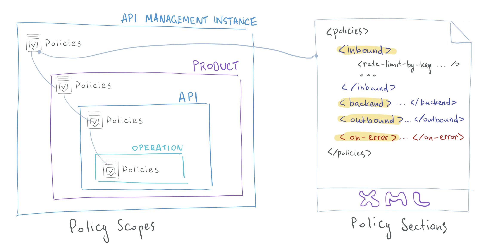

# ⚙️ **Azure API Management Policies**

## 📖 **What is a Policy?**

A **policy** in APIM is a configuration (written in **XML**) that executes at runtime inside the **API Gateway pipeline**.
Policies are **declarative**, meaning you don’t write backend code — you describe the **what**, not the **how**.

👉 Example:

- Want to **reject requests over 1 MB**? → Policy.
- Want to **convert XML responses to JSON**? → Policy.
- Want to **validate a JWT token**? → Policy.

---

<div align="center" style="background-color: #ffffffff ;border-radius: 10px;border: 2px solid white">
  
</div>

---

## 🍰 **Policy Segments**

Policies are expressed in XML and structured to manage various scenarios through four primary segments:

- **Inbound**: Handles rules for processing incoming requests.
- **Backend**: Applies policies before forwarding the request to the backend service.
- **Outbound**: Modifies the outgoing response.
- **Error**: Contains steps to execute if an error occurs (defined in the <on-error> block).

If an error occurs during processing, the system halts the standard flow and triggers the instructions specified in the error block.

## 📜 **Basic Policy Structure**

Below is an example of a fundamental policy structure outlining the different processing segments:

```xml
<policies>
  <inbound>
    <!-- statements to be applied to the request go here -->
  </inbound>
  <backend>
    <!-- statements to be applied before the request is forwarded to the backend service go here -->
  </backend>
  <outbound>
    <!-- statements to be applied to the response go here -->
  </outbound>
  <on-error>
    <!-- statements to be applied if there is an error condition go here -->
  </on-error>
</policies>
```

For example, consider a simple find-and-replace policy implemented in the inbound section. This policy modifies the incoming request by replacing a specific string value:

```xml
<policies>
  <inbound>
    <cross-domain />
    <base />
    <find-and-replace from="xyz" to="abc" />
  </inbound>
</policies>
```

## 🪈 **Policy Pipeline**

When a request hits the APIM Gateway, it flows through **three policy sections**:

1. **Inbound** → Runs **before** the request is forwarded to the backend.

   - Typical tasks: **Auth**, **rate limiting**, **rewrite URL**, **validate headers**.

2. **Backend** → Runs **before sending request to backend service**.

   - Typical tasks: **modify request headers/body**, **choose different backend**.

3. **Outbound** → Runs **after backend responds but before sending to client**.

   - Typical tasks: **transform response**, **add headers**, **convert XML → JSON**.

4. **On-Error** → Runs if an error occurs anywhere in the pipeline.

   - Typical tasks: **custom error response**, **fallback**, **logging**.

**📌 Diagram of flow:**

<div align="center" style="background-color: #ffffffff ;border-radius: 10px;border: 2px solid white">
  
</div>

---

## 🔍 **Policy Scope**

Policies can be applied at **different levels**:

- **Global (All APIs in APIM instance)**
- **Product (Bundle of APIs with shared policies)**
- **API (One API)**
- **Operation (One endpoint/method inside an API)**

<div align="center" style="background-color: #ffffffff ;border-radius: 10px;border: 2px solid white">
  
</div>

> 👉 This hierarchy allows you to enforce **common rules globally** (e.g., JWT validation for all APIs) and **specific tweaks** at the API/operation level.

---

## 🧩 **Common Policy Categories**

Let’s go through the **main types of policies**:

---

### 1️⃣ **Security Policies**

- **Subscription key enforcement**

  ```xml
  <check-header name="Ocp-Apim-Subscription-Key" failed-check-httpcode="401" failed-check-error-message="Missing subscription key" />
  ```

- **JWT validation** (Azure AD, Entra ID, Google, etc.)

  ```xml
  <validate-jwt header-name="Authorization" require-scheme="Bearer">
    <openid-config url="https://login.microsoftonline.com/{tenant}/v2.0/.well-known/openid-configuration" />
    <required-claims>
      <claim name="aud" match="any">
        <value>api://my-api-app-id</value>
      </claim>
    </required-claims>
  </validate-jwt>
  ```

- **IP restriction**

  ```xml
  <check-header name="X-Forwarded-For" exists-action="override">
    <value>Allowed-IP-Only</value>
  </check-header>
  ```

---

### 2️⃣ **Traffic Control Policies**

- **Rate limiting**

  ```xml
  <rate-limit calls="10" renewal-period="60" />
  ```

- **Quota (daily/monthly cap)**

  ```xml
  <quota calls="1000" renewal-period="2592000" /> <!-- ~30 days -->
  ```

- **Caching** (responses cached at gateway)

  ```xml
  <cache-lookup vary-by-developer="true" />
  <cache-store duration="60" />
  ```

---

### 3️⃣ **Transformation Policies**

- **Rewrite URL**

  ```xml
  <rewrite-uri template="/v2/employees/{id}" />
  ```

- **Add/Remove headers**

  ```xml
  <set-header name="x-api-version" exists-action="override">
    <value>2.0</value>
  </set-header>
  ```

- **Convert XML → JSON**

  ```xml
  <xml-to-json apply="always" consider-accept-header="false" />
  ```

- **Modify request body (via Liquid templates)**

  ```xml
  <set-body template="liquid">
  {
    "newId": "{{body.oldId}}",
    "newName": "{{body.oldName}}"
  }
  </set-body>
  ```

---

### 4️⃣ **Integration Policies**

- **Call another API (chaining)**

  ```xml
  <send-request mode="new" response-variable-name="extra">
    <set-url>https://otherapi.com/data</set-url>
    <set-method>GET</set-method>
  </send-request>
  ```

- **Forward to different backend**

  ```xml
  <set-backend-service base-url="https://new-backend.com" />
  ```

- **Inject Key Vault secrets**

  ```xml
  <set-header name="Authorization" exists-action="override">
    <value>@Microsoft.KeyVault(SecretUri=https://myvault.vault.azure.net/secrets/apikey)</value>
  </set-header>
  ```

---

### 5️⃣ **Error Handling Policies**

- **Custom error response**

  ```xml
  <choose>
    <when condition="@(context.Response.StatusCode == 500)">
      <return-response>
        <set-status code="503" reason="Service Unavailable" />
        <set-body>{"error": "Backend temporarily unavailable"}</set-body>
      </return-response>
    </when>
  </choose>
  ```

---

## ✍🏻 **Example – Full Policy Pipeline**

```xml
<policies>
  <inbound>
    <base />
    <validate-jwt header-name="Authorization" require-scheme="Bearer" />
    <rate-limit calls="100" renewal-period="60" />
    <rewrite-uri template="/v2/employees" />
  </inbound>
  <backend>
    <set-backend-service base-url="https://myapp.azurewebsites.net" />
  </backend>
  <outbound>
    <set-header name="X-Powered-By" exists-action="override">
      <value>APIM</value>
    </set-header>
    <xml-to-json apply="always" />
  </outbound>
  <on-error>
    <return-response>
      <set-status code="500" reason="Internal Error" />
      <set-body>{"message": "Something went wrong"}</set-body>
    </return-response>
  </on-error>
</policies>
```

---

## 💭 **Real-World Use Cases**

- 🔐 Secure all APIs with **JWT validation** globally.
- 🧭 Route old clients from `/v1/*` → `/v2/*` with **rewrite-uri**.
- ⚡ Improve performance with **response caching** for 60s.
- 🔄 Aggregate multiple APIs into **one response** via **send-request**.
- 🚨 Gracefully handle downtime with **on-error → return-response**.

---

## 🏁 **Summary**

- **Policies = programmable rules inside APIM Gateway**.
- **Pipeline = inbound → backend → outbound → on-error**.
- Categories: **Security, Traffic control, Transformation, Integration, Error handling**.
- Written in **XML** but super powerful (think "middleware as config").
- Let you enforce **security, consistency, and developer experience** across **all APIs** without backend changes.
