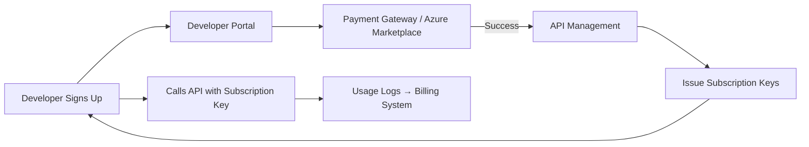

# 💰 Managing API Subscriptions for Monetization in Azure API Management

When you expose APIs publicly (to partners, customers, startups, etc.), you need a way to:

1. **Control access** 🔐
2. **Track usage** 📊
3. **Bill for consumption** 💵

APIM **subscriptions + products** are the foundation. From there, you layer on **plans, monetization models, and external billing integrations**.

---

## 🏗️ 1. Organize APIs into Products

- Group APIs into **Products** (e.g., _Free_, _Standard_, _Premium_).
- Each product can have:

  - Usage **quotas** (e.g., 1,000 calls/month).
  - Rate limits (e.g., 10 calls/sec).
  - SLA promises.

📌 Example:

- **Free Product** → 100 calls/day, limited APIs.
- **Pro Product** → Unlimited calls, all APIs, \$49/month.

---

## 🔑 2. Issue Subscriptions per Developer

- Developers must **subscribe** to a product.
- Each subscription generates **two keys** (primary & secondary).
- You can:

  - Auto-approve subscriptions ✅
  - Require admin approval before issuing keys 🛂

> Keys = contract. Whoever has the key is a paying (or free-tier) customer.

---

## ⚙️ 3. Enforce Monetization with Policies

APIM Policies let you enforce **who gets what for how much**:

- `quota-by-key` → “10,000 calls/month max for this subscription.”
- `rate-limit-by-key` → “50 requests/sec for premium tier.”
- `check-header` → “Reject calls without valid key.”

📌 Example policy inside `inbound`:

```xml
<inbound>
  <rate-limit-by-key calls="100" renewal-period="60" />
  <quota-by-key calls="10000" renewal-period="2592000" />
</inbound>
```

---

## 💵 4. Monetization Models

Here’s where you “get your money”:

| Model                       | How It Works                         | Example                               |
| --------------------------- | ------------------------------------ | ------------------------------------- |
| **Freemium**                | Free basic tier + paid premium tiers | First 1,000 calls free, then upgrade  |
| **Subscription (Flat)**     | Fixed monthly fee for a product      | \$99/month for unlimited API calls    |
| **Pay-as-You-Go (Metered)** | Bill based on API usage              | \$0.01 per API call                   |
| **Tiered Pricing**          | Price changes by usage tier          | $10 for 10k calls, $50 for 100k calls |
| **Enterprise Contracts**    | Custom agreements                    | SLA + special quota for partners      |

---

## 🔗 5. Integrating Billing

👉 APIM **does not bill customers directly**. You integrate with external systems:

- **Azure Marketplace**

  - Publish your API product on Azure Marketplace.
  - Customers subscribe & get billed via their Azure subscription.
  - You get paid by Microsoft.

- **External Payment Gateway (Stripe, PayPal, etc.)**

  - Use Developer Portal + custom signup workflow.
  - Customers pay on your site → you provision subscriptions in APIM.

- **CRM/ERP Integration**

  - Manage contracts in Salesforce/HubSpot.
  - Automatically create subscriptions in APIM for new customers.

---

## 👨‍💻 6. Workflow Example



---

## 📊 7. Tracking & Reporting

- **APIM Analytics** → See which subscriptions use the most traffic.
- **Export Logs to Log Analytics / App Insights** → Build custom dashboards.
- **Azure Monitor Alerts** → Notify when quota limits are hit.

---

## ✅ Best Practices

- Always provide **two keys per subscription** → makes rotation possible.
- Offer **clear tiers** (Free, Standard, Premium) → easier to market & sell.
- Use **quota + rate limit policies** to prevent abuse.
- Integrate with **Azure Marketplace** if you want Microsoft to handle billing.
- For DIY billing → integrate Developer Portal → Payment Provider → APIM Subscriptions.
- Automate with **APIM REST API** or **az apim subscription** commands.

---

🔑 **In summary**:

- Use **Products + Subscriptions** to define access levels.
- Enforce **quotas & limits** via Policies.
- Choose a **monetization model** (freemium, pay-as-you-go, subscription).
- Integrate APIM with **Azure Marketplace** or external billing.
- Monitor usage → turn traffic into revenue.

---

👉 Do you want me to build you a **hands-on monetization lab** where:

- We create _Free_ and _Premium_ products,
- Auto-issue subscription keys,
- Enforce quotas,
- And hook usage reporting to **Log Analytics** for billing simulation?
