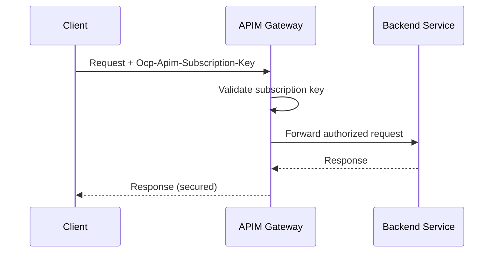
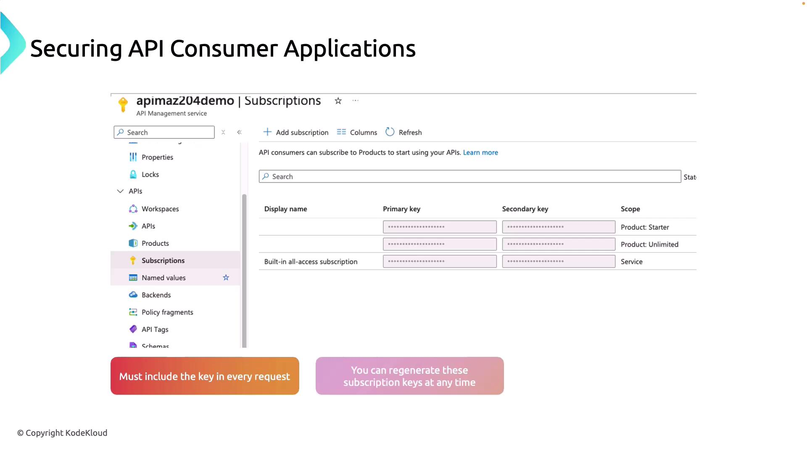
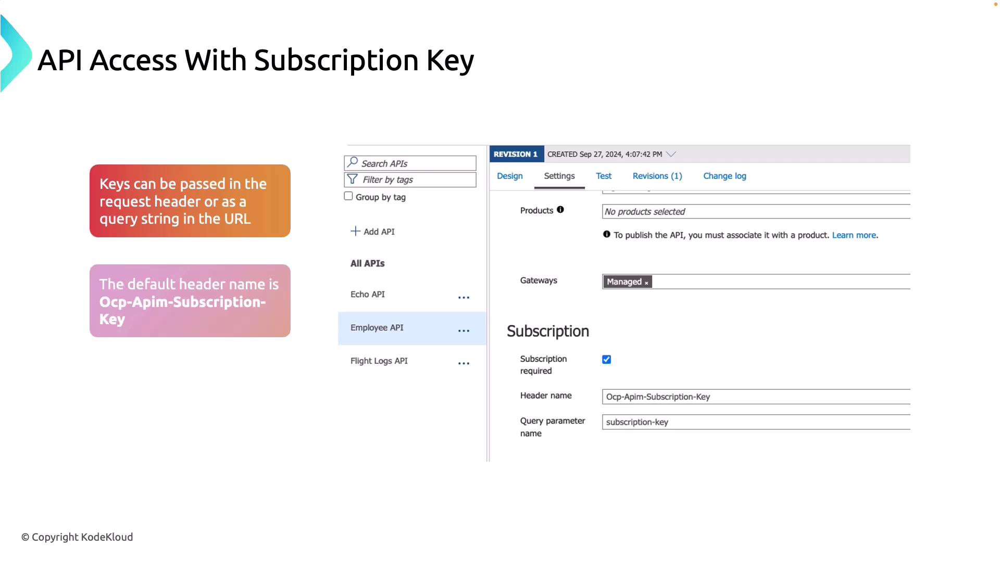

# 🔐 Securing APIs with Subscriptions in APIM

Securing your APIs is essential to ensure that only authorized applications can connect to your services. Azure API Management employs subscription keys as a primary way to control API access.

## 🚩 Why Subscriptions?

- Every API needs **controlled access**.
- Instead of exposing your backend to _anyone_ on the internet, APIM issues **subscription keys** (like API keys).
- These keys are tied to **products** (a bundle of APIs) and **developers** (consumers).
- You enforce:

  - Who can access (authN).
  - How much they can consume (authZ + quotas/rate limits).

---

## 🏗️ Core Concepts

- **Subscription** → Contract between an **API consumer** and a **Product** (set of APIs).
- **Subscription Key** → Unique string that must be included in API requests.
- **Products** → Bundle APIs + Policies (rate limiting, quotas, terms). Developers subscribe to products.
- **Groups** → Control who can subscribe to products (e.g., _internal devs_, _partners_, _guests_).
- **Primary/Secondary Keys** → Each subscription has two keys for safe rotation.

---

## 🔍 **Subscription Key Scopes**

Azure API Management allows you to apply subscription keys at different scopes to suit your access control needs:

1. **All APIs Scope**:  
   The subscription key provides access to every API available through the gateway. This simplifies management when you want a single key to cover your entire API portfolio.

2. **Single API Scope**:  
   The subscription key is limited to a specific API and all its endpoints. This approach is ideal for restricting access to selected APIs.

3. **Product Scope**:  
   A product is a grouping of APIs with shared access rules, usage quotas, and terms of use. Subscription keys at the product level are particularly useful for managing bundled service offerings.

## 🔄 Request Flow with Subscriptions

<div align="center">



</div>

- Without a valid key → `401 Unauthorized`.
- With an invalid product subscription → `403 Forbidden`.

---

## 🤔 Do quotas _require_ subscription keys?

- **Yes.**
  In APIM, **quota and rate-limit policies are applied per subscription**.
  Why? Because APIM needs a **stable identifier** (the subscription ID/key) to know _which consumer_ is making the call so it can keep track of counters (e.g., `calls=100/day`).

- Without a subscription key:

  - APIM sees every request as **anonymous / untracked**.
  - You can still apply **global throttling** (`rate-limit-by-key` with something like IP address), but it won’t be tied to a specific _user/customer account_.

---

## 🛠️ Why did I create a subscription key for the **Free plan**?

Because even in a free tier scenario (like **100 calls/day**):

- You still want to **track usage per user/customer**.
- Subscription key acts like a _membership card_ → "this is FreeUser123, he gets 100/day".
- Once quota resets tomorrow, he can call again.

If you didn’t require a subscription key for Free plan:

- Every anonymous caller would share the same quota bucket → abuse is easy.
- You couldn’t differentiate users → no “per customer” metering.

---

## ⚖️ Subscription Key vs. OAuth2/JWT

- **Subscription key** = _Access + Metering_.

  - Primary purpose: Identify subscription → apply quota/limits.
  - Weakness: Not identity-bound (if leaked, others can use).

- **OAuth2/JWT** = _Identity + Authorization_.

  - Primary purpose: Verify user is _who they say they are_.
  - Can carry claims like roles, tenant, scopes.

👉 Best practice in production:

- Use **both**:

  - Subscription key → metering, quotas, billing.
  - JWT → user identity & fine-grained authorization.

---

## 🧩 Example Scenarios

| Scenario                             | Subscription Key | JWT         | Quota/Rate-Limit                        |
| ------------------------------------ | ---------------- | ----------- | --------------------------------------- |
| Public free API (100/day)            | ✅ required      | ❌ optional | Per user (via sub key)                  |
| Premium SaaS API                     | ✅ required      | ✅ required | Per user, tied to plan                  |
| Internal API (no billing, only auth) | ❌ optional      | ✅ required | Can apply global rate-limit by IP/claim |

---

## ⚙️ Step-by-Step Hands-On

### 🎨 **Using Portal**

#### 1️⃣ To manage subscription keys in the Azure portal:

1. Navigate to your API Management instance.
2. Select the "Subscriptions" section to view both product-level keys and service-level keys that grant access to all APIs.
3. Click "Add Subscription" to create a new subscription. Provide a name (for example, "Flight API") and select the appropriate scope.

<div align="left">
  
</div>

- > For example, you might choose the "Specific API" option and select the "Flight Logs API." After creating the subscription, click on "Show/Hide Keys" to view the primary key. You will then integrate this key in your API calls, either as a **header** with the name `OCP-Apim-Subscription-Key` or as a **query string parameter** with the name `?subscription-key=<value>`.

<div align="left">
  
</div>

### 🧑🏻‍💻 **Using CLI**

#### 1️⃣ Create a Product in APIM

```bash
az apim product create \
  --resource-group my-rg \
  --service-name my-apim \
  --product-id premium-api \
  --display-name "Premium API Product" \
  --approval-required false \
  --state published
```

#### 2️⃣ Link an API to the Product

```bash
az apim product api add \
  --resource-group my-rg \
  --service-name my-apim \
  --product-id premium-api \
  --api-id employee-v1
```

#### 3️⃣ Create a Subscription

```bash
az apim subscription create \
  --resource-group my-rg \
  --service-name my-apim \
  --name "Employee API Subscription" \
  --display-name "DevTeam1 Access" \
  --scope "/products/premium-api"
```

> This will generate **primary** and **secondary** subscription keys.

#### 4️⃣ Call API with Subscription Key

```bash
# Using header
curl -H "Ocp-Apim-Subscription-Key: <primary-key>" \
  "https://my-apim.azure-api.net/employee?api-version=v1"

# Or using query string
curl "https://my-apim.azure-api.net/employee?api-version=v1&subscription-key=<primary-key>"
```

---

## 🔑 Best Practices

- 🔁 **Rotate Keys** → use primary/secondary alternately during deployment.
- 🛡️ **Policies** → combine with subscription:

  - `rate-limit-by-key` (e.g., 100 calls/min per subscription).
  - `quota-by-key` (e.g., 10,000 calls/month).

- 🎯 **Limit Subscription Scope** →

  - Product-level: devs subscribe to a _set_ of APIs.
  - API-level: direct subscription to one API (rare).

- 🔌 **Combine with OAuth/JWT** → subscription is _not a replacement_ for OAuth but can be layered.
- 👀 **Monitor** → subscription keys appear in APIM analytics for usage tracking.

---

## ⚔️ Subscription Keys vs Other Security Options

| Method                  | What it Secures         | Strengths                           | Weaknesses                       |
| ----------------------- | ----------------------- | ----------------------------------- | -------------------------------- |
| **Subscription Keys**   | Product/API access      | Simple, usage tracking, rate limits | Shared secret, not user identity |
| **OAuth2/JWT**          | User identity + scopes  | Fine-grained auth, enterprise-grade | More complex                     |
| **Client certs (mTLS)** | Client machine identity | Strong security                     | Harder to manage                 |

👉 Often you’ll use **subscription keys + OAuth/JWT** together in enterprise scenarios.
