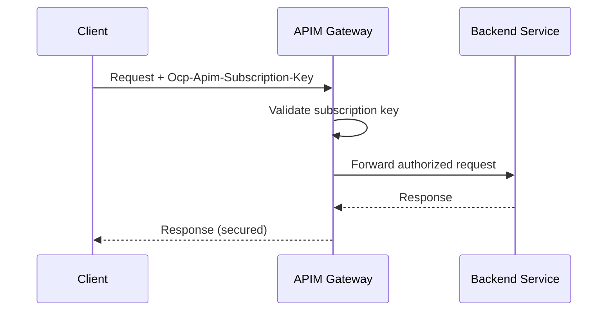

# 🔐 Securing APIs with Subscriptions in APIM

## 🚩 Why Subscriptions?

- Every API needs **controlled access**.
- Instead of exposing your backend to _anyone_ on the internet, APIM issues **subscription keys** (like API keys).
- These keys are tied to **products** (a bundle of APIs) and **developers** (consumers).
- You enforce:

  - Who can access (authN).
  - How much they can consume (authZ + quotas/rate limits).

---

## 🏗️ Core Concepts

- **Subscription** → Contract between an **API consumer** and a **Product** (set of APIs).
- **Subscription Key** → Unique string that must be included in API requests.
- **Products** → Bundle APIs + Policies (rate limiting, quotas, terms). Developers subscribe to products.
- **Groups** → Control who can subscribe to products (e.g., _internal devs_, _partners_, _guests_).
- **Primary/Secondary Keys** → Each subscription has two keys for safe rotation.

---

## 🔄 Request Flow with Subscriptions

<div align="center">



</div>

- Without a valid key → `401 Unauthorized`.
- With an invalid product subscription → `403 Forbidden`.

---

## ⚙️ Step-by-Step Hands-On

### 1️⃣ Create a Product in APIM

```bash
az apim product create \
  --resource-group my-rg \
  --service-name my-apim \
  --product-id premium-api \
  --display-name "Premium API Product" \
  --approval-required false \
  --state published
```

### 2️⃣ Link an API to the Product

```bash
az apim product api add \
  --resource-group my-rg \
  --service-name my-apim \
  --product-id premium-api \
  --api-id employee-v1
```

### 3️⃣ Create a Subscription

```bash
az apim subscription create \
  --resource-group my-rg \
  --service-name my-apim \
  --name "Employee API Subscription" \
  --display-name "DevTeam1 Access" \
  --scope "/products/premium-api"
```

> This will generate **primary** and **secondary** subscription keys.

### 4️⃣ Call API with Subscription Key

```bash
# Using header
curl -H "Ocp-Apim-Subscription-Key: <primary-key>" \
  "https://my-apim.azure-api.net/employee?api-version=v1"

# Or using query string
curl "https://my-apim.azure-api.net/employee?api-version=v1&subscription-key=<primary-key>"
```

---

## 🔑 Best Practices

- 🔁 **Rotate Keys** → use primary/secondary alternately during deployment.
- 🛡️ **Policies** → combine with subscription:

  - `rate-limit-by-key` (e.g., 100 calls/min per subscription).
  - `quota-by-key` (e.g., 10,000 calls/month).

- 🎯 **Limit Subscription Scope** →

  - Product-level: devs subscribe to a _set_ of APIs.
  - API-level: direct subscription to one API (rare).

- 🔌 **Combine with OAuth/JWT** → subscription is _not a replacement_ for OAuth but can be layered.
- 👀 **Monitor** → subscription keys appear in APIM analytics for usage tracking.

---

## ⚔️ Subscription Keys vs Other Security Options

| Method                  | What it Secures         | Strengths                           | Weaknesses                       |
| ----------------------- | ----------------------- | ----------------------------------- | -------------------------------- |
| **Subscription Keys**   | Product/API access      | Simple, usage tracking, rate limits | Shared secret, not user identity |
| **OAuth2/JWT**          | User identity + scopes  | Fine-grained auth, enterprise-grade | More complex                     |
| **Client certs (mTLS)** | Client machine identity | Strong security                     | Harder to manage                 |

👉 Often you’ll use **subscription keys + OAuth/JWT** together in enterprise scenarios.

---

✅ **In summary**:
Subscriptions in APIM secure APIs by requiring **subscription keys**, managing access at **product/API level**, and enforcing **quotas & rate limits**. They’re simple but powerful for **consumer onboarding, tracking, and governance**.
