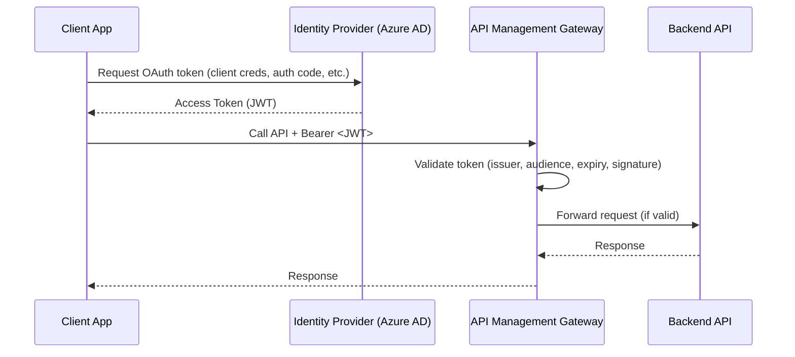

# 🔒 Securing APIs Using OAuth 2.0 in Azure API Management

## 1️⃣ Why OAuth 2.0?

OAuth 2.0 is an **industry-standard authorization framework** that lets apps access APIs **on behalf of users or other apps** — without sharing passwords.

- ✅ Stronger security than subscription keys.
- ✅ Tied to identity (JWT tokens carry claims).
- ✅ Works with identity providers (Azure AD, Entra ID, Google, GitHub, etc.).
- ✅ Enables fine-grained **scope-based access**.

---

## 2️⃣ How It Works (Flow in APIM Context)



- **Client** requests token from **IdP** (e.g., Azure AD).
- **Client** calls API with `Authorization: Bearer <JWT>`.
- **APIM** validates token before forwarding to backend.

---

## 3️⃣ Where OAuth Fits in APIM

In APIM, OAuth 2.0 appears in **two main places**:

1. **OAuth 2.0 Authorization Server (APIM config)**

   - Defines how APIM talks to your Identity Provider.
   - Example: Azure AD Tenant → `https://login.microsoftonline.com/{tenantId}/oauth2/v2.0/token`.

2. **API Authorization Settings (per API / operation)**

   - Enforce: "Only calls with valid tokens from this auth server are allowed."
   - Map scopes → control what APIs/operations the token can access.

---

## 4️⃣ Hands-On: Securing an API with OAuth in APIM

### Step 1: Register an App in Azure AD (Entra ID)

1. Go to **Entra ID → App registrations → New Registration**.
2. Give it a name: `my-api-client`.
3. Redirect URI: `https://jwt.ms` (for testing).
4. Note down:

   - **Application (client) ID**
   - **Directory (tenant) ID**

Generate a **Client Secret** (for machine-to-machine flows).

---

### Step 2: Configure OAuth 2.0 in APIM

1. Open your **API Management instance**.
2. Navigate to **Security → OAuth 2.0 + OpenID Connect**.
3. Add new server:

   - **Display Name**: `AzureAD`
   - **Client Registration URL**: (optional for dev portal)
   - **Authorization Endpoint**: `https://login.microsoftonline.com/<tenant-id>/oauth2/v2.0/authorize`
   - **Token Endpoint**: `https://login.microsoftonline.com/<tenant-id>/oauth2/v2.0/token`
   - **Client ID**: `<your-client-id>`
   - **Client Secret**: `<your-secret>` (if needed)

---

### Step 3: Link API to OAuth Server

1. In APIM → Select your API.
2. Go to **Settings → OAuth 2.0**.
3. Choose the server you just created (`AzureAD`).
4. Select **Authorization: OAuth 2.0** for inbound policy.

---

### Step 4: Apply OAuth Validation Policy (Inbound Policy)

```xml
<policies>
  <inbound>
    <validate-jwt header-name="Authorization" failed-validation-httpcode="401" failed-validation-error-message="Invalid or expired token.">
      <openid-config url="https://login.microsoftonline.com/<tenant-id>/v2.0/.well-known/openid-configuration" />
      <audiences>
        <audience>api://your-api-id</audience>
      </audiences>
      <issuers>
        <issuer>https://login.microsoftonline.com/<tenant-id>/v2.0</issuer>
      </issuers>
    </validate-jwt>
    <base />
  </inbound>
  <backend>
    <base />
  </backend>
  <outbound>
    <base />
  </outbound>
</policies>
```

- Validates JWT signature using Azure AD public keys.
- Checks `aud` (audience) claim matches your API.
- Rejects expired or tampered tokens.

---

### Step 5: Test

1. Use Postman or curl:

   - Get token:

   ```bash
   curl -X POST \
     -H "Content-Type: application/x-www-form-urlencoded" \
     -d "grant_type=client_credentials&client_id=<CLIENT_ID>&client_secret=<CLIENT_SECRET>&scope=api://<API_ID>/.default" \
     https://login.microsoftonline.com/<TENANT_ID>/oauth2/v2.0/token
   ```

   - Response:

   ```json
   {
     "access_token": "eyJhbGciOiJSUzI1NiIs...",
     "token_type": "Bearer",
     "expires_in": 3600
   }
   ```

2. Call API through APIM:

   ```bash
   curl -H "Authorization: Bearer <access_token>" \
        https://<apim-name>.azure-api.net/myapi/endpoint
   ```

3. If token invalid → `401 Unauthorized`.

---

## 5️⃣ Use Cases

| Use Case                        | Why OAuth 2.0 is Best                                               |
| ------------------------------- | ------------------------------------------------------------------- |
| **SaaS API (per user pricing)** | Tokens tied to identity, supports scopes/roles.                     |
| **Mobile apps**                 | No secrets on device; user logins handled via OAuth flows.          |
| **Partner APIs**                | Control access per partner; rotate client secrets without downtime. |
| **Internal APIs**               | Combine OAuth with conditional access (MFA, IP restrictions).       |

---

✅ **Summary**

- **Subscription keys** = metering & quotas.
- **OAuth 2.0** = identity & authorization.
- In APIM, you typically **combine both** → keys for billing, OAuth for security.
