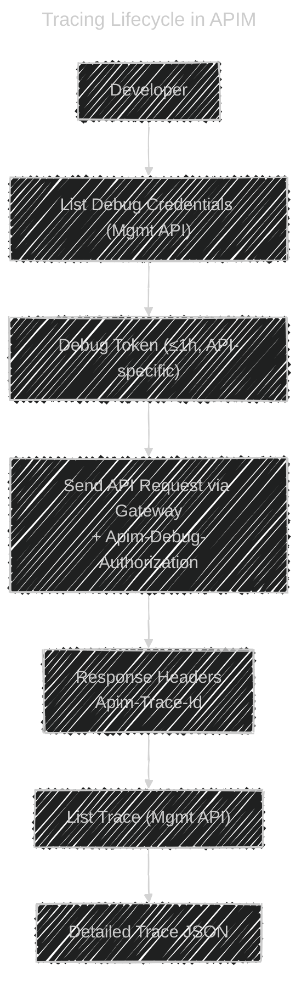
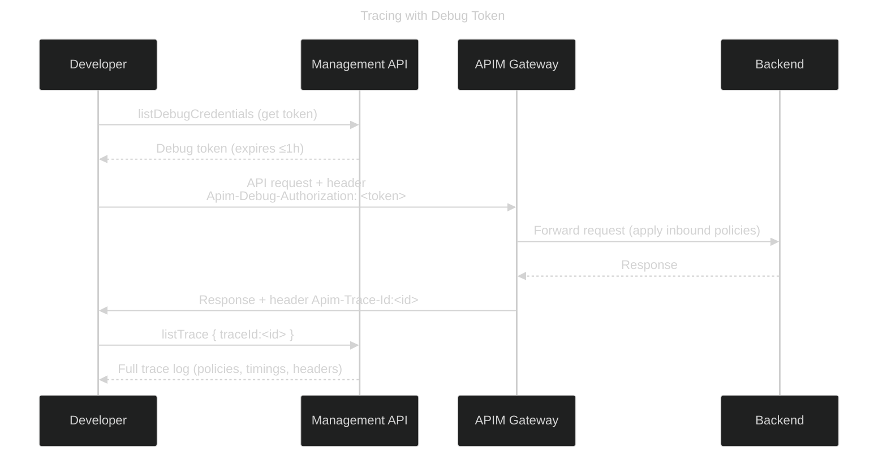

# 🔍 Tracing in Azure API Management (APIM)

## 📖 Official definition

**Tracing in APIM** is a **diagnostic mechanism** that captures **detailed step-by-step execution logs** of a request as it passes through the API Management gateway.
It shows how inbound/outbound policies are applied, what transformations occur, and what is sent to/received from the backend.

👉 It’s your **debugging microscope** inside APIM.

---

## 🎯 Key points

- **Not automatic** → must be explicitly enabled.
- Requires a **per-request debug token** (short-lived, ≤1h).
- Without a token, you cannot fetch trace logs for security reasons.
- Logs are retrieved via APIM **management APIs**, not the normal gateway response.
- **Trace info includes**:

  - Execution of inbound/outbound policies
  - Request/response headers & body
  - Backend timings & results
  - Latency breakdown

---

## 🏗️ How tracing works

1. **Get debug token** → via Management API (`listDebugCredentials`).
2. **Call API with debug header** → add `Apim-Debug-Authorization: <token>`.
3. **Response includes trace id** → `Apim-Trace-Id`.
4. **Retrieve trace** → via Management API (`listTrace`) using trace id.

---

## 🧭 Flow: Trace lifecycle



---

## 📜 Sequence: per-request trace with token



---

## 🧪 Hands-on steps

### 1) Get debug token

```http
POST https://management.azure.com/subscriptions/{subId}/resourceGroups/{rg}/providers/Microsoft.ApiManagement/service/{apim}/gateways/managed/listDebugCredentials?api-version=2023-05-01-preview
Authorization: Bearer <ARM-token>
Content-Type: application/json

{
  "credentialsExpireAfter": "PT1H",
  "apiId": "/subscriptions/{subId}/resourceGroups/{rg}/providers/Microsoft.ApiManagement/service/{apim}/apis/{apiId}",
  "purposes": ["tracing"]
}
```

### 2) Call your API with the token

```bash
curl -i "https://<gateway>/<api-path>" \
  -H "Ocp-Apim-Subscription-Key: <sub-key>" \
  -H "Apim-Debug-Authorization: <token>"
# Look for Apim-Trace-Id in response
```

### 3) Retrieve the trace

```http
POST https://management.azure.com/subscriptions/{subId}/resourceGroups/{rg}/providers/Microsoft.ApiManagement/service/{apim}/gateways/managed/listTrace?api-version=2023-05-01-preview
Authorization: Bearer <ARM-token>
Content-Type: application/json

{ "traceId": "<Apim-Trace-Id>" }
```

---

## 🧠 Cheat sheet

- **Enable tracing = Get token → Call API with token → Fetch trace by id.**
- **Tokens are short-lived (≤1h)** and scoped to one API.
- **Old header `Ocp-Apim-Trace:true` is deprecated** — replaced by `Apim-Debug-Authorization`.
- **Trace logs are detailed & sensitive** → use only in debugging, restrict access.
- **Where to view**:

  - Management API (JSON trace output)
  - Portal _Test_ tab (portal automates token behind the scenes)

---

✅ **Summary**:
Tracing in APIM is a **per-request, opt-in debug feature** using **short-lived debug tokens**. It lets you replay the **entire execution pipeline (inbound → backend → outbound)** and see exactly what happened inside the gateway — the ultimate tool for **debugging policies & performance bottlenecks**.

---
