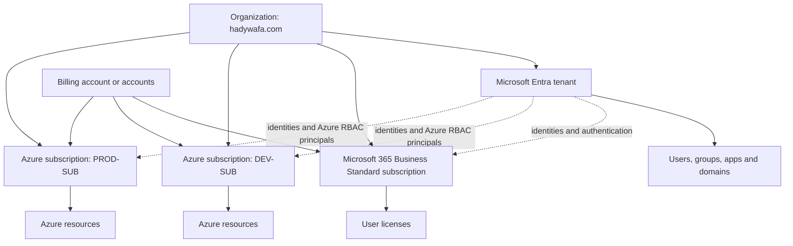

# Microsoft Cloud Subscriptions — The Complete Mental Model

The word **subscription** is overloaded across Microsoft products. It does not always mean the same thing.

The easiest way to understand the Microsoft cloud is to separate five concepts:

1. **Identity account**
2. **Microsoft Entra tenant**
3. **Product subscription**
4. **Licenses**
5. **Billing account and agreement**

---

## 1. The five concepts

| Concept | What it represents | Examples |
|---|---|---|
| Identity account | The identity used to sign in | Personal Microsoft account, work or school account |
| Microsoft Entra tenant | The organization's identity directory | Users, groups, applications, service principals, domains |
| Product subscription | An agreement to consume a Microsoft cloud product | Microsoft 365 Business Standard, Dynamics 365, Azure subscription |
| License | A per-user entitlement inside many SaaS subscriptions | One Microsoft 365 Business Standard seat assigned to one user |
| Billing account | The commercial and invoicing relationship with Microsoft or a partner | MCA, MOSA, MOSP, EA, MPA |

These objects are related, but they are **not interchangeable**.

---

## 2. Personal Microsoft account versus work or school account

### Personal Microsoft account

Examples:

```text
hadywafa@outlook.com
hady@gmail.com registered as a Microsoft account
```

Common uses:

- Outlook.com
- Microsoft 365 Personal or Family
- Xbox
- Consumer OneDrive
- Personal Azure sign-up

A personal Microsoft account can also own or access Azure resources. That does not turn it into an organizational work account.

### Work or school account

Example:

```text
contact@hadywafa.com
```

This identity exists inside a Microsoft Entra tenant.

Common uses:

- Microsoft 365 Business
- Microsoft Teams for an organization
- SharePoint Online
- Azure administration
- Enterprise applications
- Entra roles and Azure RBAC

---

## 3. Microsoft Entra tenant

A Microsoft Entra tenant is the organization's identity directory.

It contains:

```text
Tenant
├── Users
├── Groups
├── Devices
├── Enterprise applications
├── App registrations
├── Service principals
├── Administrative units
└── Custom domains
```

Example:

```text
Tenant name: Hady Wafa
Initial domain: hadywafa.onmicrosoft.com
Custom domain: hadywafa.com
```

The tenant answers:

> Who are the identities, and how do they authenticate?

The tenant is **not** an Azure billing account and is **not** an Azure subscription.

---

## 4. Product subscriptions

Microsoft uses the word subscription for different product models.

### 4.1 SaaS product subscription

Examples:

- Microsoft 365 Business Standard
- Microsoft 365 E5
- Dynamics 365 Sales
- Power BI Pro
- Microsoft Entra ID P1

These products are usually licensed per user or by capacity.

Example:

```text
Microsoft 365 Business Standard subscription
└── 5 purchased licenses
    ├── License assigned to contact@hadywafa.com
    ├── License assigned to admin@hadywafa.com
    └── 3 unassigned licenses
```

The subscription is the purchased product.  
The license is the entitlement assigned to a user.

### 4.2 Azure subscription

An Azure subscription is a resource-management and consumption scope.

Example:

```text
Azure subscription: DEV-SUB
├── Resource groups
├── Virtual machines
├── AKS
├── Storage accounts
├── Key vaults
└── Azure usage charges
```

Azure generally charges according to resource consumption rather than assigning one Azure license to each user.

### 4.3 Visual Studio subscription

A Visual Studio subscription is a developer-benefit product. Depending on the plan, it can include:

- Visual Studio software
- Developer tools
- Monthly Azure credit
- An Azure benefit subscription

The Visual Studio subscription and the resulting Azure subscription are related, but they are not the same object.

---

## 5. Licenses

Licenses are mainly relevant to Microsoft SaaS products.

```text
Organization
└── Microsoft 365 Business Standard subscription
    └── Purchased seats
        └── Assigned to users
```

Examples:

| Product | Typical assignment |
|---|---|
| Microsoft 365 Business Standard | Per user |
| Microsoft Entra ID P1 | Per eligible user |
| Power BI Pro | Per user |
| Dynamics 365 Sales | Per user |
| Azure infrastructure | Normally consumption-based, not one license per user |

### Entra ID Free, P1, and P2

Every Microsoft Entra directory has baseline identity capabilities.

- **Microsoft Entra ID Free** is included with Microsoft cloud subscriptions such as Azure and Microsoft 365.
- **Microsoft Entra ID P1** adds capabilities such as Conditional Access and is included in Microsoft 365 Business Premium, not Business Standard.
- **Microsoft Entra ID P2** adds advanced identity protection and privileged identity capabilities through eligible plans.

Microsoft 365 Business Basic and Business Standard should not be treated as if they automatically include Entra ID P1.

---

## 6. Billing accounts and agreements

A billing account answers:

> Under which commercial relationship are products purchased, invoiced, and paid for?

Microsoft billing agreement names vary by product and purchasing channel.

### Azure billing account types

- Microsoft Online Subscription Program (**MOSP**)
- Enterprise Agreement (**EA**)
- Microsoft Customer Agreement (**MCA**)
- Microsoft Partner Agreement (**MPA**)

### Microsoft business billing account types

In the Microsoft 365 admin center, common types include:

- Microsoft Customer Agreement (**MCA**)
- Microsoft Partner Agreement (**MPA**)
- Microsoft Online Subscription Agreement (**MOSA**)

> **MOSA and MOSP are not the same term.**
>
> - MOSA is associated with older direct Microsoft business-product purchases.
> - MOSP is associated with direct Azure billing such as traditional Azure pay-as-you-go or free-account sign-up.

---

## 7. One organization can have multiple subscriptions

A business can use one Entra tenant as the common identity provider for several Microsoft products.



Important:

- The tenant provides identity.
- Microsoft 365 subscriptions provide SaaS services and user licenses.
- Azure subscriptions contain Azure resources.
- Billing accounts pay for the products.
- The billing account is not necessarily a child of the tenant.

---

## 8. What Microsoft 365 Business Standard creates

Purchasing Microsoft 365 Business Standard for a new organization normally gives you:

```text
Microsoft organization
├── Microsoft Entra tenant
├── Initial onmicrosoft.com domain
├── Microsoft 365 product subscription
├── Purchased user licenses
└── A Microsoft business billing account
```

It does **not** automatically mean that you have:

```text
Azure infrastructure subscription
├── VMs
├── AKS
├── Storage
└── Azure consumption billing
```

An Azure subscription must be created or added separately.

The Microsoft business billing account might be MCA, MOSA, or partner-based depending on how and where the product was purchased. Check the Microsoft 365 admin center rather than assuming the type.

---

## 9. Your two identities

### Old personal identity

```text
hadywafa@outlook.com
```

This is a personal Microsoft account.

It may have access to:

- A personal Azure billing account
- One or more Azure subscriptions
- Consumer Microsoft subscriptions

If Azure shows an MCA billing account, that means the Azure commercial relationship you are viewing is MCA. It does not prove, by itself, that the account was migrated from MOSP. Check the billing account history and properties before making that conclusion.

### New organizational identity

```text
contact@hadywafa.com
```

This is a work account in your Microsoft Entra tenant.

It can be assigned:

- A Microsoft 365 Business Standard license
- Entra directory roles
- Azure RBAC roles
- Access to one or more Azure subscriptions

The work account and the subscription are separate objects.

---

## 10. The most useful questions

| Question | Correct object |
|---|---|
| Who signs in? | Personal account or work/school account |
| Where are organizational identities stored? | Microsoft Entra tenant |
| Which users can use Microsoft 365? | Assigned Microsoft 365 licenses |
| Where do Azure resources live? | Azure subscription |
| Who can manage an Azure resource? | Azure RBAC assignment |
| Who can manage users and groups? | Microsoft Entra role |
| Who receives and pays the invoice? | Billing account and billing profile |
| Which commercial agreement applies? | MCA, MOSA, MOSP, EA, or MPA |

---

## 11. Final mental model

```text
Identity
└── Personal account OR work/school account

Organization identity
└── Microsoft Entra tenant
    ├── Users
    ├── Groups
    ├── Applications
    └── Domains

SaaS products
└── Microsoft 365 / Dynamics / Power Platform subscription
    └── Licenses assigned to users

Azure infrastructure
└── Azure subscription
    └── Resource groups
        └── Resources

Commercial relationship
└── Billing account and agreement
    └── Pays for product subscriptions and usage
```

Do not use one hierarchy to explain all Microsoft products. Identity, products, Azure resources, and billing are connected but separate dimensions.

---

## Official references

- [Subscriptions, licenses, accounts, and tenants for Microsoft cloud offerings](https://learn.microsoft.com/en-us/microsoft-365/enterprise/subscriptions-licenses-accounts-and-tenants-for-microsoft-cloud-offerings)
- [Understand your Microsoft business billing account](https://learn.microsoft.com/en-us/microsoft-365/commerce/manage-billing-accounts)
- [Microsoft Entra licensing](https://learn.microsoft.com/en-us/entra/fundamentals/licensing)
- [Associate an Azure subscription with a Microsoft Entra tenant](https://learn.microsoft.com/en-us/entra/fundamentals/how-subscriptions-associated-directory)
