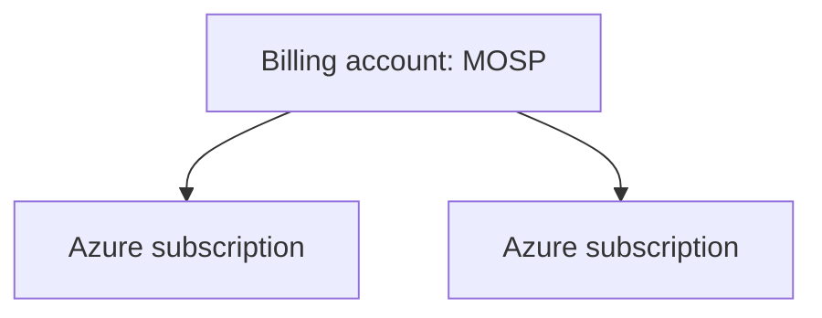
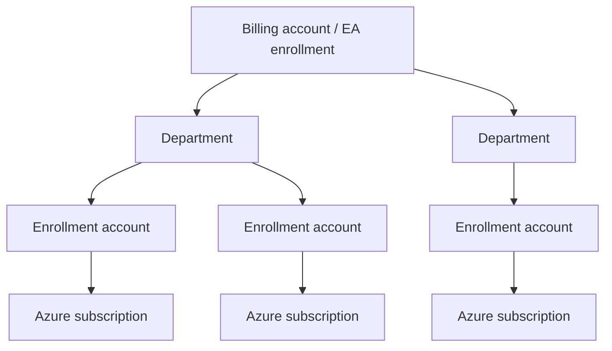
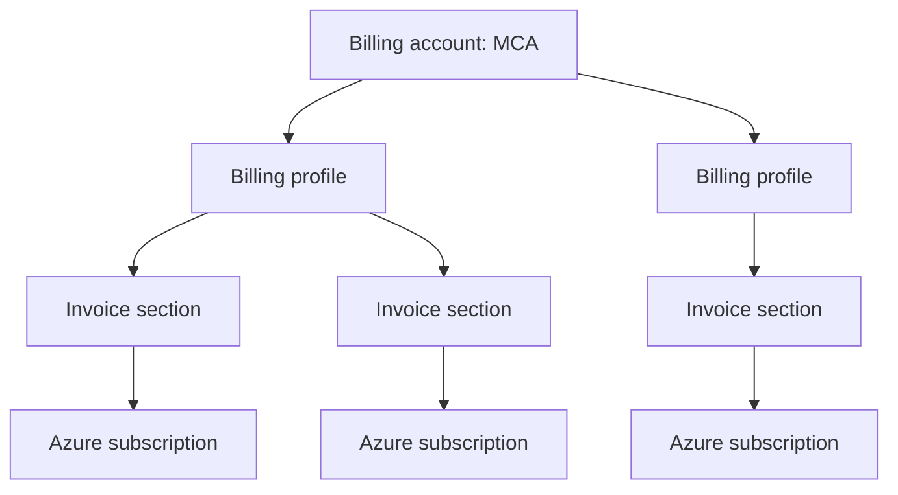
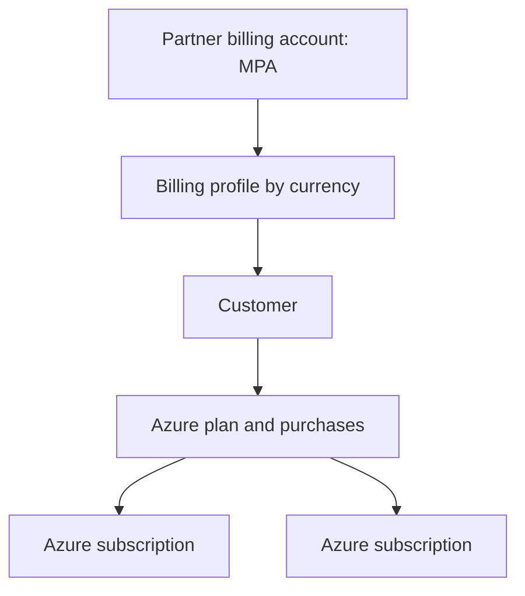
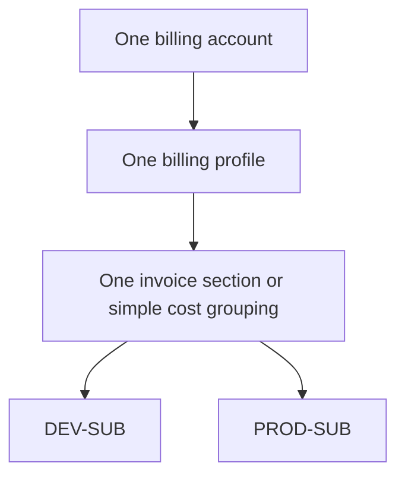

# Azure Billing Agreements, Accounts, and Hierarchies

Azure billing becomes easier when three layers are kept separate:

```text
Commercial agreement
Billing hierarchy
Azure subscription and resources
```

They are related, but they do not mean the same thing.

---

## 1. The three layers

### Layer 1 — Commercial agreement

This defines the purchasing relationship with Microsoft or a partner.

Examples:

```text
MOSP
EA
MCA
MPA
```

### Layer 2 — Billing hierarchy

This defines:

- Who receives invoices
- Which payment method is used
- How charges are grouped
- Which billing administrators can view and manage costs

The hierarchy differs by agreement type.

### Layer 3 — Azure subscription

The Azure subscription is where Azure resources are deployed and usage is recorded.

```text
Azure subscription
└── Resource groups
    └── Resources
```

---

## 2. Azure billing account types

Microsoft currently documents four main Azure billing account types:

| Type | Full name | Typical customer or channel |
|---|---|---|
| MOSP | Microsoft Online Subscription Program | Direct online Azure customer |
| EA | Enterprise Agreement | Large enterprise with an enrollment |
| MCA | Microsoft Customer Agreement | Direct Microsoft commercial agreement |
| MPA | Microsoft Partner Agreement | Cloud Solution Provider partner |

MCA does **not** mean “enterprise only.” An individual or a small company can have an MCA billing account.

EA and MOSP still exist. MCA should not be described as if it universally replaced every older account.

---

## 3. MOSP

### Full name

```text
Microsoft Online Subscription Program
```

MOSP is the traditional direct online Azure billing model.

Examples include direct Azure sign-up scenarios such as:

- Azure Free Account
- Traditional pay-as-you-go rates

### Simplified hierarchy



Compared with MCA, MOSP has a simpler billing structure and does not use the same Billing Profile → Invoice Section hierarchy.

### Best fit

- Individual learning account
- Small direct Azure usage
- Simple card-based billing
- Older direct Azure subscriptions

---

## 4. Enterprise Agreement

### Full name

```text
Enterprise Agreement
```

An Azure EA is designed for large organizations and enterprise purchasing.

### Billing hierarchy



### Main scopes

| Scope | Purpose |
|---|---|
| Billing account / enrollment | Top-level EA billing relationship |
| Department | Optional cost and organizational grouping |
| Enrollment account | Scope used by account owners to create and manage subscriptions |
| Azure subscription | Azure resource and consumption scope |

EA can include enterprise pricing, prepayment, commitments, and enterprise billing administration. Exact contract terms vary; do not assume every EA is exactly a three-year agreement.

---

## 5. Microsoft Customer Agreement

### Full name

```text
Microsoft Customer Agreement
```

MCA provides a modern billing hierarchy for direct Microsoft commercial purchases.

### Billing hierarchy



### Billing account

Represents the top-level commercial relationship and legal customer information.

It is used to manage:

- Agreements
- Legal and tax information
- Billing roles
- Billing profiles
- Overall billing visibility

### Billing profile

A billing profile represents an **invoice and its payment information**.

It controls or contains information such as:

- Bill-to details
- Payment method
- Invoice delivery
- Purchase-order information
- Currency and market inherited from the billing account

Microsoft generates a monthly invoice for each billing profile.

> Multiple billing profiles normally mean multiple invoices.

### Invoice section

An invoice section is a grouping of charges inside the billing profile's invoice.

Examples:

```text
Platform
Security
Development
Production
Project-A
Project-B
```

> Multiple invoice sections do not mean separate invoices.  
> They appear as sections or subtotals on the billing profile's invoice.

### Azure subscription under MCA

When creating an Azure subscription under an MCA, you select:

1. Billing account
2. Billing profile
3. Invoice section
4. Azure plan
5. Subscription name

The subscription usage is charged to the selected billing profile and displayed under the selected invoice section.

---

## 6. Microsoft Partner Agreement and CSP

### Full name

```text
Microsoft Partner Agreement
```

MPA is primarily the partner's agreement with Microsoft in the Cloud Solution Provider model.

### Simplified hierarchy



Important distinction:

- The CSP partner owns and manages the MPA billing relationship.
- The customer buys through the partner.
- The customer normally contacts the partner for billing and support questions governed by that channel.
- A customer should not describe its own Azure subscription as if it personally owns the partner's MPA billing account.

---

## 7. Agreement type versus plan, offer, or benefit

This is the most important distinction.

### Agreement or billing-account type

Examples:

```text
MCA
MOSP
EA
MPA
```

This answers:

> Under which commercial relationship is Azure purchased?

### Plan, offer, or benefit

Examples include:

```text
Azure plan
Pay-As-You-Go
Azure Free Account
Azure for Students
Visual Studio Azure benefit
Sponsorship
Enterprise Dev/Test
```

This answers questions such as:

- How is the subscription priced?
- Does it receive credit?
- Is there a spending limit?
- Is it restricted to development and testing?
- Which benefits apply?

A billing account type and an offer can coexist because they describe different dimensions.

However, current terminology varies by channel:

- Under MCA, Microsoft commonly uses **Azure plan** when creating subscriptions.
- Older or direct subscriptions might display **Pay-As-You-Go**, an offer name, or an offer ID.
- “Pay as you go” can be used informally as a pricing model, so always inspect the actual billing account type and subscription offer.

---

## 8. Historical view without the misleading assumptions

A safer historical model is:

### Earlier direct Azure purchasing

```text
MOSP billing account
└── Azure subscription
```

### Enterprise purchasing

```text
EA enrollment
└── Departments
    └── Enrollment accounts
        └── Azure subscriptions
```

### Modern direct commercial billing

```text
MCA billing account
└── Billing profiles
    └── Invoice sections
        └── Azure subscriptions and other purchases
```

### Partner purchasing

```text
MPA partner billing account
└── Billing profile
    └── Customer
        └── Azure plan and subscriptions
```

Do not state:

```text
All old MOSP accounts were silently migrated to MCA.
```

Microsoft supports migrations and updated billing experiences, but the history of a specific account must be checked. Seeing MCA today does not prove exactly how or when the account reached MCA.

---

## 9. Your likely scenarios

### Personal Azure usage

Identity:

```text
hadywafa@outlook.com
```

Possible billing structures:

```text
MOSP
or
MCA
```

The correct answer is whatever appears in:

```text
Azure portal
→ Cost Management + Billing
→ Billing scopes or Properties
→ Billing account type
```

If it shows MCA, use the MCA hierarchy. Do not infer the previous agreement without billing history.

### Business tenant

Identity:

```text
contact@hadywafa.com
```

Purchasing Microsoft 365 Business Standard creates a Microsoft business billing relationship, but that billing account can be MCA, MOSA, or partner-based depending on the purchasing channel.

An Azure subscription added later can have its own Azure billing relationship. Verify it in the Azure portal rather than assuming the Microsoft 365 purchase created the Azure subscription.

---

## 10. Recommended lab billing design

For a personal or small learning environment:



Recommended approach:

- Use one billing profile unless you genuinely need separate legal invoices or payment methods.
- Use multiple Azure subscriptions for governance and environmental isolation.
- Use invoice sections only when they improve cost reporting.
- Avoid creating extra billing profiles merely to separate DEV and PROD; separate profiles can produce separate invoices and can affect usage aggregation and reservation sharing.
- Add budgets and cost alerts to each Azure subscription.

Optional:

```text
Invoice section: Development
└── DEV-SUB

Invoice section: Production
└── PROD-SUB
```

This is useful for cost presentation, but it is not required to isolate resources.

---

## 11. How to verify your actual type

### Azure portal

```text
Cost Management + Billing
→ Billing scopes
→ Billing account type
```

Possible values include:

```text
Microsoft Online Subscription Program
Enterprise Agreement
Microsoft Customer Agreement
Microsoft Partner Agreement
```

For an MCA, inspect:

```text
Billing account
├── Billing profiles
└── Invoice sections
```

### Microsoft 365 admin center

```text
Billing
→ Billing accounts
→ Billing account type
```

Possible business billing types include:

```text
Microsoft Customer Agreement
Microsoft Partner Agreement
Microsoft Online Subscription Agreement
```

Remember:

```text
Azure MOSP ≠ Microsoft 365 MOSA
```

---

## 12. Final summary

| Question | Answer |
|---|---|
| What agreement do I buy Azure under? | MOSP, EA, MCA, or partner channel |
| Who is the top-level paying entity? | Billing account |
| Under MCA, what generates the invoice? | Billing profile |
| Under MCA, what groups costs inside the invoice? | Invoice section |
| Where are Azure resources deployed? | Azure subscription |
| Is MCA enterprise-only? | No |
| Does every subscription generate a separate invoice under MCA? | No |
| Does seeing MCA prove an old account was migrated from MOSP? | No |
| Is Pay-As-You-Go the same concept as MCA? | No |
| Is MOSA the same as MOSP? | No |

---

## Official references

- [View Azure billing accounts and account types](https://learn.microsoft.com/en-us/azure/cost-management-billing/manage/view-all-accounts)
- [Microsoft Customer Agreement billing overview](https://learn.microsoft.com/en-us/azure/cost-management-billing/understand/mca-overview)
- [Organize MCA billing with billing profiles and invoice sections](https://learn.microsoft.com/en-us/azure/cost-management-billing/manage/mca-section-invoice)
- [Enterprise Agreement billing administration](https://learn.microsoft.com/en-us/azure/cost-management-billing/manage/ea-direct-portal-get-started)
- [Microsoft Partner Agreement billing overview](https://learn.microsoft.com/en-us/azure/cost-management-billing/understand/mpa-overview)
- [Understand Microsoft business billing accounts](https://learn.microsoft.com/en-us/microsoft-365/commerce/manage-billing-accounts)
