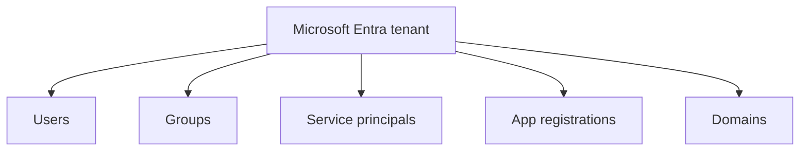
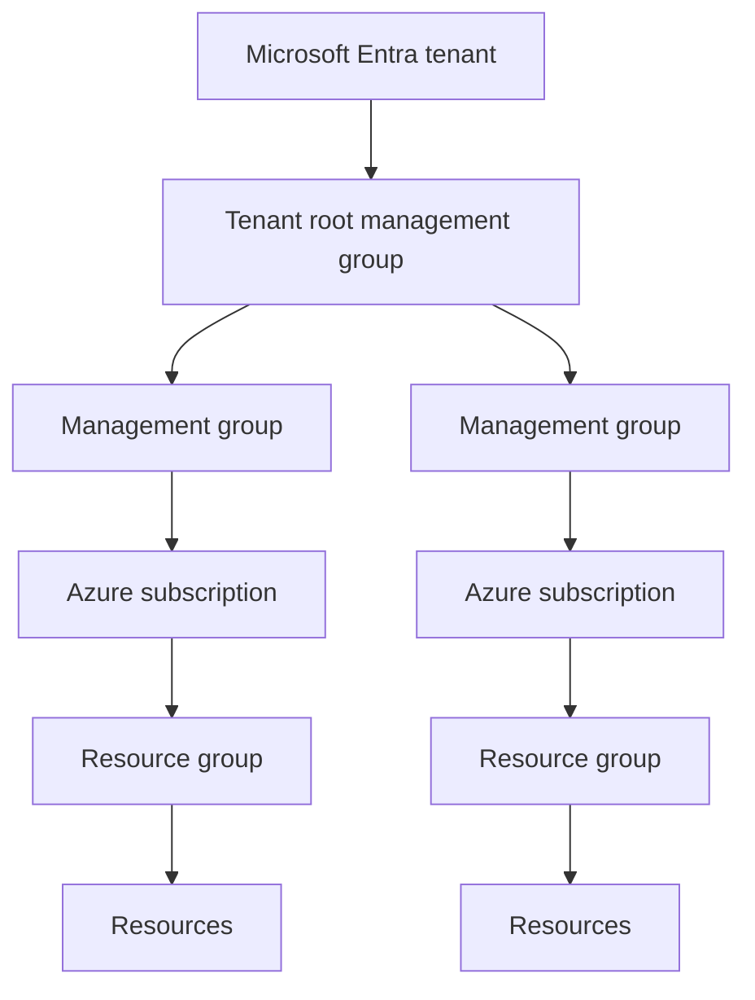
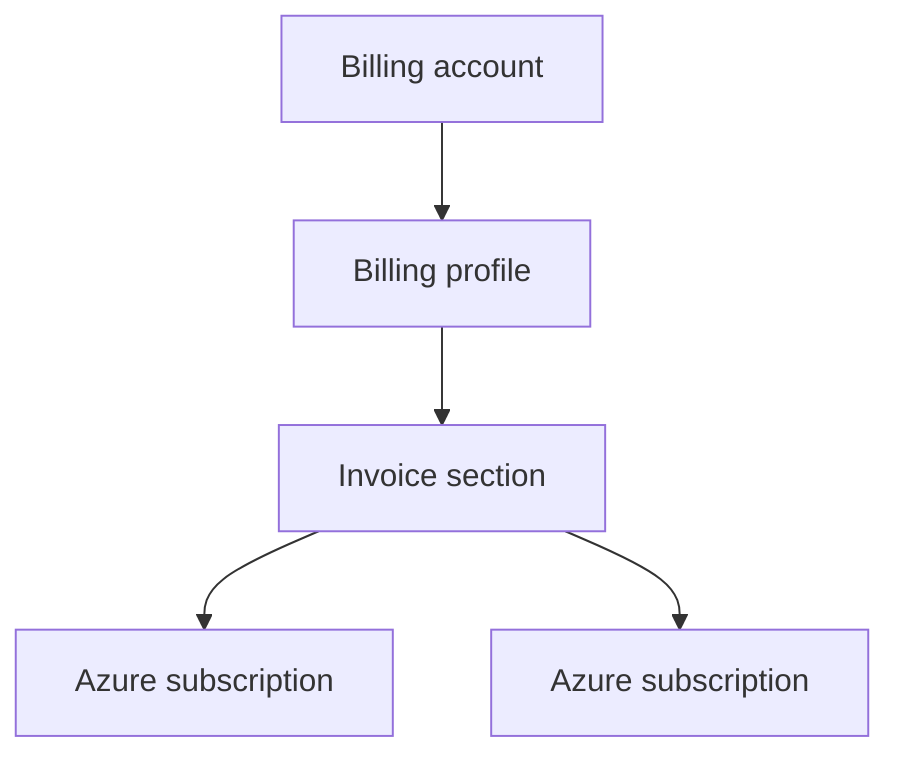
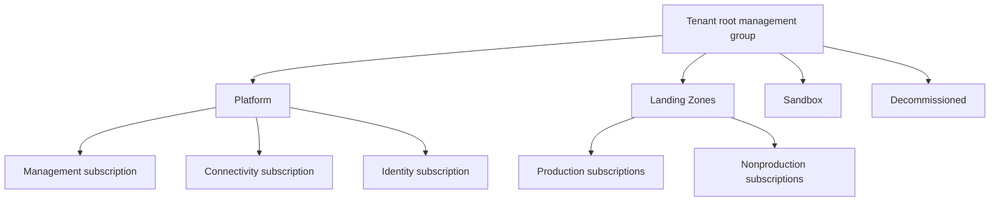
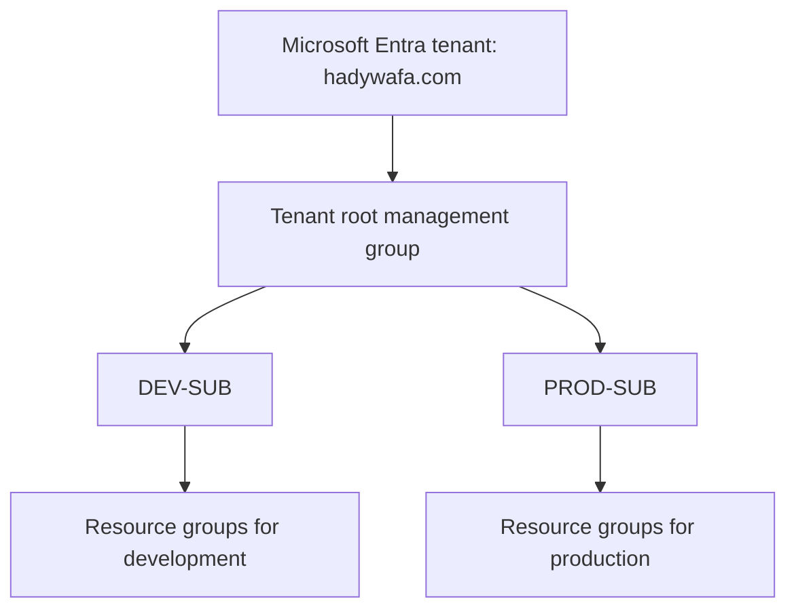
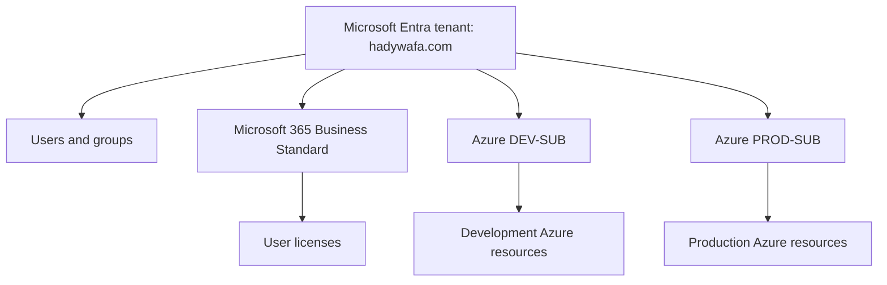

# Azure Subscriptions, Tenants, Management Groups, and Resources

An Azure subscription is not a user account, tenant, license, or invoice.

It is primarily a scope for:

- Azure resources
- Governance
- Access control
- Cost tracking
- Quotas and service limits

---

## 1. Definition

An Azure subscription is a logical Azure resource-management and consumption boundary.

It contains resource groups and resources:

```text
Azure subscription
└── Resource groups
    └── Azure resources
```

Examples of resources:

```text
AKS
Virtual machines
Virtual networks
Storage accounts
Key vaults
Databases
App Services
Container registries
```

---

## 2. The three independent Azure hierarchies

Azure administrators often mix three different hierarchies.

### Identity hierarchy



Purpose:

- Authentication
- Identity lifecycle
- Directory roles
- Applications and service principals

### Resource and governance hierarchy



Purpose:

- Organizing Azure subscriptions
- Azure Policy inheritance
- Azure RBAC scope inheritance
- Resource deployment and governance

### Billing hierarchy under MCA



Purpose:

- Invoices
- Payment methods
- Cost organization
- Billing roles

The tenant is not the parent of the billing account. Billing and identity are separate relationships connected through permissions and subscription associations.

---

## 3. Tenant-to-subscription relationship

Every Azure subscription trusts one Microsoft Entra tenant at a time.

```text
One Azure subscription
→ one trusted Microsoft Entra tenant
```

One tenant can be trusted by many Azure subscriptions:

```text
One Microsoft Entra tenant
├── DEV-SUB
├── TEST-SUB
├── PROD-SUB
├── SECURITY-SUB
└── CONNECTIVITY-SUB
```

The tenant supplies the identities:

- Users
- Groups
- Service principals
- Managed identities
- Devices

Azure RBAC determines what those identities can do at Azure scopes.

---

## 4. Entra roles versus Azure RBAC

These are separate authorization systems.

### Microsoft Entra roles

Manage directory objects.

Examples:

```text
Global Administrator
User Administrator
Application Administrator
Groups Administrator
```

Typical scope:

```text
Microsoft Entra tenant
```

### Azure RBAC roles

Manage Azure resources.

Examples:

```text
Owner
Contributor
Reader
User Access Administrator
Azure Kubernetes Service RBAC Admin
AcrPush
```

Available scopes:

```text
Management group
Subscription
Resource group
Resource
```

Being a Global Administrator does not automatically make a user an Owner of every Azure subscription.

Being an Azure subscription Owner does not automatically make a user a Global Administrator of the tenant.

---

## 5. What boundary does an Azure subscription provide?

An Azure subscription is a useful boundary for:

| Area | What is separated |
|---|---|
| Cost | Usage, budgets, exports, and cost analysis |
| Quota and scale | Many service quotas and limits are subscription-scoped |
| Governance | Azure Policy assignments and initiatives |
| Access | Azure RBAC assignments |
| Resource organization | Resource groups and deployed services |
| Operational isolation | Production and nonproduction administration |
| Provider registration | Azure resource providers can be registered per subscription |

It is reasonable to call a subscription a governance, cost, quota, and access-control boundary for contained Azure resources.

It is not a complete identity boundary because identities normally come from the shared Microsoft Entra tenant.

---

## 6. Billing boundary: important nuance

A subscription tracks its own Azure usage and costs, but it does not always receive a separate invoice.

Under MCA:

```text
One billing profile
→ one monthly invoice
→ charges from multiple Azure subscriptions
```

Invoice sections can show subscription costs as grouped sections on the same invoice.

Therefore, this statement is inaccurate:

```text
Every Azure subscription always generates its own invoice.
```

A better statement is:

```text
Every Azure subscription records its own usage and cost,
while invoice generation depends on the billing agreement and billing profile.
```

---

## 7. When to use multiple Azure subscriptions

Use separate subscriptions when you need a strong management or operational boundary.

### Common reasons

| Scenario | Why separate subscriptions help |
|---|---|
| Production versus nonproduction | Different RBAC, policies, budgets, and risk levels |
| Different business units | Delegated administration and cost ownership |
| Platform versus workloads | Separate connectivity, identity, security, and management services |
| Regulatory requirements | Different controls and allowed configurations |
| Quota separation | Independent service quotas and scaling capacity |
| Workload lifecycle | Easier subscription vending and retirement |
| Different billing ownership | Charges can be linked to different billing scopes where supported |

Do not create one subscription for every small application without a management reason. Subscriptions should represent meaningful boundaries.

---

## 8. Recommended enterprise resource hierarchy

A common Azure landing-zone pattern is:



This is suitable for a large enterprise.

---

## 9. Recommended structure for your lab

For your current learning tenant, keep it simpler:



Recommended:

```text
One Microsoft Entra tenant
├── DEV-SUB
└── PROD-SUB
```

Use:

- Different budgets
- Different Azure Policy assignments
- Different RBAC assignments
- Different resource naming
- Separate resource groups per workload

Management groups are useful for learning, but a complex enterprise hierarchy is unnecessary for only two subscriptions.

---

## 10. Microsoft 365 and Azure in your tenant

Your environment should be understood as:



More precisely:

- Microsoft 365 Business Standard is a SaaS product subscription.
- Its licenses are assigned to organizational users.
- The Microsoft Entra tenant stores the identities.
- The Azure subscriptions trust the tenant for identities.
- Azure subscriptions are added separately and contain Azure resources.
- Billing can be connected to one or more billing accounts independently.

---

## 11. Moving an Azure subscription to another tenant

An Azure subscription can be associated with a different Microsoft Entra directory, subject to prerequisites and product limitations.

Do not summarize the requirement as:

```text
You must be Global Administrator in both tenants.
```

The actual permissions and prerequisites depend on the transfer scenario. Subscription ownership, access to the target directory, billing ownership, and product-specific restrictions must be checked.

Changing the directory has significant consequences:

- Existing Azure RBAC role assignments that reference identities in the old tenant lose access.
- Service principals and application identities might need to be recreated or reassigned.
- Managed identities and integrations must be reviewed.
- Key Vault access and other identity-based permissions can break.
- AKS can lose functionality because role assignments and service-principal permissions change.

Changing the subscription's directory changes its identity trust. It does not automatically transfer its billing ownership.

---

## 12. Azure versus AWS comparison

The closest practical comparison is:

| Azure | AWS |
|---|---|
| Microsoft Entra tenant | Central identity directory; partly comparable to IAM Identity Center or an external IdP |
| Management group | AWS Organizations organizational unit or policy grouping |
| Azure subscription | Closest to an AWS account for resource, quota, governance, and cost separation |
| Resource group | No exact equivalent; closest to a logical resource grouping using tags and service constructs |
| Azure RBAC | IAM permissions applied to Azure scopes |
| Azure Policy | Service Control Policies plus AWS Config-style governance, depending on the use case |

An Azure subscription is **similar to**, but not identical to, an AWS account.

Key difference:

```text
Many Azure subscriptions commonly trust one shared Entra tenant.
```

AWS accounts each have their own IAM boundary, although organizations often centralize workforce authentication using IAM Identity Center or an external identity provider.

---

## 13. Corrected misconceptions

| Incorrect statement | Correct statement |
|---|---|
| A Microsoft 365 subscription is an Azure subscription | They are different product subscription types |
| Microsoft 365 automatically gives Azure infrastructure | It provides SaaS services and a tenant; Azure infrastructure requires an Azure subscription |
| Every Azure subscription has a separate invoice | Invoice behavior depends on the billing agreement; MCA invoices are generated per billing profile |
| A subscription can use many tenants simultaneously | It trusts one Entra tenant at a time |
| A tenant can have only one Azure subscription | A tenant can be trusted by many Azure subscriptions |
| Global Administrator means Azure subscription Owner | Entra roles and Azure RBAC are separate |
| Azure subscription Owner means Global Administrator | Subscription ownership does not grant directory administration |
| Azure subscription is a complete identity boundary | It is an Azure resource access/governance boundary; identities come from the tenant |
| Azure subscriptions are tied to one region | A subscription is global and can contain resources from multiple Azure regions |
| Business Standard includes Entra ID P1 | Business Premium includes P1; Business Standard normally has the baseline Entra capabilities |

---

## 14. Final mental model

```text
Microsoft Entra tenant
├── Identities
├── Groups
├── Applications
└── Domains

Management groups
└── Azure subscriptions
    └── Resource groups
        └── Resources

Billing account
└── Agreement-specific billing scopes
    └── Pays for Azure subscriptions

Microsoft 365 subscription
└── Licenses
    └── Assigned to tenant users
```

When troubleshooting, first identify which plane the issue belongs to:

```text
Identity issue?
Azure resource issue?
Authorization issue?
Product license issue?
Billing issue?
```

This prevents most Microsoft cloud subscription confusion.

---

## Official references

- [Associate an Azure subscription with a Microsoft Entra tenant](https://learn.microsoft.com/en-us/entra/fundamentals/how-subscriptions-associated-directory)
- [Azure subscription considerations and recommendations](https://learn.microsoft.com/en-us/azure/cloud-adoption-framework/ready/landing-zone/design-area/resource-org-subscriptions)
- [Azure subscription and service limits](https://learn.microsoft.com/en-us/azure/azure-resource-manager/management/azure-subscription-service-limits)
- [Microsoft cloud subscriptions, licenses, accounts, and tenants](https://learn.microsoft.com/en-us/microsoft-365/enterprise/subscriptions-licenses-accounts-and-tenants-for-microsoft-cloud-offerings)
- [Microsoft Customer Agreement billing overview](https://learn.microsoft.com/en-us/azure/cost-management-billing/understand/mca-overview)
