# ⚔️ Azure Firewall vs Web Application Firewall (WAF)

| Feature / Purpose     | **Azure Firewall**                                                                      | **Web Application Firewall (WAF)**                                                                        |
| --------------------- | --------------------------------------------------------------------------------------- | --------------------------------------------------------------------------------------------------------- |
| **OSI Layer**         | Layer 3 & 4 (Network + Transport)                                                       | Layer 7 (Application / HTTP)                                                                              |
| **Primary Use Case**  | Secure and filter _network traffic_ across VNets, subnets, and on-premises connections. | Protect _web applications_ from application-layer attacks like SQL injection, XSS, and request smuggling. |
| **Understands HTTP?** | ❌ No — it only filters based on IPs, ports, protocols.                                 | ✅ Yes — it inspects HTTP/S requests and applies OWASP rules.                                             |
| **SSL Termination**   | ❌ Not supported (it doesn’t decrypt HTTPS traffic).                                    | ✅ Performs SSL termination and deep inspection of web traffic.                                           |
| **Integration Point** | Typically sits at the **network perimeter** (e.g. hub VNet).                            | Sits **in front of web apps** (e.g. Application Gateway or Azure Front Door).                             |
| **Scenarios**         | Outbound filtering, DNAT/SNAT, network segmentation, egress control, logging.           | Defend against OWASP Top 10 web vulnerabilities, bot protection, rate limiting, custom rules.             |
| **Example**           | Block all traffic except HTTPS to certain IPs.                                          | Block requests containing `<script>` or SQL keywords in a URL parameter.                                  |

---

## 🌐 In This Question’s Context

> You are designing a **web application** that needs:
>
> - Advanced **traffic management**
> - **SSL termination**
> - **Multi-site routing**
> - Protection from **web vulnerabilities**

Let’s analyze:

### 🔹 To manage web traffic, SSL termination, and multi-site routing

➡️ You need a **Layer 7 load balancer** →
✅ **Azure Application Gateway (v2)** or **Azure Front Door (Premium)**

These services:

- Terminate SSL/TLS (HTTPS offloading)
- Route traffic based on hostname/path
- Integrate WAF
- Scale automatically

### 🔹 To enhance security against web vulnerabilities

➡️ You need **Azure Web Application Firewall (WAF)**

- Built into Application Gateway (regional) or Front Door (global)
- Uses OWASP Core Rule Sets
- Protects against SQL injection, XSS, and malicious bots

### ⚠️ Why **Azure Firewall** Is NOT Correct Here

- It can’t handle HTTPS termination or inspect HTTP requests.
- It doesn’t support multi-site routing or URL-based routing.
- It operates at **Layer 3/4**, while the requirement (SSL termination + app-layer filtering) is **Layer 7**.
- It’s often used **together** with Application Gateway/WAF, not _instead of_ it.

---

## ✅ Final Design Recommendation

| Purpose                                                     | Azure Service                                                      | Why                                                                                                   |
| ----------------------------------------------------------- | ------------------------------------------------------------------ | ----------------------------------------------------------------------------------------------------- |
| **Traffic management, SSL termination, multi-site routing** | **Azure Application Gateway (v2)** or **Azure Front Door Premium** | Provides HTTPS load balancing, global routing, and scaling.                                           |
| **Web security (app-layer protection)**                     | **Web Application Firewall (WAF)**                                 | Protects against OWASP Top 10 threats and malicious HTTP traffic.                                     |
| _(Optional – network layer defense)_                        | **Azure Firewall**                                                 | Can sit in hub VNet for egress control and hybrid connectivity, but **not** for web-layer protection. |

---

### 🧠 Visual Diagram (Mermaid)

```mermaid
sequenceDiagram
    participant User as User 🌍
    participant FrontDoor/WAF as FrontDoor/WAF 🧱
    participant AppGateway as AppGateway 💠
    participant WebApp as WebApp 🖥️
    participant SQLDB as SQLDB 🗄️

    User->>FrontDoor/WAF: HTTPS Request
    FrontDoor/WAF->>FrontDoor/WAF: SSL Termination + OWASP inspection
    FrontDoor/WAF->>AppGateway: Forward sanitized HTTPS traffic
    AppGateway->>WebApp: Route request based on host/path
    WebApp->>SQLDB: Query/Store data
    SQLDB-->>WebApp: Return results
    WebApp-->>AppGateway: HTTPS Response
    AppGateway-->>FrontDoor/WAF: Response filtering
    FrontDoor/WAF-->>User: Secure HTTPS response
```

---

### 🏁 Summary

- **Azure Firewall** = Network security (Layer 3/4)
- **WAF (via App Gateway / Front Door)** = Web app protection (Layer 7)
- **For AZ-305 design** →
  ✅ Application Gateway or Front Door (for traffic + SSL)
  ✅ WAF (for web security)
