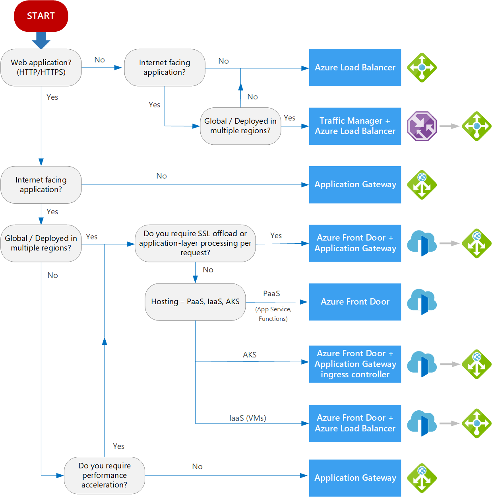

# ⚔️ **Azure Traffic Manager, Application Gateway, and Front Door**

**Azure Traffic Manager, Application Gateway, and Front Door are all load balancing solutions—but they operate at different layers, scopes, and use cases.** Here's a clear breakdown to help you choose the right one for your architecture.

---

  

---

## 🧠 Core Differences

| Feature                            | **Traffic Manager**                        | **Application Gateway**              | **Front Door**                           |
| ---------------------------------- | ------------------------------------------ | ------------------------------------ | ---------------------------------------- |
| **Layer**                          | DNS (Layer 7, DNS-based)                   | HTTP/HTTPS (Layer 7)                 | HTTP/HTTPS (Layer 7)                     |
| **Routing Method**                 | DNS-based (priority, weighted, geographic) | Path-based, host-based               | Path-based, latency, geo-routing         |
| **Scope**                          | Global DNS redirection                     | Regional (within VNet)               | Global (edge PoPs)                       |
| **SSL Termination**                | ❌ No                                      | ✅ Yes                               | ✅ Yes                                   |
| **Web Application Firewall (WAF)** | ❌ No                                      | ✅ Yes                               | ✅ Yes                                   |
| **Session Affinity**               | ❌ No                                      | ✅ Yes                               | ✅ Yes                                   |
| **Health Probes**                  | DNS-level endpoint checks                  | HTTP probes                          | HTTP probes                              |
| **Best For**                       | Multi-region failover, DNS-level routing   | Internal app routing, secure ingress | Global apps, CDN, acceleration, failover |

---

## 🔍 Use Case Breakdown

### 🔹 **Azure Traffic Manager**

- **DNS-based load balancer**: Routes users to endpoints based on DNS resolution.
- **Best for**: Multi-region failover, geo-distribution, hybrid cloud.
- **Limitation**: Doesn’t inspect HTTP traffic; no SSL offload or WAF.

### 🔹 **Azure Application Gateway**

- **Regional Layer 7 load balancer**: Works inside your VNet.
- Supports **SSL termination**, **path-based routing**, and **WAF**.
- **Best for**: Secure app ingress, microservices routing, internal APIs.

### 🔹 **Azure Front Door**

- **Global application delivery network**: Combines CDN, load balancing, and security.
- Routes traffic to the **closest healthy backend** using latency or geo-routing.
- **Best for**: High-performance global web apps, static/dynamic content, failover.

---

## 🧪 Real-World Scenarios

| Scenario                                 | Recommended Service                  |
| ---------------------------------------- | ------------------------------------ |
| Global website with CDN and failover     | **Front Door**                       |
| Internal app with secure routing and WAF | **Application Gateway**              |
| DNS-based failover across regions        | **Traffic Manager**                  |
| AKS ingress controller with SSL          | **App Gateway or Front Door + AGIC** |
| Hybrid cloud with on-prem + Azure        | **Traffic Manager**                  |

---

## 📚 **Sources**

- [Microsoft Learn – Load Balancing Overview](https://learn.microsoft.com/en-us/azure/architecture/guide/technology-choices/load-balancing-overview)
- [Azure Comparison Guide – Tutorials Dojo](https://tutorialsdojo.com/azure-load-balancer-vs-app-gateway-vs-traffic-manager/)
