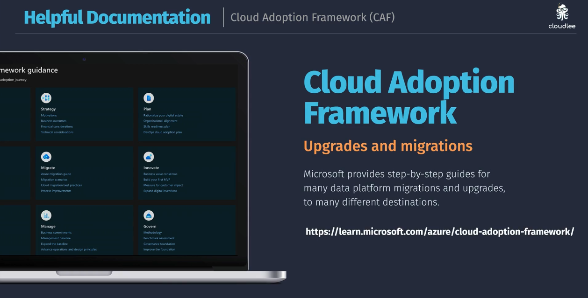

# Cloud Adoption Framework (CAF)

The [Cloud Adoption Framework (CAF)](https://learn.microsoft.com/en-us/azure/cloud-adoption-framework/) is a comprehensive guide provided by Microsoft to help organizations successfully adopt cloud technologies. It offers best practices, documentation, and tools to assist in the planning, implementation, and management of cloud adoption strategies.

The CAF covers various aspects of cloud adoption, including:

- 🌟 **Strategy** — defining business motivations and expected outcomes for cloud adoption
- 🏗️ **Plan** — creating a detailed plan for cloud adoption, including skills readiness and governance
- 🛠️ **Ready** — preparing the cloud environment, including landing zones and resource organization
- 🚀 **Adopt** — migrating and innovating with cloud-native technologies
- 🛡️ **Govern** — establishing policies and controls to manage cloud resources effectively
- 📈 **Manage** — monitoring and optimizing cloud resources for performance and cost-efficiency

The Cloud Adoption Framework is designed to help organizations of all sizes and industries navigate the complexities of cloud adoption, ensuring a smooth transition to the cloud while maximizing the benefits of cloud technologies.

