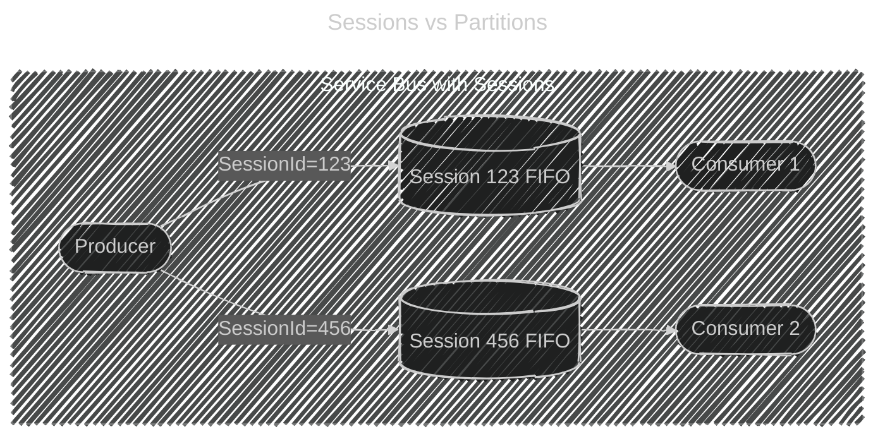
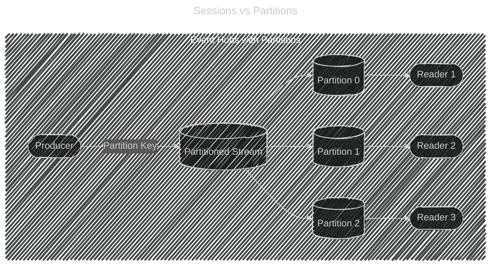
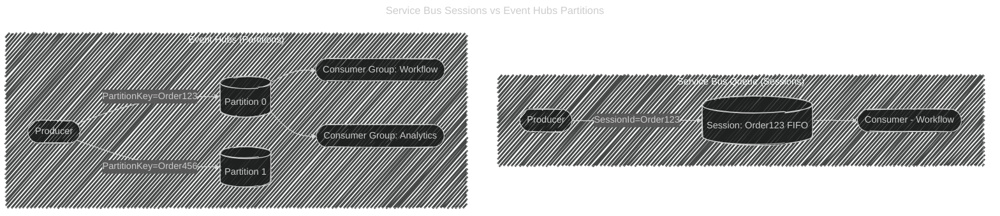

# ⚖️ Service Bus Sessions vs Event Hubs Partitions

## 1️⃣ **Purpose**

- **Service Bus Sessions** → Preserve **message order** & state **per workflow / entity**.

  - Example: All updates for `Order123` stay together, in order.
  - Sessions = **mini-queues (FIFO)** inside one queue.

- **Event Hubs Partitions** → Provide **scalability** by splitting the event stream.

  - Example: 10 million telemetry events spread across 8 partitions.
  - Partitions = **shards** for parallel processing, not per-entity ordering.

---

## 2️⃣ **Key Mechanism**

- **Sessions (Service Bus)**:

  - Messages tagged with `SessionId`.
  - Consumer locks a session → gets **all messages for that session in order**.
  - Only **one consumer** at a time per session.

- **Partitions (Event Hubs)**:

  - Events distributed across fixed **N partitions** (decided at namespace creation).
  - Partition key decides event placement.
  - Multiple consumers can read partitions in parallel (consumer groups).

---

## 3️⃣ **Use Cases**

### 🔹 Service Bus Sessions

- Order processing (all events for `Order123` go together).
- Chat application (all messages in `ChatRoom42` stay in order).
- Banking (all debits/credits for `Account123` processed sequentially).

### 🔹 Event Hubs Partitions

- IoT telemetry (millions of sensors streaming data).
- Application logs, clickstreams, analytics pipelines.
- Large-scale ingestion with **parallel consumers**.

---

## 4️⃣ **Analogy**

- **Sessions** = “Dedicated checkout line for each customer.”

  - If Linda (SessionId=123) comes in with 5 items, the cashier (consumer) handles **all 5 in order**.

- **Partitions** = “Warehouse conveyor belts.”

  - Boxes (events) are spread across **8 belts** (partitions).
  - Workers (consumers) can pick boxes off in parallel.

---

## 5️⃣ **Diagram: Comparison**

<div align="center" style="background: #343739ff; border-radius: 20px">





</div>

---

## 6️⃣ **Key Differences Table**

| Feature            | **Service Bus Sessions**            | **Event Hubs Partitions**                              |
| ------------------ | ----------------------------------- | ------------------------------------------------------ |
| Main Purpose       | Ordering & stateful workflows       | High-scale event ingestion & parallelism               |
| Key Property       | `SessionId`                         | `Partition Key`                                        |
| Ordering Guarantee | Per Session (FIFO)                  | Per Partition (FIFO)                                   |
| Consumer Ownership | One consumer per session            | Multiple consumers per partition (via consumer groups) |
| Scalability        | Limited (session = lock contention) | Very high (millions of events/sec)                     |
| Best For           | Orders, banking, chats, workflows   | Telemetry, logs, analytics, streams                    |

---

## ✅ Final Takeaway

- **Service Bus Sessions** → “Keep _related messages together_ in strict order.”
- **Event Hubs Partitions** → “Distribute _huge event volumes_ across multiple readers.”

👉 They look similar because both use **keys (`SessionId` / `PartitionKey`)**, but:

- Sessions = focus on **ordering + stateful processing**.
- Partitions = focus on **scale + parallelism**.

---

## 🏷️ Scenario: Order123 Workflow

A customer places **Order123** with 3 steps:

1. `OrderCreated`
2. `OrderPacked`
3. `OrderShipped`

We need to ensure **these 3 events stay together in sequence**.
But the platform also handles **millions of other orders per day**.

---

## 1️⃣ Using **Service Bus with Sessions**

✅ **Goal**: Guarantee **strict ordering per order**.

- Each order has a **SessionId**.
- All messages with `SessionId=Order123` are routed to the **same consumer** in order.

### Sending Messages

```csharp
await sender.SendMessageAsync(new ServiceBusMessage("OrderCreated")
{
    SessionId = "Order123"
});
await sender.SendMessageAsync(new ServiceBusMessage("OrderPacked")
{
    SessionId = "Order123"
});
await sender.SendMessageAsync(new ServiceBusMessage("OrderShipped")
{
    SessionId = "Order123"
});
```

### Receiving Messages

```csharp
ServiceBusSessionReceiver receiver =
    await client.AcceptSessionAsync("orders-queue", "Order123");

ServiceBusReceivedMessage msg1 = await receiver.ReceiveMessageAsync();
ServiceBusReceivedMessage msg2 = await receiver.ReceiveMessageAsync();
ServiceBusReceivedMessage msg3 = await receiver.ReceiveMessageAsync();

Console.WriteLine($"{msg1.Body} → {msg2.Body} → {msg3.Body}");
```

👉 Output:

```ini
OrderCreated → OrderPacked → OrderShipped
```

💡 **Guarantees**:

- Messages for `Order123` always handled by **one consumer in order**.
- Perfect for workflows, but **does not scale to millions of parallel events** (sessions are locked to single consumers).

---

## 2️⃣ Using **Event Hubs with Partitions**

✅ **Goal**: Handle **massive event scale** (millions/sec).

- Each event has a **PartitionKey** (we use `OrderId`).
- Events with the same key always go to the same **partition** (FIFO inside partition).
- Many consumers can read partitions in parallel.

### Sending Messages

```csharp
await producerClient.SendAsync(new EventData(Encoding.UTF8.GetBytes("OrderCreated"))
{
    PartitionKey = "Order123"
});
await producerClient.SendAsync(new EventData(Encoding.UTF8.GetBytes("OrderPacked"))
{
    PartitionKey = "Order123"
});
await producerClient.SendAsync(new EventData(Encoding.UTF8.GetBytes("OrderShipped"))
{
    PartitionKey = "Order123"
});
```

### Receiving Messages

```csharp
await foreach (PartitionEvent ev in consumerClient.ReadEventsFromPartitionAsync("0", EventPosition.Earliest))
{
    Console.WriteLine(Encoding.UTF8.GetString(ev.Data.Body.ToArray()));
}
```

👉 Output:

```ini
OrderCreated → OrderPacked → OrderShipped
```

💡 **Guarantees**:

- Ordering **only within a partition**.
- Scale to millions of events/sec.
- No session locking, but you can have multiple **consumer groups** reading the same stream differently (analytics, archiving, real-time processing).

---

## 🔄 Visual Comparison

<div align="center" style="background: #343739ff; border-radius: 20px">



</div>

---

## ✅ Key Takeaways

| Feature            | **Service Bus Sessions**                         | **Event Hubs Partitions**                  |
| ------------------ | ------------------------------------------------ | ------------------------------------------ |
| Best For           | Workflows, ordered tasks, stateful processing    | High-scale ingestion, telemetry, analytics |
| Ordering Guarantee | Per **SessionId**                                | Per **Partition**                          |
| Consumer Handling  | 1 consumer per session                           | Many consumers per partition (via groups)  |
| Scale              | Limited (locks slow things down if 1M+ sessions) | Extreme scale (millions/sec)               |
| Example            | Order123 processing (workflow)                   | IoT telemetry, website clickstream         |

---

💡 **Rule of Thumb**:

- If you need **workflow-style, stateful, ordered processing** → **Service Bus with Sessions**.
- If you need **firehose-style, scalable ingestion** → **Event Hubs with Partitions**.
