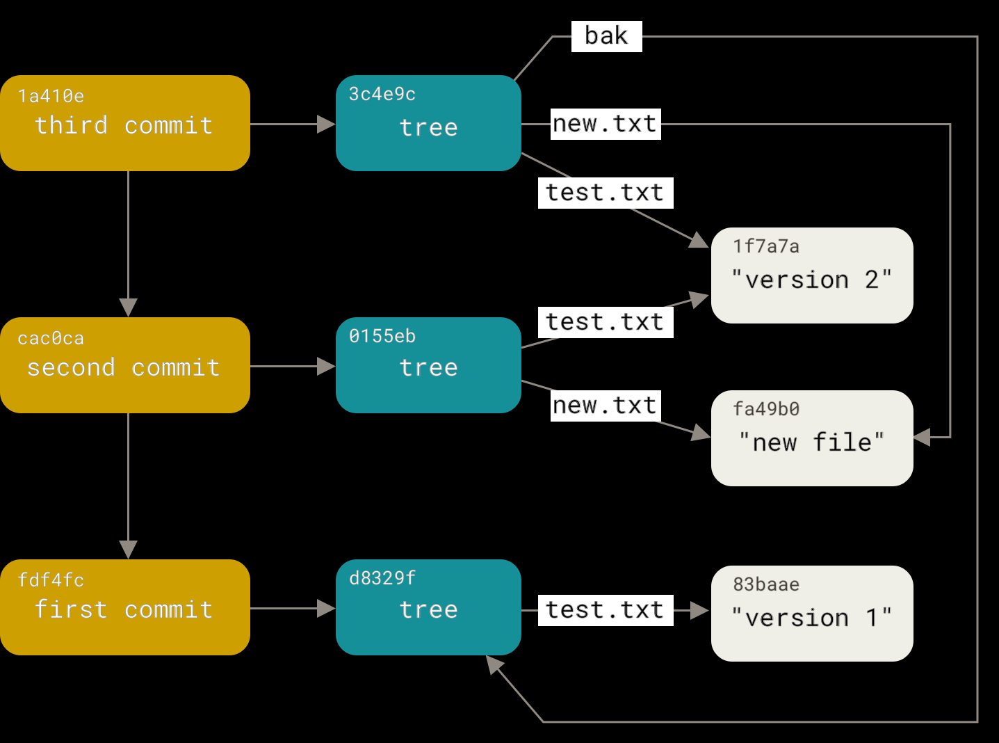
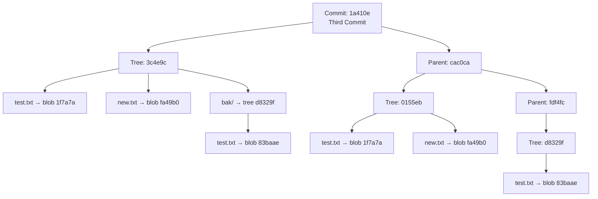

# 🧠 Git Internals Explained: From Concept to Advanced

> Understand how `git commit` _really_ works under the hood, with snapshots, trees, and blobs (in your style 💡💥)

---

## 📌 1. What is a Git Commit?

A **Git commit** is:

> 🗃️ A _snapshot_ of your project at a point in time — not a diff.

Each commit contains:

- 🔗 A pointer to the **tree** (snapshot of your folder/files)
- 🧑 Author, timestamp, and commit message
- 🧬 A reference to the **parent commit** (except the first commit)

---

## 📦 2. Git's Building Blocks (Objects in `.git/objects`)

Git is like a content-addressable database.

| Git Object | What It Represents                      | Example                            |
| ---------- | --------------------------------------- | ---------------------------------- |
| **Blob**   | File content                            | `test.txt = "version 1"`           |
| **Tree**   | Folder structure (file list)            | `tree = {test.txt → blob}`         |
| **Commit** | Full snapshot of the project + metadata | `commit = {tree, parent, message}` |

🧠 All Git objects are stored using **SHA-1 hashes** as filenames.

---

## 🔄 3. The Lifecycle of a Commit (Step by Step)

Let’s recreate the diagram from the bottom up 🧗

---



---

### ✅ First Commit (`fdf4fc`)

```ini
📂 Working Directory:
  test.txt = "version 1"

🧪 Command:
  git add test.txt
  git commit -m "first commit"
```

🔧 Internally:

- Git creates:

  - 🧱 Blob (`83baae`) for `test.txt`
  - 🌳 Tree (`d8329f`) linking `test.txt` to blob
  - 🧾 Commit (`fdf4fc`) pointing to the tree

💬 Summary:

> Git stores test.txt's content as a blob and builds a snapshot tree of the repo.

---

### ✅ Second Commit (`cac0ca`)

```ini
📂 Working Directory:
  test.txt = "version 2"   (edited)
  new.txt  = "new file"    (added)

🧪 Command:
  git add .
  git commit -m "second commit"
```

🔧 Internally:

- Git creates:

  - 🧱 New blob `1f7a7a` for `test.txt` ("version 2")
  - 🧱 New blob `fa49b0` for `new.txt`
  - 🌳 New tree `0155eb` linking:

    - `test.txt → 1f7a7a`
    - `new.txt → fa49b0`

  - 🧾 Commit `cac0ca` pointing to this tree, with parent = `fdf4fc`

💬 Summary:

> Git stores the new version of `test.txt` as a new blob, reuses nothing from previous commit.

---

### ✅ Third Commit (`1a410e`)

```ini
📂 Working Directory:
  mkdir bak
  cp test.txt bak/

🧪 Command:
  git add .
  git commit -m "third commit"
```

🔧 Internally:

- Git creates:

  - 🌳 A tree `3c4e9c` for the root folder:

    - `test.txt → 1f7a7a` (same as before)
    - `new.txt → fa49b0` (same as before)
    - `bak/` → nested tree:

      - `test.txt → 83baae` ✅ reused from first commit!

  - 🧾 Commit `1a410e` with:

    - parent = `cac0ca`
    - tree = `3c4e9c`

💬 Summary:

> Git reuses old blobs when content is identical, even if in a different folder.

---

## 🧬 4. Visualization of Commit Internals



---

## 🧠 5. Advanced Concepts Made Simple

| Concept                       | Easy Explanation                                                                                                                           |
| ----------------------------- | ------------------------------------------------------------------------------------------------------------------------------------------ |
| **Content-Addressed Storage** | All blobs/trees/commits are stored using SHA-1 of their content. If two files are _identical_, they get the same blob hash and are reused. |
| **Snapshot, not diff**        | Each commit is a full snapshot of the repo, not just the changed files. But unchanged files point to the same blob.                        |
| **Efficiency**                | Thanks to SHA-based deduplication, Git avoids duplicating data.                                                                            |
| **Immutable objects**         | Once a blob or tree or commit is written, it's never changed — only new objects are created.                                               |

---

## 🔍 6. What's Stored Inside Each Git Object?

### ✅ Blob: file content

```bash
git cat-file -p 83baae
# Output:
version 1
```

### ✅ Tree: directory structure

```bash
git cat-file -p d8329f
# Output:
100644 blob 83baae    test.txt
```

### ✅ Commit: snapshot + metadata

```bash
git cat-file -p fdf4fc
# Output:
tree d8329f
author You <you@example.com>
date ...

first commit
```

---

## 🧪 Final Recap with Commit Chain

```text
🟡 Commit 1 (fdf4fc)
 └── tree: d8329f
     └── test.txt → blob "version 1"

🟡 Commit 2 (cac0ca)
 └── tree: 0155eb
     ├── test.txt → blob "version 2"
     └── new.txt  → blob "new file"

🟡 Commit 3 (1a410e)
 └── tree: 3c4e9c
     ├── test.txt → blob "version 2"
     ├── new.txt  → blob "new file"
     └── bak/
         └── test.txt → blob "version 1"
```

---

## ✅ Summary Cheat Sheet

| Term         | Meaning                                                    |
| ------------ | ---------------------------------------------------------- |
| `git add`    | Creates blob (file content) and stage in index             |
| `git commit` | Creates tree and commit object                             |
| Tree         | Like a folder: list of file names and blob/tree references |
| Blob         | Stores file data                                           |
| Commit       | Points to a tree + parent commit                           |
| Reuse        | Git reuses blobs and trees if unchanged                    |
