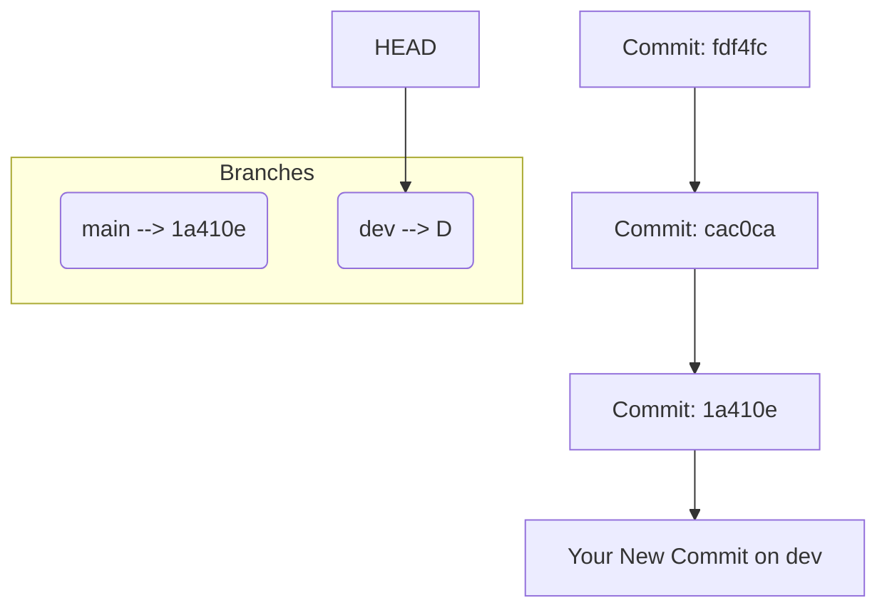

# 🌿 Git Branches Internals

> What is a branch? How does Git store it? Why is it so powerful?

---

## 🧠 1. What Is a Branch in Git?

> A **branch is just a movable pointer to a commit.** That’s it. No magic. No mystery.

In the `.git/refs/heads/` folder (or in packed refs), each branch is a file that stores **the commit hash it points to**.

---

### 📦 Example:

```ini
📂 .git/refs/heads/
    ├── main       # contains: 1a410e
    ├── feature-x  # contains: cac0ca
```

---

### 📍 In Your Diagram:

- `main` points to commit `1a410e` (third commit)
- That commit points to:

  - Parent = `cac0ca` (second)
  - Parent of that = `fdf4fc` (first)

📸 So `main` represents a timeline of:

```ini
fdf4fc → cac0ca → 1a410e
             ↑
          (main)
```

---

## 🧪 2. How Is a Branch Created?

When you run:

```bash
git branch dev
```

💥 Git simply creates a new pointer to the **current commit**.

```bash
.git/refs/heads/dev → 1a410e
```

Nothing else changes! No checkout, no new files — just a new label pointing to the same commit.

---

## 🔄 3. How Do Branches Move?

When you **checkout a branch and commit**, Git updates the branch pointer to point to the new commit.

🪄 Example:

```bash
git checkout dev
echo "new line" >> new.txt
git commit -am "dev work"
```

Internally:

```ini
dev (HEAD) → 🆕 new commit
            ↑ was: 1a410e
```

Now:

```ini
fdf4fc → cac0ca → 1a410e → 💥dev commit
                     ↑
                    main
```

---

## 🎯 4. `HEAD` : Where Am I Now?

In Git, `HEAD` is a **special pointer** that tells you what branch or commit you're currently on.

```bash
.git/HEAD
# Contains: ref: refs/heads/main
```

If you're in detached mode:

```bash
.git/HEAD
# Contains: 1a410e (commit hash)
```

So:

| HEAD Mode              | Meaning                                              |
| ---------------------- | ---------------------------------------------------- |
| `ref: refs/heads/main` | You're on branch `main`                              |
| `1a410e`               | You're in **detached HEAD** mode (not on any branch) |

---

## 🧬 5. How Git Uses Branches Under the Hood



- `main` stays at `1a410e`
- `dev` moves forward with the new commit
- `HEAD` tells Git which branch is active

---

## 🧰 6. Real Git Files Behind the Scenes

🗂️ You’ll see:

```bash
.git/
├── HEAD                    # current branch (ref)
├── refs/
│   └── heads/
│       ├── main            # contains commit hash 1a410e
│       └── dev             # contains commit hash of new commit
└── objects/                # contains blobs, trees, commits
```

---

## 🪄 7. What Happens on Checkout?

```bash
git checkout dev
```

Git will:

- Update `HEAD` to point to `refs/heads/dev`
- Load the commit `dev` points to
- Restore the tree (snapshot) from that commit into your working directory

No merge. No magic. Just moving HEAD and copying files.

---

## 🧪 8. Git Branch Commands Internally

| Command                     | What It Does Internally                                          |
| --------------------------- | ---------------------------------------------------------------- |
| `git branch <name>`         | Creates `.git/refs/heads/<name>` pointing to current commit      |
| `git checkout <branch>`     | Sets `HEAD` to point to branch ref and updates working directory |
| `git commit`                | Writes new commit and moves `HEAD` branch forward                |
| `git reset --hard <commit>` | Moves branch pointer and resets working directory                |
| `git branch -d <name>`      | Deletes the ref file under `.git/refs/heads/<name>`              |

---

## 🔥 9. Branches vs Tags

| Branch                               | Tag                           |
| ------------------------------------ | ----------------------------- |
| **Movable pointer** to latest commit | **Fixed pointer** to a commit |
| Changes as you commit                | Never changes                 |
| Used for development                 | Used for releases/bookmarks   |
| Stored in `.git/refs/heads/`         | Stored in `.git/refs/tags/`   |

---

## ✅ Summary: Branches in Git

| Concept                 | Description                                                               |
| ----------------------- | ------------------------------------------------------------------------- |
| Branch = pointer        | A branch is just a pointer to a commit                                    |
| HEAD = current location | HEAD points to the current branch or commit                               |
| Branches move on commit | The branch you’re on moves when you commit                                |
| Lightweight             | Git branches are just files with commit hashes — super cheap and fast     |
| Snapshots not diffs     | Branches don’t store diffs — commits do, and they point to full snapshots |

---

## 💡 Final Analogy

Imagine Git like a train track 🚂:

- **Commits** = Train cars
- **Branches** = Colored labels stuck on a train car
- **HEAD** = Where you're currently standing
- When you **commit**, the train gets a new car, and your current branch label moves forward 🚀
