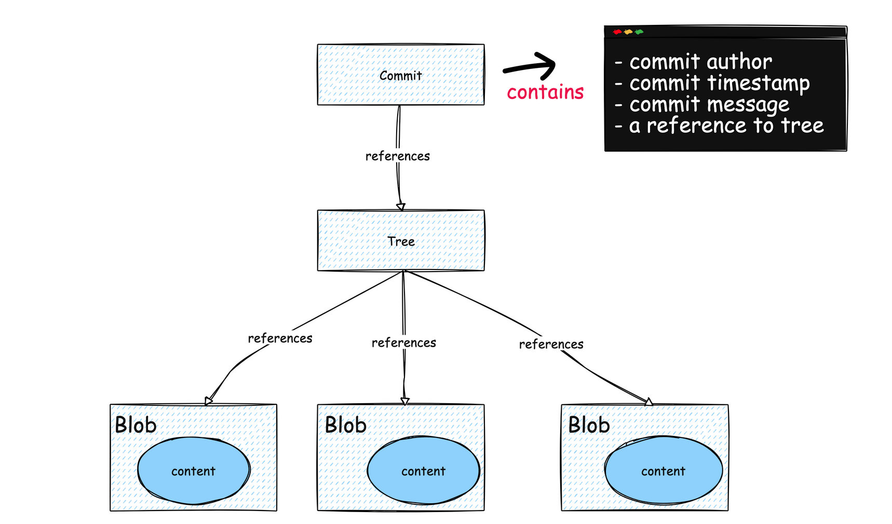

# 🧠 Git Internals

> Understand how `git commit` _really_ works under the hood, with snapshots, trees, and blobs

---

## 📌 What is a Git Commit?

A **Git commit** is:

> 🗃️ A _snapshot_ of your project at a point in time — not a diff.

Each commit contains:

- 🔗 A pointer to the **tree** (snapshot of your folder/files)
- 🧑 Author, timestamp, and commit message
- 🧬 A reference to the **parent commit** (except the first commit)

---

<div align="center">
  
</div>

---

## 📦 Git's Building Blocks (Objects in `.git/objects`)

Git is like a content-addressable database.

| Git Object | What It Represents                      | Example                            |
| ---------- | --------------------------------------- | ---------------------------------- |
| **Blob**   | File content                            | `test.txt = "version 1"`           |
| **Tree**   | Folder structure (file list)            | `tree = {test.txt → blob}`         |
| **Commit** | Full snapshot of the project + metadata | `commit = {tree, parent, message}` |

> 🧠 All Git objects are stored using **SHA-1 hashes** as filenames.

---

## ✍🏻 Example: Git Data Structure

```ini
project/
├── file1.txt  → "Hello"
└── dir1/
    └── file2.txt → "World"
```

---

### 🧨 First Commit: Initial Snapshot

Git creates:

- `Blob1` for `"Hello"` (file1.txt)
- `Blob2` for `"World"` (file2.txt)
- `Tree2` for `dir1/` → maps `file2.txt` to `Blob2`
- `Tree1` for root → maps `file1.txt` to `Blob1`, `dir1/` to `Tree2`
- `Commit1` → points to `Tree1`

```mermaid
---
config:
  look: handDrawn
  theme: dark # dark,neutral
title: "First Commit: Initial Snapshot"
---
flowchart TD
    C1[(**Commit1**)]
    C1 --> T1{"**Tree1** </br>(root)"}
    T1 --> B1(["**Blob1**"])
    B1 --> F1["file1.txt → "Hello""]
    T1 --> T2{"**Tree2** </br>(dir1/)"}
    T2 --> B2([**Blob2**])
    B2 --> F2["file2.txt → "World""]

    classDef orange color:#333,font-size:12pt,fill:#bcb350ff,stroke:#333,stroke-width:2px;
    classDef pink color:#333,font-size:12pt,fill:#f9f,stroke:#333,stroke-width:2px;
    classDef green color:#333,font-size:12pt,fill:#99ffa5ff,stroke:#333,stroke-width:2px;
    class C1 orange
    class T1,T2 pink
    class B1,B2 green

```

<div align="center" style="background: #578198ff; border-radius: 20px">



</div>

---

### ✏️ Second Commit: Update `file2.txt`

You change `file2.txt` to `"World v2"`.

Git creates:

- `Blob3` for `"World v2"`
- `Tree3` for `dir1/` → maps `file2.txt` to `Blob3`
- `Tree4` for root → maps `file1.txt` to **existing** `Blob1`, `dir1/` to `Tree3`
- `Commit2` → points to `Tree4`, parent is `Commit1`

```mermaid
---
config:
  look: handDrawn
  theme: dark # dark,neutral
title: "Second Commit: Initial Snapshot"
---
flowchart TD
    C1[(Commit1)]
    C2[(Commit2)]
    C2 --> T4{"Tree4 </br>(root)"}
    T4 --> B1(["Blob1"]) --> F1["file1.txt → "Hello""]
    T4 --> T3{"Tree3 </br>(dir1/)"}
    T3 --> B3(["Blob3"]) --> F3["file2.txt → "World v2""]
    C1 --> C2

    classDef orange color:#333,font-size:12pt,fill:#bcb350ff,stroke:#333,stroke-width:2px;
    classDef pink color:#333,font-size:12pt,fill:#f9f,stroke:#333,stroke-width:2px;
    classDef green color:#333,font-size:12pt,fill:#99ffa5ff,stroke:#333,stroke-width:2px;
    class C1,C2 orange
    class T3,T4 pink
    class B1,B3 green
```

<div align="center" style="background: #578198ff; border-radius: 20px;">



</div>

> 🧠 Git reuses `Blob1` and doesn’t touch unchanged files.

---

### 📄 Third Commit: Add `file3.txt`

You add `file3.txt` with `"New file"` at root.

Git creates:

- `Blob4` for `"New file"`
- `Tree5` for root → maps:
  - `file1.txt` → `Blob1`
  - `file3.txt` → `Blob4`
  - `dir1/` → `Tree3` (unchanged from previous commit)
- `Commit3` → points to `Tree5`, parent is `Commit2`

```mermaid
---
config:
  look: handDrawn
  theme: dark # dark,neutral
title: "Third Commit: Initial Snapshot"
---
flowchart TD
    C1[(Commit1)]
    C2[(Commit2)]
    C3[(Commit3)]
    C3 --> T5{"Tree5 </br>(root)"}
    T5 --> B1(["Blob1"]) --> F1["file1.txt → "Hello""]
    T5 --> B4(["Blob4"]) --> F4["file3.txt → "New file""]
    T5 --> T3{"Tree3 </br>(dir1/)"}
    T3 --> B3(["Blob3"]) --> F3["file2.txt → "World v2""]
    C1 --> C2
    C2 --> C3

    classDef orange color:#333,font-size:12pt,fill:#bcb350ff,stroke:#333,stroke-width:2px;
    classDef pink color:#333,font-size:12pt,fill:#f9f,stroke:#333,stroke-width:2px;
    classDef green color:#333,font-size:12pt,fill:#99ffa5ff,stroke:#333,stroke-width:2px;
    class C1,C2,C3 orange
    class T3,T5 pink
    class B1,B3,B4 green
```

<div align="center" style="background: #578198ff; border-radius: 20px;">



</div>

---

### 🔍 Summary of Git’s Behavior

| Commit | Changed File(s) | New Objects                         | Reused Objects      |
| ------ | --------------- | ----------------------------------- | ------------------- |
| C1     | All             | Blob1, Blob2, Tree1, Tree2, Commit1 | —                   |
| C2     | file2.txt       | Blob3, Tree3, Tree4, Commit2        | Blob1               |
| C3     | file3.txt       | Blob4, Tree5, Commit3               | Blob1, Blob3, Tree3 |

---

## 🔁 Git’s Tree Behavior: Immutable by Design

- Git treats all objects — blobs, trees, commits — as **immutable**.
- When you change a file, Git creates a **new blob** for the content.
- Then it builds a **new tree** for the directory containing that file.
- If the root directory changes (e.g., new file added), Git builds a **new root tree**.
- Each commit points to a **new tree object**, even if most of it reuses previous blobs and subtrees.

---

## 🧠 Architectural Insight

This design is why Git is:

- **Reliable**: Every commit is a full snapshot, not a diff.
- **Efficient**: Unchanged blobs and trees are reused.
- **Safe**: History is immutable — no accidental edits.

> This is why Git is blazing fast and reliable — it builds **immutable snapshots** using **modular trees and blobs**, and reuses unchanged content across commits.
