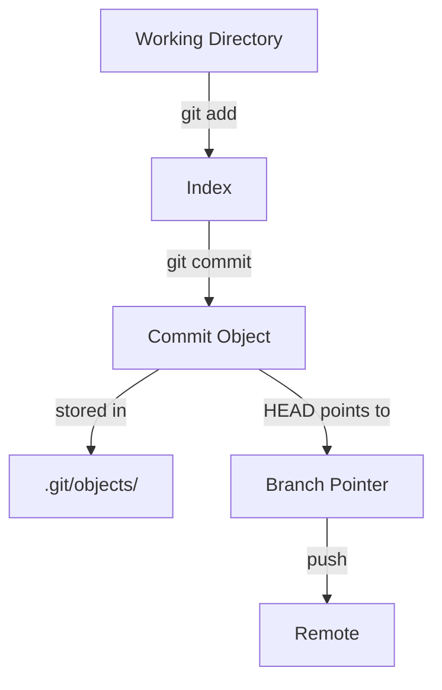

# 🧱 `.git/` Folder Structure + Most Important Git Commands

> Master Git by understanding what lives in the `.git` folder and how each command affects it.

---

## 📁 1. What is `.git/`?

When you run `git init` in a project folder, Git creates a hidden folder:

```bash
.git/
```

This folder is the **heart and brain of your Git repository**.
Everything — commits, branches, history, remotes, staging area — lives here.

> 💡 Pro Tip: If you delete `.git/`, you lose your Git repo!

---

## 🧭 2. Complete `.git/` Folder Structure (Visual)

```text
.git/
├── HEAD                   👈 current branch or commit
├── config                 👈 repo config (user, remote, etc)
├── description            👈 used by GitWeb
├── index                  👈 staging area (what's added)
├── refs/                  👈 branch and tag pointers
│   ├── heads/             👈 branches (main, dev, etc)
│   └── tags/              👈 tags (v1.0, release)
├── objects/               👈 all Git data (blobs, trees, commits)
│   ├── info/
│   └── pack/
├── logs/                  👈 history of branch updates
│   ├── HEAD
│   └── refs/
├── hooks/                 👈 client-side Git hooks (pre-commit, etc)
├── info/
│   └── exclude            👈 like .gitignore (local only)
└── packed-refs            👈 compressed refs (for performance)
```

Let’s now break these down 👇

---

## 🗂️ 3. What’s Inside `.git/` — Folder by Folder

| Folder/File         | Meaning                                                                   |
| ------------------- | ------------------------------------------------------------------------- |
| `.git/HEAD`         | Pointer to current branch (e.g., `ref: refs/heads/main`)                  |
| `.git/config`       | Repo-specific config (remote URLs, user name, etc)                        |
| `.git/index`        | Staging area – snapshot of what you’ve added (`git add`)                  |
| `.git/objects/`     | All Git objects: blobs (file contents), trees (folder structure), commits |
| `.git/refs/heads/`  | Each file = a branch name pointing to the latest commit                   |
| `.git/refs/tags/`   | Same as heads, but for tags                                               |
| `.git/logs/`        | Operation logs – history of movements of HEAD, branches                   |
| `.git/hooks/`       | Optional scripts triggered by actions (e.g., `pre-commit`)                |
| `.git/info/exclude` | Like `.gitignore`, but only for local use                                 |
| `.git/packed-refs`  | Optimized version of `refs/` when repo grows large                        |

---

## 🧪 4. Important Git Commands + Internals

Now let’s explore the **most essential Git commands**, what they do, and what they affect in `.git/`.

---

### ✅ `git init`

> Initialize a Git repo

- Creates `.git/` folder with entire structure
- Sets up an empty database

```bash
.git/
├── HEAD → refs/heads/main
├── objects/
├── refs/
│   └── heads/
```

---

### ✅ `git add <file>`

> Stage changes (add to the index)

- Computes blob hash of the file
- Stores blob in `.git/objects/`
- Updates `.git/index` with that file

🧠 Doesn’t create a commit yet — just prepares for it.

---

### ✅ `git commit -m "message"`

> Create a snapshot (commit)

- Reads the current `.git/index`
- Builds a **tree** object
- Creates a **commit** object pointing to that tree
- Updates your current branch file (`.git/refs/heads/main`) with the new commit hash

---

### ✅ `git status`

> Shows what’s changed, staged, committed

- Reads:

  - Working Directory
  - `.git/index`
  - Current commit from `.git/HEAD → refs/heads/main`

Compares them to tell you:

- What’s new
- What’s modified
- What’s staged

---

### ✅ `git diff`

> Shows _unstaged_ differences (working directory vs index)

### ✅ `git diff --cached`

> Shows _staged_ differences (index vs HEAD)

---

### ✅ `git log`

> Shows commit history

- Reads from `.git/refs/heads/<current-branch>` (e.g., `main`)
- Follows the chain of parent commits back in time

---

### ✅ `git checkout <branch|commit>`

> Switch working directory to a branch or commit

- Updates `.git/HEAD`
- Updates your working directory to match the tree of that commit

If you checkout a commit directly: `HEAD` becomes **detached**!

---

### ✅ `git branch <name>`

> Create a new branch

- Creates file: `.git/refs/heads/<name>` pointing to current commit

Does **not switch to it**. Just creates it.

---

### ✅ `git merge <branch>`

> Merge changes from another branch into current

- Creates a new commit with **two parents**
- Tree is the combined result
- Changes `.git/objects/` and `.git/refs/heads/<current>`

---

### ✅ `git tag <name>`

> Create a fixed label on a commit

- Adds file `.git/refs/tags/<name>` pointing to the current commit
- Unlike branches, tags don’t move

---

### ✅ `git remote add origin <url>`

> Link local repo to remote

- Adds entry to `.git/config`

```ini
[remote "origin"]
    url = https://github.com/user/repo.git
    fetch = +refs/heads/*:refs/remotes/origin/*
```

---

### ✅ `git fetch`

> Download objects and refs from remote — but don’t merge them

- Adds new commits and refs to `.git/refs/remotes/`

---

### ✅ `git pull`

> Fetch + merge (fast-forward or real merge)

---

### ✅ `git push`

> Push your branch's commits to the remote

- Updates remote branch
- Requires remote ref to match local

---

## 🔄 5. Git Command Flow (Cheat Sheet)



---

## ✅ Summary

| Command          | Affects                                     |
| ---------------- | ------------------------------------------- |
| `git init`       | Creates `.git/`                             |
| `git add`        | Updates `.git/index` and `.git/objects/`    |
| `git commit`     | Creates tree and commit in `.git/objects/`  |
| `git checkout`   | Updates `.git/HEAD`, updates files          |
| `git branch`     | Adds file in `.git/refs/heads/`             |
| `git merge`      | Creates new commit with two parents         |
| `git tag`        | Adds file in `.git/refs/tags/`              |
| `git push/fetch` | Interacts with `.git/config` and remotes    |
| `git status`     | Compares working directory, index, and HEAD |
